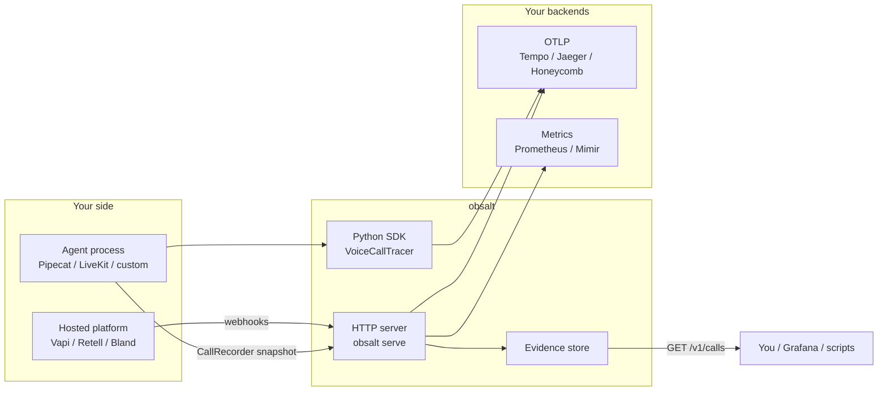

# obsalt

Observability for voice AI agents. One **trace** for where time went, one **evidence** record for what was said.

obsalt is software you run. It is not a hosted dashboard. Traces go to Grafana, Tempo, Jaeger, Honeycomb, or any OpenTelemetry backend. Transcripts, tools, hangups, and evals stay in obsalt and are queried over HTTP.



## Which integration?

| You run | You do |
| --- | --- |
| Your own STT / LLM / TTS loop (Pipecat, LiveKit, custom) | Instrument with [`VoiceCallTracer`](docs/instrumentation.md) |
| **Vapi**, **Retell**, or **Bland** | Run [`obsalt serve`](docs/getting-started.md) and point the provider webhook at it |
| OpenAI Realtime (event batch with `t_ms`) | `POST /v1/ingest/openai-realtime` — [guide](docs/providers/openai-realtime.md) |
| The loop, but you do not want OpenTelemetry in-process | [`CallRecorder`](docs/providers/native.md) → `ObsaltClient.ingest_native` |

The SDK emits spans as the conversation happens. The server reconstructs the **same** span tree from webhooks after the call, stores the transcript, and runs hangup / hallucination / eval analysis.

Live spans never land in the evidence store on their own. For a live waterfall **and** search/evals, instrument with `VoiceCallTracer` and also POST a `CallRecorder` snapshot.

## Install

Python 3.11+.

```bash
pip install -e ".[dev]"
```

## 60-second setup

```bash
obsalt init
# optional local Tempo + Grafana + Prometheus:
# docker run --rm -p 3000:3000 -p 4317:4317 -p 4318:4318 grafana/otel-lgtm
obsalt doctor
obsalt serve
```

Point a webhook at `http://localhost:8080/v1/ingest/vapi` (or retell / bland). Auth header: `X-API-Key: change-me` (the secret from `obsalt.toml` / `OBSALT_API_KEYS`).

```bash
obsalt parse tests/fixtures/vapi_end_of_call.json
curl -H "X-API-Key: change-me" http://localhost:8080/v1/calls
```

Full walkthrough: **[Getting started](docs/getting-started.md)**. Provider dashboards: **[Vapi](docs/providers/vapi.md) · [Retell](docs/providers/retell.md) · [Bland](docs/providers/bland.md)**.

## Quick start: instrument an agent

Use this when **your process** owns STT, the LLM, tools, and TTS.

```python
from obsalt import VoiceCallTracer, setup_tracing

setup_tracing(otlp_endpoint="http://localhost:4318")

with VoiceCallTracer.start(call_id="c1", workspace_id="acme", agent_id="support") as call:
    with call.turn(0, "user") as turn:
        with turn.stt("deepgram") as stt:
            stt.set(confidence=0.91, latency_ms=412)
        with turn.llm("gpt-4o", provider="openai") as llm:
            llm.set(ttft_ms=340, tokens_in=200, tokens_out=80)
            with llm.tool("lookup_order") as tool:
                tool.set(execution_ms=120, status_code=200)
        with turn.tts("elevenlabs") as tts:
            tts.set(synthesis_ms=290, first_audio_ms=70)
    call.set_call_outcome(duration_ms=45_000, status="ended")
```

Do not put transcript text, prompts, or tool payloads on spans. Those belong in evidence. Full guide: [Instrument an agent](docs/instrumentation.md).

## Quick start: ingest a hosted platform

```bash
export OBSALT_OTLP_ENDPOINT=http://localhost:4318
export OBSALT_API_KEYS=acme:secret
export OBSALT_REQUIRE_AUTH=true
obsalt serve --port 8080
```

| Provider | Webhook URL | Guide |
| --- | --- | --- |
| Vapi | `POST /v1/ingest/vapi` | [Vapi](docs/providers/vapi.md) |
| Retell | `POST /v1/ingest/retell` | [Retell](docs/providers/retell.md) |
| Bland | `POST /v1/ingest/bland` | [Bland](docs/providers/bland.md) |
| OpenAI Realtime | `POST /v1/ingest/openai-realtime` | [Realtime](docs/providers/openai-realtime.md) |
| Native snapshot | `POST /v1/ingest/native` | [Native](docs/providers/native.md) |

```python
from obsalt import CallRecorder, ObsaltClient

rec = CallRecorder(provider="openai-realtime", call_id="session-1", agent_id="concierge")
with rec.turn("user", "book Friday") as turn:
    turn.stt_ms = 120
with rec.turn("assistant", "Booked.") as turn:
    turn.llm_ms = 300
    turn.tts_ms = 90

with ObsaltClient(api_key="secret") as client:
    result = rec.send(client)
    print(client.get_call(result["call_id"])["transcript_text"])
```

## What you get

**Traces** — one `call.lifecycle` root per call, nested turns, STT attempts (including fallbacks), LLM, tools, TTS. Join every span to evidence with `call.id`. [Trace model](docs/trace-model.md).

**Metrics** — Prometheus-safe histograms and counters. Never `call_id` as a label. [Metrics and Grafana](docs/grafana.md).

**Evidence** — transcript, recording URL, tool payload *shapes* (not secrets), hangup taxonomy, hallucination flags, eval scores. [HTTP API](docs/api.md).

**Why not Langfuse / generic GenAI tracing?** A voice turn is not a chat completion. Time-to-first-audio is VAD + STT + LLM TTFT + TTS TTFB. LLM dashboards stay green while the caller hears silence because STT fell back, a tool timed out, or the transcript never finalized. OpenTelemetry GenAI conventions cover LLM and tools. They do not standardize STT, TTS, VAD, barge-in, or SIP.

## Documentation

| Guide | When to read it |
| --- | --- |
| [Getting started](docs/getting-started.md) | Install, `obsalt init` / `doctor` / `serve`, first call |
| [Configuration](docs/configuration.md) | `obsalt.toml`, env vars, production checklist |
| [Architecture](docs/architecture.md) | What runs on the client, what runs on the server |
| [Data model](docs/data-model.md) | `CanonicalCall` and how providers map onto it |
| [Data flow](docs/data-flow.md) | Live events vs terminal webhooks vs reconstructed traces |
| [Scenarios](docs/scenarios.md) | Worked examples (refund hallucination, STT fallback, transfer) |
| [Providers](docs/providers/index.md) | Vapi, Retell, Bland, OpenAI Realtime, native, custom agents |
| [Instrument an agent](docs/instrumentation.md) | `VoiceCallTracer` in your process |
| [Trace model](docs/trace-model.md) | Span names, attributes, PII rules |
| [HTTP API](docs/api.md) | Auth, endpoints, responses |
| [Metrics and Grafana](docs/grafana.md) | Prometheus vs Tempo vs Loki vs evidence |

## CLI

```text
obsalt init          Write obsalt.toml and .env.example
obsalt doctor        Check keys, auth, and OTLP reachability
obsalt serve         Run the ingest & evidence API
obsalt parse FILE    Normalize a webhook locally (auto-detects provider)
obsalt version
```

`obsalt --port 8080` still works as `obsalt serve`.

## Tests

```bash
python3 -m pytest
```

## Status

v0.1. Evidence is in-memory (a restart loses calls). Default evals are heuristic, not an LLM judge. There is no hosted UI.
