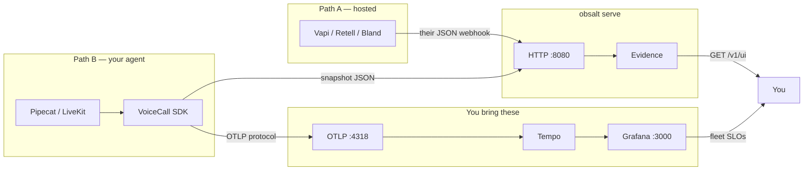

# obsalt

Observability for voice AI agents. One **trace** for where time went, one **evidence** record for what was said.

obsalt is software you run. It is not a hosted dashboard. Traces go to Grafana Tempo (or Jaeger, Honeycomb). Transcripts, tools, hangups, and evals stay in obsalt and are queried over HTTP. Open `/v1/ui` to see one call's span tree next to its transcript without copying `call.id` between tools.

There are **two integrations**. Mixing them on the same call is almost always a mistake.

```
Who owns STT / LLM / TTS?
├─ Vapi / Retell / Bland     → Path A: webhook → obsalt serve
└─ Pipecat / LiveKit / you   → Path B: VoiceCall in the agent process
```

Full decision: **[Choose a path](docs/choose-a-path.md)**. What Grafana vs the API shows: **[What you can see](docs/what-you-see.md)**. Names that look like servers: **[Glossary](docs/glossary.md)** (OTLP, VoiceCallTracer, snapshot).



## Path A — hosted platform

Run `obsalt serve`. Point the vendor webhook at it. Do **not** import `VoiceCall`.

```bash
obsalt init
obsalt serve
# Vapi Server URL: http://localhost:8080/v1/ingest/vapi
```

Guides: [Vapi](docs/providers/vapi.md) · [Retell](docs/providers/retell.md) · [Bland](docs/providers/bland.md).

The vendor’s JSON *is* the evidence. obsalt adapters translate it. They will never send a `CallRecorder` snapshot — that JSON schema is ours, not theirs.

## Path B — Pipecat / custom agent

Instrument **your** process. `VoiceCall` emits live spans over OTLP and can POST evidence.

```python
from obsalt import VoiceCall, ObsaltClient, setup_tracing

setup_tracing(otlp_endpoint="http://localhost:4318")

with VoiceCall.start(
    call_id=room_id,
    workspace_id="acme",
    agent_id="support",
    client=ObsaltClient(api_key="secret"),  # omit for Tempo only
) as call:
    with call.turn(0, "user", text="book Friday") as turn:
        with turn.stt("deepgram") as stt:
            stt.set(confidence=0.91, latency_ms=412)
        with turn.llm("gpt-4o") as llm:
            llm.set(ttft_ms=340)
        with turn.tts("elevenlabs") as tts:
            tts.set(first_audio_ms=70)
```

Pipecat: `from obsalt.integrations.pipecat import ObsaltObserver`. Guide: [Custom agents](docs/custom-agents.md).

`VoiceCallTracer` is a library class (not a server). **OTLP** is a protocol (not a server). `obsalt serve` is the HTTP server.

## What you look at

| Question | Where |
| --- | --- |
| Where did 1.8s go **and** what was said? | `http://localhost:8080/v1/ui` (per-call join view) |
| Fleet waterfalls / P95 | Grafana → Tempo / Prometheus |
| Hangup clusters / search | `GET /v1/hangups`, `GET /v1/search` |

The join view does **not** put transcripts on OpenTelemetry spans. Grafana remains the fleet UI. [What you can see](docs/what-you-see.md).

## Install

Python 3.11+.

```bash
pip install -e ".[dev]"
```

## 60-second setup (Path A, with a fixture)

```bash
obsalt init
# optional local Tempo + Grafana + Prometheus:
# docker run --rm -p 3000:3000 -p 4317:4317 -p 4318:4318 grafana/otel-lgtm
obsalt doctor
obsalt serve
```

```bash
curl -X POST http://localhost:8080/v1/ingest/vapi \
  -H "X-API-Key: change-me" \
  -H "Content-Type: application/json" \
  -d @tests/fixtures/vapi_end_of_call.json

curl -H "X-API-Key: change-me" http://localhost:8080/v1/calls
# then open http://localhost:8080/v1/ui
```

Auth header: `X-API-Key` (secret from `obsalt.toml` / `OBSALT_API_KEYS`). Walkthrough: [Getting started](docs/getting-started.md).

## Why not Langfuse / generic GenAI tracing?

A voice turn is not a chat completion. Time-to-first-audio is VAD + STT + LLM TTFT + TTS TTFB. LLM dashboards stay green while the caller hears silence because STT fell back, a tool timed out, or the transcript never finalized. OpenTelemetry GenAI conventions cover LLM and tools. They do not standardize STT, TTS, VAD, barge-in, or SIP. obsalt follows that split: spans stay reviewer-safe; `/v1/ui` joins them to evidence. The span tree matches the [conversation-shaped voice-agent model](https://hamming.ai/resources/opentelemetry-voice-agents-tracing-guide) (call → turn → STT/LLM/TTS), including the rule that transcripts do not belong on span attributes.

## Documentation

| Guide | When |
| --- | --- |
| [Choose a path](docs/choose-a-path.md) | Hosted vs Pipecat — start here |
| [What you can see](docs/what-you-see.md) | Grafana vs HTTP API vs Prometheus |
| [Glossary](docs/glossary.md) | OTLP, VoiceCallTracer, snapshot |
| [Getting started](docs/getting-started.md) | Install, `init` / `doctor` / `serve` |
| [Architecture](docs/architecture.md) | Hierarchy of processes |
| [Custom agents](docs/custom-agents.md) | Pipecat `VoiceCall` / observer |
| [Providers](docs/providers/index.md) | Vapi, Retell, Bland, Realtime |
| [Native snapshot](docs/providers/native.md) | The JSON packet Path B POSTs |
| [HTTP API](docs/api.md) | Ingest and evidence |
| [Metrics and Grafana](docs/grafana.md) | Prometheus vs Tempo |

## CLI

```text
obsalt init          Write obsalt.toml and .env.example
obsalt doctor        Check keys, auth, and OTLP reachability
obsalt serve         Run the ingest & evidence API
obsalt parse FILE    Normalize a webhook locally (auto-detects provider)
obsalt version
```

`obsalt --port 8080` still works as `obsalt serve`.

## Tests

```bash
python3 -m pytest
```

## Status

v0.1. Evidence is in-memory (a restart loses calls). Default evals are heuristic, not an LLM judge. There is no hosted UI.
