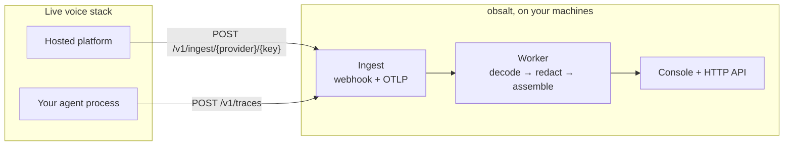

# obsalt

Self-hosted call analytics and quality for live AI voice agents.

obsalt is a **service you run**. It is not a SaaS, not an agent builder, and
not a better Grafana. You install it next to your voice stack. Live calls
flow in. You open a console when one of them went wrong — or when you want
to know which agent is losing customers.

**Product managers:** start at [What obsalt is](docs/product.md) — the six
capabilities, what a week of adoption looks like, and what each provider
will *actually* show you.

Three pieces ship together:

| Piece | What it is |
| --- | --- |
| **Service** | HTTP API + worker. Receives calls, stores them, scores them. |
| **Console** | The web UI at `/v1/ui`. Call list, join view, hangups, evals, search. |
| **`VoiceCall`** | A thin tracer you import **only** if you own the agent process. |

Providers are **plugins**. Core ships none. You install `obsalt-vapi` or
`obsalt-pipecat` the same way you install any other Python package.

```
Hosted platform (Vapi, Retell, …)  --signed webhook-->  obsalt service
Your agent (Pipecat, LiveKit, …)   --OTLP traces----->       |
                                                              +--> console  /v1/ui
                                                              +--> your Tempo / Grafana
                                                              +--> HTTP API  /v1/*
```

## Architecture

A call enters as raw bytes. Nothing provider-facing waits on analysis.
Decode happens in a worker. The console reads a complete, immutable
revision — never a half-built guess.



Under the hood: Postgres (inbox, keys, the "which revision is live" pointer),
ClickHouse (immutable call facts), object storage (raw payloads, short-lived),
Redis (lease accelerator only). There is no SQLite mode. `docker compose up`
is the supported path.

The rule that keeps the product honest: **a timeline bar is drawn only when
we have real start and end timestamps.** Hosted platforms often send
durations without clocks. Those become chips, not invented waterfalls. The
console says so.

Full internals: [Architecture](docs/architecture.md).

## The product, in six lines

| Capability | The question it answers |
| --- | --- |
| **Latency** | Where did time go — without inventing a waterfall? |
| **Hangups** | Why did we lose this caller? |
| **Hallucination** | Did the agent invent a price, an id, or a completed tool? |
| **Tools** | Which function calls fail, retry, or stall the turn? |
| **Evals** | Did this call meet *our* bar, in plain English? |
| **Search** | “Customers asking about refunds.” |

What you will see on Vapi vs Pipecat is not the same, and the console
says so. Details: [Product](docs/product.md) and [The console](docs/console.md).

## Two ways to connect a live agent

Pick **one** per call. Mixing a webhook and OTLP on the same conversation
gives you two partial records that do not join.

| You already run | How it connects | What you install | Guide |
| --- | --- | --- | --- |
| **Vapi, Retell, ElevenLabs, Cartesia** | They POST a signed webhook at you | `obsalt-vapi` / `obsalt-retell` / … | [Connect a hosted platform](docs/connect-hosted.md) |
| **Pipecat, LiveKit, OpenAI Realtime, Gemini Live** | Your process emits OTLP | `obsalt-pipecat` / `obsalt-livekit` / … | [Connect your own agent](docs/connect-custom.md) |

Hosted platforms do not push standard OTLP to an arbitrary collector. Their
webhook is the path that exists. Custom agents have real clocks; those
spans can draw a waterfall, and they still get forwarded to your existing
backend.

**What data you will actually see** — including the provider-by-provider
gaps — is in [The console](docs/console.md). Read that before you expect a
stage waterfall from Vapi.

## 60-second start

```bash
git clone https://github.com/coder-with-a-bushido/obsalt.git
cd obsalt
python -m pip install -r requirements-dev.txt
docker compose up -d
obsalt init --write-env
obsalt doctor
obsalt serve
```

In another terminal: `obsalt worker`.

`doctor` must show your plugins and `postgres` / `clickhouse` / `object_store`
as ok. Redis is optional (lease accelerator). If serve exits 2, compose
is not up — there is no SQLite mode.

Open http://localhost:8080/v1/ui and sign in with `dev-key`. That bootstrap
key is fine on localhost. Change `OBSALT_BOOTSTRAP_API_KEY` before anything
is reachable from a network you do not trust.

Then connect a real agent — [hosted](docs/connect-hosted.md) or
[your own](docs/connect-custom.md) — place one call, and open it in the
console. If a latency number is a chip instead of a bar, that is the
product working.

Walkthrough: [Getting started](docs/getting-started.md).

## Documentation

| I want to… | Go here |
| --- | --- |
| Decide if this is the right tool | [Product guide](docs/product.md) |
| Run it on my machine | [Getting started](docs/getting-started.md) |
| Point Vapi / Retell / ElevenLabs / Cartesia at it | [Connect a hosted platform](docs/connect-hosted.md) |
| Point my Pipecat / LiveKit / Realtime / Gemini agent at it | [Connect your own agent](docs/connect-custom.md) |
| Know what I will see, provider by provider | [The console](docs/console.md) |
| Something is wrong | [Troubleshooting](docs/troubleshooting.md) |
| Call the HTTP API | [HTTP API](docs/api.md) |
| Run it for real | [Operate](docs/ops.md) |
| Understand the insides | [Architecture](docs/architecture.md) |
| Write a provider plugin | [Write a plugin](docs/plugins.md) |
| Change this repo | [Developing](docs/developing.md) · [Conventions](docs/conventions.md) |

The map of the whole tree is [docs/README.md](docs/README.md).

## Repository

```
packages/obsalt            service: domain, ingest, assembly, analysis, API, UI
packages/obsalt-testkit    conformance tests for plugin authors
packages/obsalt-*          first-party source plugins (not bundled into core)
tests/                     unit / integration / blackbox / contract / conformance
docs/                      start here after this README
```

```bash
pip install "obsalt[vapi,retell]"
# or every first-party plugin:
pip install obsalt-providers-all
```

## Develop

```bash
make install
make test-unit          # fast path
make ci                 # lint + typecheck + full tests
```

This product is unreleased. Packaging versions exist so extras resolve;
they are not a public release number.

License: Apache-2.0
