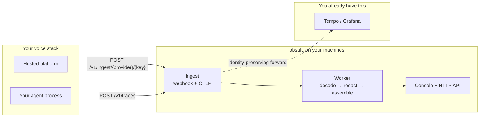

# obsalt

The production call record for live AI voice agents.

You already have a voice stack. Vapi, Retell, Pipecat, LiveKit — something
that talks to customers. What you do **not** have is a place that joins
the transcript, the timing, the hangup, the tools, and the “did we just
invent a refund?” question on one page you own.

obsalt is that place. You run it. Calls flow in. The console is what you
open at 2 a.m. when a call went weird, and what a PM opens on Monday when
an agent is quietly losing people after the hold music.

It is a **service**, not a SaaS, not an agent builder, and not Grafana
with extra feelings.

| Piece | What you get |
| --- | --- |
| **Service** | HTTP API + worker. Receives calls, stores them, scores them. |
| **Console** | Seven screens at `/v1/ui`. No query builder. The join view is the product. |
| **`VoiceCall`** | A thin tracer. Import it only if **you** own the agent process. |

Core ships **no** providers. `obsalt-vapi` and `obsalt-pipecat` are ordinary
Python packages, same contract as a plugin you write on a Friday.

**Deciding?** Start at [the product guide](docs/product.md) — six
capabilities, a week of adoption, and the table that tells you what Vapi
will actually send.

## The shape of the system

A call enters as raw bytes. The provider gets an ack. Decode happens in a
worker. The console reads a complete, immutable revision — never a
half-built guess.

```
Hosted platform (Vapi, Retell, …)  --signed webhook-->  obsalt
Your agent (Pipecat, LiveKit, …)   --OTLP traces----->     |
                                                           +--> console   /v1/ui
                                                           +--> your Tempo / Grafana
                                                           +--> HTTP API  /v1/*
```



Under the hood: Postgres (inbox, keys, the “which revision is live”
pointer), ClickHouse (immutable call facts), object storage (raw
payloads, short-lived), Redis (lease accelerator only). There is no
SQLite mode. `docker compose up` is the supported path.

The rule that keeps the product honest: **a timeline bar is drawn only
when we have real start and end timestamps.** Hosted platforms often send
durations without clocks. Those become chips, not invented waterfalls.
The console says so.

Internals: [Architecture](docs/architecture.md).

## Six questions the product answers

| Capability | The question |
| --- | --- |
| **Latency** | Where did time go — without inventing a waterfall? |
| **Hangups** | Why did we lose this caller? |
| **Hallucination** | Did the agent invent a price, an id, or a completed tool? |
| **Tools** | Which function calls fail, retry, or stall the turn? |
| **Evals** | Did this call meet *our* bar, in plain English? |
| **Search** | “Customers asking about refunds.” |

What you see on Vapi is not what you see on Pipecat. That is not a bug.
Read your row in [the console](docs/console.md) before you file one.

## Two doors in

Pick **one** per call. Mixing a webhook and OTLP on the same conversation
gives you two partial records that do not join.

| You already run | How it connects | What you install | Guide |
| --- | --- | --- | --- |
| **Vapi, Retell, ElevenLabs, Cartesia** | They POST a signed webhook at you | `obsalt-vapi` / `obsalt-retell` / … | [Connect a hosted platform](docs/connect-hosted.md) |
| **Pipecat, LiveKit, OpenAI Realtime, Gemini Live** | Your process emits OTLP | `obsalt-pipecat` / `obsalt-livekit` / … | [Connect your own agent](docs/connect-custom.md) |

Hosted platforms do not push standard OTLP to an arbitrary collector.
Their webhook is the path that exists. Custom agents have real clocks;
those spans can draw a waterfall, and they still get forwarded to the
backend you already pay for.

## 60 seconds to a console

This gets you a signed-in UI. An empty call list is success — fixtures
in this repo are for tests. The console fills from **live** traffic.

```bash
git clone https://github.com/coder-with-a-bushido/obsalt.git
cd obsalt
python -m pip install -r requirements-dev.txt
docker compose up -d
obsalt init --write-env
obsalt doctor
obsalt serve
```

In another terminal: `obsalt worker`.

`doctor` must show your plugins and `postgres` / `clickhouse` /
`object_store` as ok. Redis is optional. If serve exits 2, compose is not
up — there is no SQLite mode.

Open http://localhost:8080/v1/ui and sign in with `dev-key`. That
bootstrap key is fine on localhost. Change `OBSALT_BOOTSTRAP_API_KEY`
before anything is reachable from a network you do not trust.

Then connect **one** live agent — [hosted](docs/connect-hosted.md) or
[your own](docs/connect-custom.md) — place a real call, and open it. If a
latency number is a chip instead of a bar, the product is working.

Walkthrough: [Getting started](docs/getting-started.md).

## Where to go

| I want to… | Go here |
| --- | --- |
| Decide if this is the right tool | [Product](docs/product.md) |
| Run it on my machine | [Getting started](docs/getting-started.md) |
| Point Vapi / Retell / ElevenLabs / Cartesia at it | [Connect a hosted platform](docs/connect-hosted.md) |
| Point my Pipecat / LiveKit / Realtime / Gemini agent at it | [Connect your own agent](docs/connect-custom.md) |
| Know what I will see, provider by provider | [The console](docs/console.md) |
| Something is wrong | [Troubleshooting](docs/troubleshooting.md) |
| Call the HTTP API | [HTTP API](docs/api.md) |
| Run it for real | [Operate](docs/ops.md) |
| Understand the insides | [Architecture](docs/architecture.md) |
| Write a provider plugin | [Write a plugin](docs/plugins.md) |
| Change this repo | [Developing](docs/developing.md) · [Conventions](docs/conventions.md) |

The map of the whole tree is [docs/README.md](docs/README.md).

## Repository

```
packages/obsalt            service: domain, ingest, assembly, analysis, API, UI
packages/obsalt-testkit    conformance tests for plugin authors
packages/obsalt-*          first-party source plugins (not bundled into core)
tests/                     unit / integration / blackbox / contract / conformance
docs/                      start here after this README
```

```bash
pip install "obsalt[vapi,retell]"
# or every first-party plugin:
pip install obsalt-providers-all
```

```bash
make install
make test-unit          # fast path
make ci                 # lint + typecheck + full tests
```

This product is unreleased. Packaging versions exist so extras resolve;
they are not a public release number.

License: Apache-2.0
