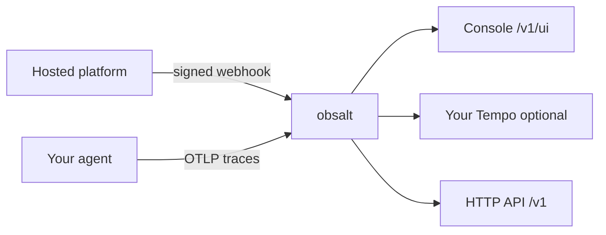

# obsalt

Self-hosted call analytics and quality for live AI voice agents.

You already have a voice stack — Vapi, Retell, Pipecat, LiveKit, or
something that talks to customers. obsalt is the service you run next
to it. Live calls flow in. The console joins the transcript, the
timing, the hangup, the tools, and quality checks on one page you own.

| Piece | What you get |
| --- | --- |
| **Service** | HTTP API + worker. Receives calls, stores them, scores them. |
| **Console** | Seven screens at `/v1/ui`. The call-detail join view is the product. |
| **`VoiceCall`** | A thin tracer. Import it only if **you** own the agent process. |

Core ships **no** providers. Install `obsalt-vapi`, `obsalt-pipecat`,
or another source plugin. Memory stores are test doubles, not a
backend. There is no SQLite mode.

Start at [What obsalt does](docs/product.md).

## How a call gets in



Pick **one** path per call. Mixing a webhook and OTLP on the same
conversation gives you two partial records that do not join.

A timeline bar is drawn only when the source sent real start and end
timestamps. Hosted platforms often send durations without clocks.
Those become chips, not invented waterfalls.

Under the hood: Postgres (inbox, keys, which revision is live),
ClickHouse (immutable call facts), object storage (raw payloads,
short-lived), Redis (optional lease accelerator).
`docker compose up` is the supported path.

## What it answers

| Capability | Question |
| --- | --- |
| **Latency** | Where did time go? |
| **Hangups** | Why did we lose this caller? |
| **Hallucination** | Did the agent invent a price, an id, or a completed tool? |
| **Tools** | Which function calls fail, retry, or stall the turn? |
| **Evals** | Did this call meet *our* bar, in plain English? |
| **Search** | Show me calls where customers asked about refunds. |

What you see on Vapi is not what you see on Pipecat. Read your row in
[the console](docs/console.md) before you file a bug.

## Two ways in

| You already run | How it connects | Guide |
| --- | --- | --- |
| **Vapi, Retell, ElevenLabs, Cartesia** | They POST a signed webhook | [Connect a hosted platform](docs/connect-hosted.md) |
| **Pipecat, LiveKit, OpenAI Realtime, Gemini Live** | Your process emits OTLP | [Connect your own agent](docs/connect-custom.md) |

## Run it

```bash
git clone https://github.com/coder-with-a-bushido/obsalt.git && cd obsalt && docker compose up -d
```

That is Postgres, ClickHouse, Redis, MinIO, the API + console on
:8080, and the decode worker. An empty call list is success. Open
http://localhost:8080/v1/ui and sign in with `dev-key`. Change
`OBSALT_BOOTSTRAP_API_KEY` in `.env` before anything is reachable from
a network you do not trust.

Developers who want the console populated locally: `obsalt seed`
(see [Develop](docs/develop.md)). Host processes instead of containers:
[Start](docs/start.md).

## Documentation

| I want to… | Go here |
| --- | --- |
| See what the product does | [What obsalt does](docs/product.md) |
| Run it on my machine | [Start](docs/start.md) |
| Point Vapi / Retell / ElevenLabs / Cartesia at it | [Connect a hosted platform](docs/connect-hosted.md) |
| Point my Pipecat / LiveKit / Realtime / Gemini agent at it | [Connect your own agent](docs/connect-custom.md) |
| Know what I will see, provider by provider | [The console](docs/console.md) |
| Fix an empty list, a 401, or a missing waterfall | [Operate](docs/operate.md) |
| Call the HTTP API | [HTTP API](docs/api.md) |
| Change this repo | [Develop](docs/develop.md) · [Conventions](docs/conventions.md) |

Full index: [docs/README.md](docs/README.md).

## Repository

```
packages/obsalt            service: domain, ingest, assembly, analysis, API, UI
packages/obsalt-testkit    conformance tests for plugin authors
packages/obsalt-*          first-party source plugins (not bundled into core)
tests/                     unit / integration / blackbox / contract / conformance
docs/                      start here after this README
```

```bash
make install
make test-unit          # fast path
make ci                 # lint + typecheck + full tests
```

This product is unreleased. Packaging versions exist so extras resolve;
they are not a public release number.

License: Apache-2.0
