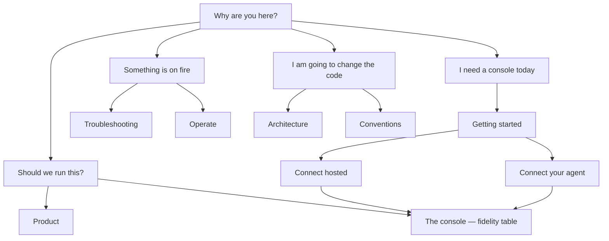

# Docs

Start at the [root README](../README.md) if you have not already. This
page is the trailhead. Pick a door. Do not hike every trail.

These pages follow the same contract as the product: **never invent a
waterfall.** If a source cannot send stage clocks, we say so in a table
on the first screen — not in a footnote after you have already planned
the quarter. Every page states who it is for, the question it answers,
and what it will not do.

## Should we run this?

For founders, PMs, QA leads, and the engineer who has to explain it
without opening a sequence diagram.

1. [Product](product.md) — what it is, the six capabilities, a week of
   adoption, vs Grafana / Hamming / the vendor dashboard.
2. [The console](console.md) — what you will **actually** see, provider
   by provider. Read this before you expect a Vapi waterfall.
3. [Glossary](reference/glossary.md) — chip, revision, provenance, and
   the other words we refuse to rename.

Then hand the install to an engineer, or keep going.

## I need a console today

1. [Getting started](getting-started.md) — compose, sign in, empty list
   (that is success).
2. Then **one** of:
   - [Connect a hosted platform](connect-hosted.md) — Vapi, Retell,
     ElevenLabs, Cartesia
   - [Connect your own agent](connect-custom.md) — Pipecat, LiveKit,
     Realtime, Gemini Live
3. [The console](console.md) — join view, provenance, fidelity.
4. [Troubleshooting](troubleshooting.md) — empty list, 401s, missing
   waterfall.

That is the whole end-to-end path. Mixing a webhook and OTLP on the same
call is almost always a mistake.

## Something is on fire / this is going to production

- [Operate](ops.md) — health, retention, deletion, rotation
- [Configuration](reference/configuration.md) — every `OBSALT_*` setting
- [CLI](reference/cli.md) — `serve`, `worker`, `doctor`, …
- [HTTP API](api.md) — `/v1` for scripts and the console
- [Security](reference/security.md) — tenancy, redaction, egress

## I am going to change it

- [Conventions](conventions.md) — vocabulary, tenets, tests, docs duty
- [Developing](developing.md) — repo layout, PR bar, adding a source
- [Architecture](architecture.md) — pipeline, stores, the rules we will
  not break
- [Write a plugin](plugins.md) — public contract, fixtures, golden files
- [Domain](reference/domain.md) — events, revisions, measurements
- [OTLP](reference/otlp.md) — span names, attributes, PII
- [AGENTS.md](../AGENTS.md) — one-screen version for coding agents
- [llms.txt](llms.txt) — the same map, compacted for machines

## How these pages are written

Six essays shaped this tree. The short version of our take:

| Habit | What it means here |
| --- | --- |
| **Docs are a product** | Show the ugly table. Do not describe a setting when you can give the curl. |
| **One question per page** | What exists, what the rules are, how to do a thing, what to do when it breaks. Not all four. |
| **Trailheads, not a wiki** | This index is a decision tree. People pogo. Headings are outcomes. |
| **Humans and agents** | Stable vocabulary, scannable tables, no contradictory asides. A coding agent that scrapes this should not invent a SQLite mode. |
| **Real value, not hello-world** | The quickstart gets you a signed-in console. The next page gets you a live call. |
| **What's next** | Every how-to ends with a door. No cliffs. |

We keep the comparison tables and the flow charts because they decide
faster than prose. Informal language is allowed. Sloppy units are not.

## One paragraph

obsalt is a self-hosted **service** (API + worker) with a **web
console**. If you build your own agent, it also exposes a small
**`VoiceCall` tracer**. It is not a hosted dashboard you log into, and
it is not an SDK that replaces your voice platform. You connect live
agents; you look at calls. The product is six capabilities: latency,
hangups, hallucination, tools, evals, and search. Everything else is in
service of those.
