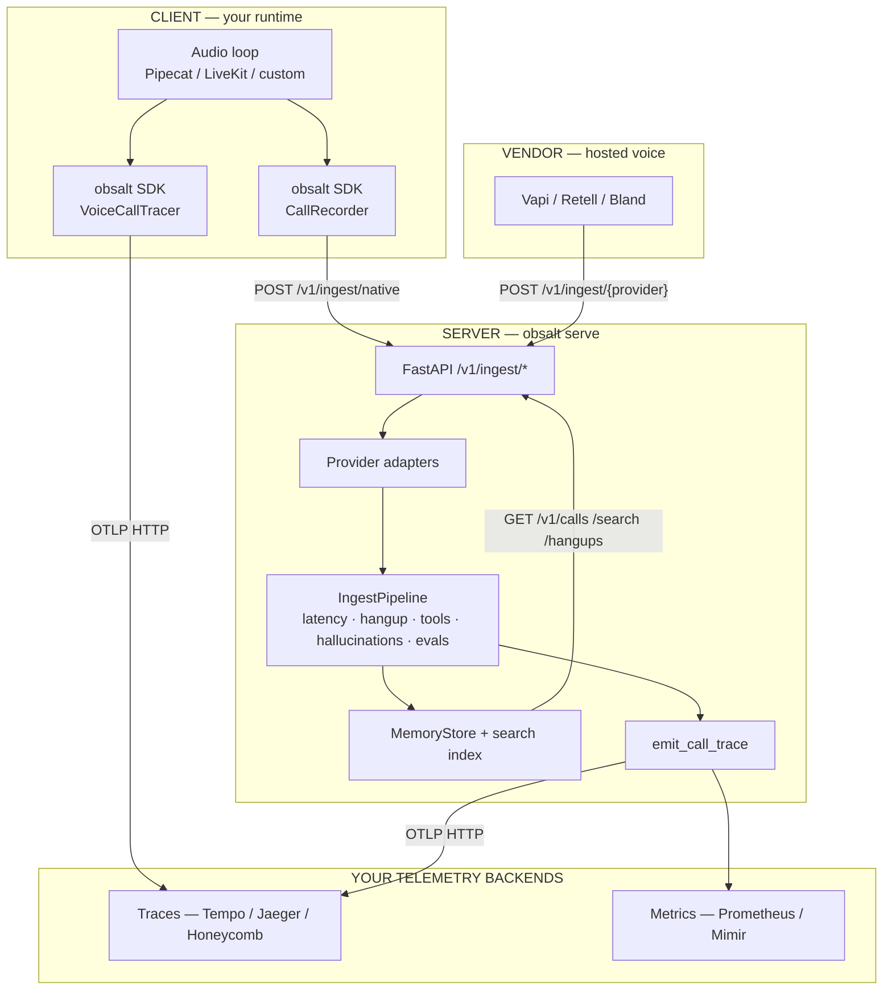
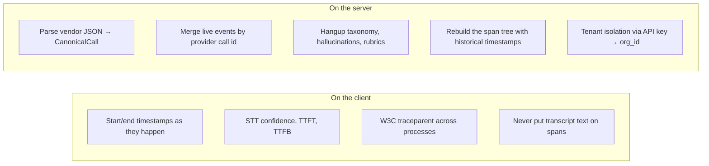

# Architecture

obsalt has two jobs:

1. Turn a voice call into an OpenTelemetry **trace** you can open in Tempo, Jaeger, or Honeycomb.
2. Keep an **evidence** record of that call — transcript, tools, hangup, hallucinations, evals — that you look up over HTTP.

Those jobs share one data model (`CanonicalCall`). They do **not** share one process.

## What runs where

| Surface | Process | What it is | What it is not |
| --- | --- | --- | --- |
| **SDK** (`VoiceCallTracer`, `setup_tracing`) | Your agent | A library. Wrap STT / LLM / TTS. Spans export over OTLP from *this* process. | It does not store transcripts. It does not run evals. It does not need `obsalt serve`. |
| **SDK** (`CallRecorder`, `ObsaltClient`) | Your agent | Builds a JSON snapshot and POSTs it. | It does not emit spans unless you also use `VoiceCallTracer`. |
| **Server** (`obsalt serve`) | Your API host | Webhooks in, evidence out, reconstructed spans to OTLP, analysis. | It is not a UI. It does not place calls. It does not keep data across restarts (v0.1). |

Use the SDK when you own the audio loop. Use the server when a hosted platform owns it. Use both when you want a live waterfall **and** searchable evidence.

## Client vs server responsibilities

The reconstructed tree from a webhook is the same shape as a live `VoiceCallTracer` tree. See [Trace model](trace-model.md).

## Traces vs evidence

| | Traces (OTLP) | Evidence (store) |
| --- | --- | --- |
| Purpose | “Where did the 1.8s go?” | “What did the agent say?” |
| Contents | Span names, timings, join keys, debug attributes | Transcript, recording URL, redacted tool args, analysis |
| Backend | Tempo, Jaeger, Honeycomb | obsalt HTTP API (in-memory today) |
| PII | Forbidden by default | Stored, redacted where possible |
| Produced by | SDK live, **or** server reconstruction | Server ingest only |

Spans carry pointers (`evidence.transcript_id`, `evidence.recording_id`), not the transcript. That is why a live-instrumented call is invisible to `/v1/search` until you also ingest a snapshot.

Join: `workspace.id` = tenant (`org_id` from the API key). `call.id` = obsalt id (`uuid5` of org + provider + provider call id). Grafana filters on `call.id`; `GET /v1/calls/{that id}` is the evidence.

## Ingest pipeline (server)

On a **terminal** webhook (`end-of-call-report`, `call_ended`, Bland post-call, native `final: true`):

1. Adapter parses the payload into a `CanonicalCall`.
2. Live events for the same provider call id are **merged** (idempotent).
3. Tool argument values are redacted (keys stay; secrets become `<string:redacted>`).
4. `finalize` runs: latency derivation, tool retries, hangup taxonomy, hallucination flags, rubric evals.
5. The call is written to the store and indexed for search.
6. `emit_call_trace` rebuilds the span tree using the call’s real timestamps, not “now”.

Non-terminal events (Vapi `status-update`, Bland live `category=latency`) merge and return without analysis.

Adapters never invent STT fallbacks. One hop in the payload is one `stt.provider.{name}` child.

Detailed sequence: [Data flow](data-flow.md).

## Analysis engines

All of these run against evidence, then attach `evaluation.assertion_check` spans to the same `call.lifecycle` root.

- **Latency** — STT, LLM, TTS, time-to-first-audio. Turn gaps fill TTFA when the provider omitted it.
- **Hangup** — Provider codes collapse to one taxonomy. Clusters group by reason, party, and last-utterance theme, and surface `lost_customer_call_id`.
- **Tools** — Success rate, consecutive-failure retries, payload JSON-type shape, time-to-tool.
- **Hallucinations** — Deterministic claim checks against grounding (prompt + knowledge + tool results + user text).
- **Evals** — `HeuristicJudge` interprets plain-English rubrics (`hallucination`, `latency`, `frustrated`, …). Swap in `LlmJudge` later on the same `Judge` protocol.

## Metrics

Exported over OTLP when `OBSALT_OTLP_ENDPOINT` is set. Labels are low cardinality: `agent`, `environment`, `stage`, `outcome`, `tool_name`. **Never** `call_id`. See [Metrics and Grafana](grafana.md).

## Package layout (what lives where in the repo)

| Path | Layer |
| --- | --- |
| `obsalt.tracing` | Client **and** server span conventions, `VoiceCallTracer`, OTLP setup |
| `obsalt.sdk` / `obsalt.client` | Client snapshot builder + HTTP client |
| `obsalt.adapters` | Server: vendor JSON → `CanonicalCall` |
| `obsalt.pipeline` | Server: merge, analyze, emit |
| `obsalt.store` | Server: in-memory evidence + search |
| `obsalt.api` / `obsalt.cli` | Server process |

## What this repository does not include

- A web UI. Use Grafana / Tempo / your OTLP vendor.
- Durable storage. `MemoryStore` dies with the process.
- A voice platform. obsalt observes calls; it does not dial them.
- An LLM judge or embedding API by default. Those are swap-in types (`LlmJudge`, `OpenAICompatEmbedder`).
