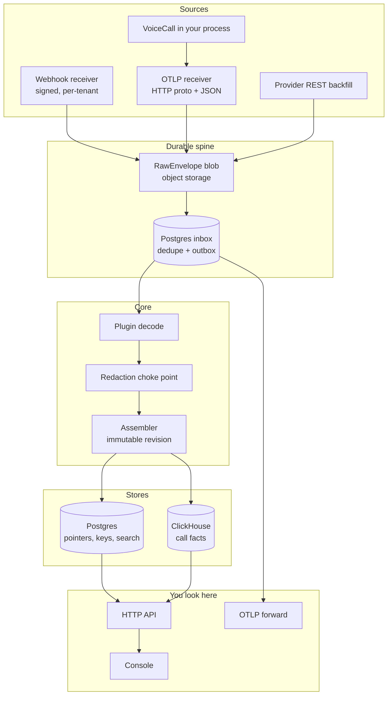

# Architecture

A call enters as raw bytes. It becomes something you can trust only after
it is authenticated, persisted, decoded, redacted, assembled, and
promoted. Nothing the provider is waiting on does the expensive work.

If you are connecting an agent, you do not need this page.
[Getting started](getting-started.md) and the connect guides are enough.
This page is for people who will change obsalt — or who need to know why
the console refuses to draw a pretty lie.

## The rules we will not break

These are load-bearing. If one of them is wrong, the shape of the system
changes. Attack them in review before anything else.

1. **Never draw what you did not measure.** A waterfall bar requires real
   start and end. Durations without clocks are chips or distributions.
   Provider p50/p95 never enter sample percentiles.
2. **Provenance is a field, not a footnote.** Every value is
   `provider_reported` (with a source path) or `obsalt_derived` (with a
   derivation). Absence is its own fact, with a reason. That is how we
   tell "they did not send it" from "we dropped it."
3. **Raw first, then ack.** The wire bytes hit object storage and a
   Postgres inbox/outbox **before** the provider-facing success response.
   Decode is a pure function. Adapter bugs become replays, not silent
   holes. Replay dies when raw retention dies; the console says so.
4. **Decoders are validated against the vendor, not against themselves.**
   Fixtures must match a vendored schema. Golden `NormalizedEvent[]`
   plus unit assertions cover units, placement, and pairing — things a
   schema will not catch.
5. **One choke point per cross-cutting concern.** All sources hit one
   normalize/assemble path. Queryable content crosses one redaction
   boundary. Forwarded telemetry crosses one export-policy boundary.
   Plugins cannot skip either.
6. **Decode, assemble, and analyze are separate, versioned stages.**
   Reprocessing builds a complete new revision and promotes it. We do
   not mutate a stored call in place.
7. **Pick the storage engine once.** Production is Postgres + ClickHouse
   + object storage. Memory types are test doubles. There is no
   pluggable-backend layer and no SQLite mode.
8. **Providers are separately installable packages.** Core ships none.
   First-party plugins use the same public contract as anyone else's.
9. **Expensive analysis is sampled and budget-capped.** Cheap
   deterministic work runs on every call. LLM judges run on a trigger or
   a sample, behind a hard per-org monthly cap. Missing judge output is
   not a pass.
10. **Tenant identity comes only from authenticated credentials.**
    Payload fields and OTLP resource attributes may corroborate. They
    may never select an org. There is no `require_auth=false`.

## Pipeline

| Stage | Input | Output |
| --- | --- | --- |
| Receive | HTTP request | `RawEnvelope` committed; provider-specific ack |
| Decode | `RawEnvelope` | `NormalizedEvent[]` (plugin, `decoder_version`) |
| Redact | those events | same, policy-stamped |
| Assemble | events | immutable `CallRevision` |
| Promote | candidate in ClickHouse | Postgres pointer CAS |
| Analyze T1 | active revision | hangup, tools, coverage, flags |
| Index | active revision | lexical + vector search doc |
| Analyze T2 | active revision | LLM eval / hallucination, if sampled |

Receive, in order, and not negotiable:

1. Read **raw bytes**. Parsing first breaks signatures.
2. Resolve `ingest_key` → org, plugin, encrypted credentials.
3. Fail-closed auth.
4. Classify. Observational events only on the webhook path.
5. Delivery key (transport identity ≠ call identity).
6. Write the blob. Commit inbox + dedupe + outbox in one Postgres
   transaction.
7. Ack.

OTLP (`POST /v1/traces`) uses the same durability path. Tenancy is the
ingest key. obsalt is **not** a general span store. Raw spans stay in
the archive for replay and forwarding. The queryable model is the call.

Voice calls have a natural upper bound generic tracing lacks. A trace
finalizes at `min(root_ended_at + grace, first_seen_at + max_call_duration)`.
A still-rootless trace becomes `unrooted` and does not invent an outcome.

## Promotion

There is no cross-database transaction. We do not pretend there is:

1. Write a complete candidate revision to ClickHouse. Wait until it is
   query-visible.
2. CAS the Postgres active-revision pointer. Failed CAS rebases and
   retries. An envelope is not "assembled" until some active revision
   covers its facts.
3. Call detail reads the pointer first, then that exact ClickHouse
   revision. Never `SELECT latest`.
4. Analysis and search are keyed by revision. States are explicit:
   `pending`, `sampled_out`, `budget_blocked`, `running`, `failed`,
   `completed`.
5. Fleet rollups are serving generations. One `as_of_generation` per
   response. A page never mixes generations.

Late events create a **new** revision. History stays put.

## Stores

| Store | Holds |
| --- | --- |
| **ClickHouse** | Immutable revisions, turns, stage measurements, tools, analysis. Append-mostly, percentile queries. |
| **Postgres** | Inbox, outbox, dedupe, active-revision pointer, keys, encrypted secrets, tombstones, search documents + pgvector. |
| **Object storage** | Org-namespaced raw blobs (unredacted, short-lived), evidence, recordings. |
| **Redis** | Lease accelerator. If it dies, workers still claim from Postgres. |

Queries always specify `(org_id, call_id, revision)`. Call-list cursors
are `{call_id}:{revision}`.

This split is intentional. Receive needs a transaction. A year of stage
measurements does not belong in the same engine. We are not going to add
a second storage backend to make `pip install && serve` look friendlier.
Compose is the compromise.

Retention defaults: 30 days raw, 90 days transcripts, 400 days
aggregates. Raw is unredacted on purpose — that is the replay tradeoff.

Search is hybrid (lexical + vector) over redacted content. Default
embedder is a local ONNX model.

## Measurement vs timeline

Hosted platforms send durations. They often do not send stage clocks.
Those are different facts:

- `StageMeasurement` — one duration, with `placement` (`interval`,
  `anchored_duration`, `unplaced`, `coarse_anchor`) and provenance.
- `AggregateMeasurement` — a provider p95. Stored separately. Never
  mixed into sample rollups.
- `SignalCoverage` — present / absent / unsupported / redacted /
  decode_failed.

A plugin that claims `INTERVAL` and emits a value without timestamps
fails conformance. A plugin that marks a signal unsupported while its
own fixtures contain the unconsumed field also fails.

Speech-to-speech sources use `user_input` / `generation` / `playout`.
Cascade STT/LLM/TTS rows must not appear as empty placeholders.

## What we are not building next to this

- A second storage backend, or SQLite "for demo."
- Waterfalls reconstructed from summary statistics.
- Decode on the webhook request path.
- A Langfuse-shaped ingest shim (tempting for Vapi; a moving proprietary
  API). First-class webhooks and OTLP win.
- Tenant-uploaded plugins. Operator-installed wheels are trusted code,
  not a sandbox.
- Deepgram as a first-party plugin. `StreamSource` is declared so a tap
  can land later without a core change.
- Bland as a first-party plugin. The contract would accept it; it is
  not in the committed set.

Domain types and hangup reasons: [domain](reference/domain.md).
Span conventions: [OTLP](reference/otlp.md).
Tenancy and redaction: [security](reference/security.md).
