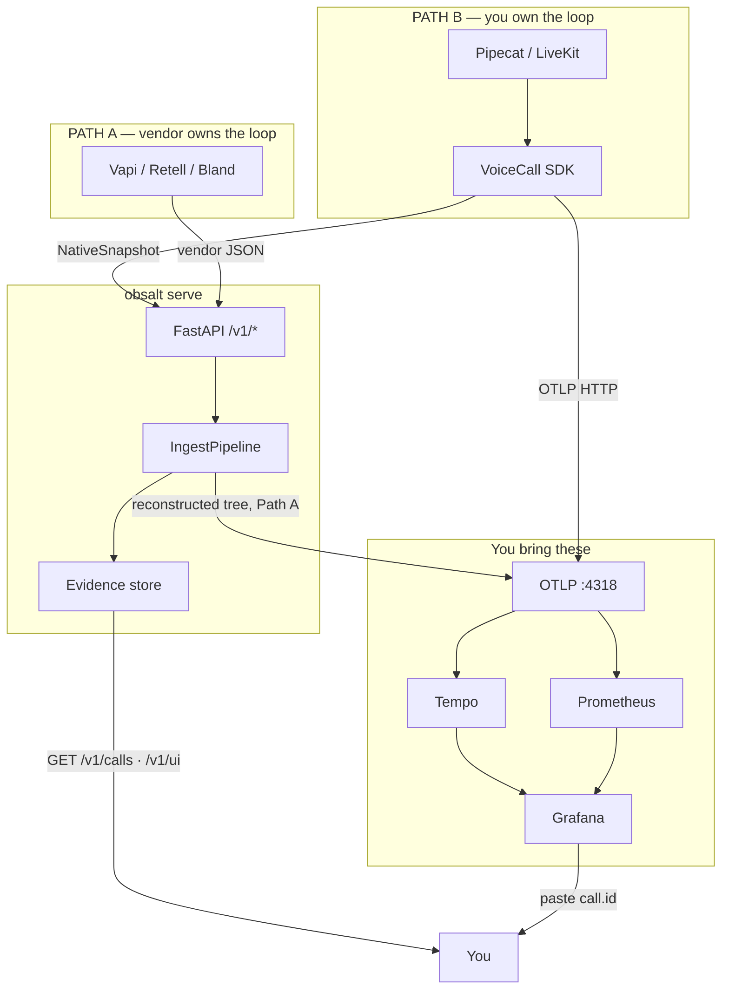

# Architecture

obsalt has two jobs:

1. Turn a voice call into an OpenTelemetry **trace** (where time went).
2. Keep an **evidence** record (what was said) that you look up over HTTP.

Those jobs share `CanonicalCall`. They do **not** share one process, and they do **not** share one integration. Read [Choose a path](choose-a-path.md) first.

## Hierarchy (what runs where)

```
Your laptop / cluster
├─ 1. Agent runtime                          Path B only
│    ├─ Pipecat / LiveKit / custom loop
│    └─ obsalt SDK  (library, not a server)
│         ├─ VoiceCall          spans + snapshot
│         ├─ VoiceCallTracer    spans only
│         └─ CallRecorder       snapshot only
│
├─ 2. Hosted voice platform                  Path A only
│    └─ Vapi / Retell / Bland cloud
│         └─ webhook POST ──► 3
│
├─ 3. obsalt serve                           HTTP :8080
│    ├─ /v1/ingest/{vapi,retell,bland,native,openai-realtime}
│    ├─ adapters → CanonicalCall
│    ├─ pipeline (latency, hangup, tools, hallucinations, evals)
│    ├─ MemoryStore  (v0.1 — dies on restart)
│    └─ emit_call_trace  (Path A, or Path B without live spans)
│
└─ 4. Your telemetry backends                not obsalt
     ├─ OTLP collector :4318  (protocol)
     ├─ Tempo / Jaeger / Honeycomb   traces
     ├─ Prometheus / Mimir           metrics
     └─ Grafana :3000                fleet UI (Tempo / Prometheus)
```



## Component cheat sheet

| Name | Kind | Port | Role |
| --- | --- | --- | --- |
| `VoiceCall` / `VoiceCallTracer` | Python library | none | Create spans in the agent |
| OTLP | Protocol | 4318 HTTP | How spans travel |
| Tempo / Jaeger / Honeycomb | Your service | vendor-specific | Store and query traces |
| Grafana | Your UI | 3000 typical | Fleet waterfalls + dashboards |
| `obsalt serve` | HTTP server | 8080 | Ingest + evidence + `/v1/ui` |
| Native snapshot | JSON document | n/a | Path B evidence packet |
| Vendor webhook | JSON document | n/a | Path A evidence packet |

[Glossary](glossary.md) · [What you can see](what-you-see.md).

## Traces vs evidence

| | Traces | Evidence |
| --- | --- | --- |
| Purpose | “Where did the 1.8s go?” | “What did the agent say?” |
| Path A | Server reconstructs after the terminal webhook | Server stores from that webhook |
| Path B | SDK exports **live** over OTLP | SDK POSTs a snapshot; server analyzes |
| Backend | Tempo | `GET /v1/calls` |
| PII | Forbidden on spans | Stored, redacted |

`call.id` (obsalt uuid) joins them. `call.provider_id` is your room/SIP/Vapi id. `/v1/ui` is that join, rendered.

Live spans never land in the evidence store by themselves. Path B without `client=` is traces-only.

Path B with `client=` sets `spans_exported: true` on the snapshot so finalize does **not** rebuild a second `call.lifecycle`. Evals still run; eval spans attach to the live trace via `traceparent`.

## Ingest pipeline (server)

On a **terminal** event (`end-of-call-report`, `call_ended`, Bland post-call, native `final: true`):

1. Adapter parses JSON → `CanonicalCall`.
2. Live events for the same `(org, provider, provider_call_id)` merge.
3. Tool argument values redacted.
4. Finalize: latency, tool retries, hangup taxonomy, hallucinations, rubrics.
5. Write store + search index.
6. If `spans_exported`: record Prometheus metrics; attach eval spans to the live trace. Else: `emit_call_trace` rebuilds the tree with historical timestamps.

Non-terminal events merge and return. Adapters never invent STT fallbacks.

## Analysis engines

Run against evidence, then attach `evaluation.assertion_check` spans to the same `call.lifecycle` root (reconstructed or live).

- **Latency** — STT, LLM, TTS, TTFA. Turn gaps fill TTFA when the provider omitted it.
- **Hangup** — Provider codes → one taxonomy. Clusters pick `lost_customer_call_id`.
- **Tools** — Success rate, retries, payload **shapes**.
- **Hallucinations** — Deterministic checks against grounding.
- **Evals** — `HeuristicJudge` on plain-English rubrics.

## Package layout

| Path | Layer |
| --- | --- |
| `obsalt.session.VoiceCall` | Path B product API |
| `obsalt.tracing` | Span conventions, `VoiceCallTracer`, OTLP setup, reconstruct, join view |
| `obsalt.sdk.CallRecorder` | Snapshot builder |
| `obsalt.integrations.pipecat` | Optional observer |
| `obsalt.adapters` | Vendor JSON → `CanonicalCall` |
| `obsalt.pipeline` | Merge, analyze, emit |
| `obsalt.store` | In-memory evidence + search |
| `obsalt.api` / `obsalt.cli` | Server process |

## What this repository does not include

- A hosted product dashboard that replaces Grafana. `/v1/ui` is the per-call join view. Fleet waterfalls stay in Tempo.
- Durable storage. `MemoryStore` dies with the process.
- A voice platform. obsalt observes calls; it does not dial them.
- An LLM judge by default (`LlmJudge` is a swap-in).
- A hosted OTLP collector. You run Tempo / LGTM / Honeycomb.
