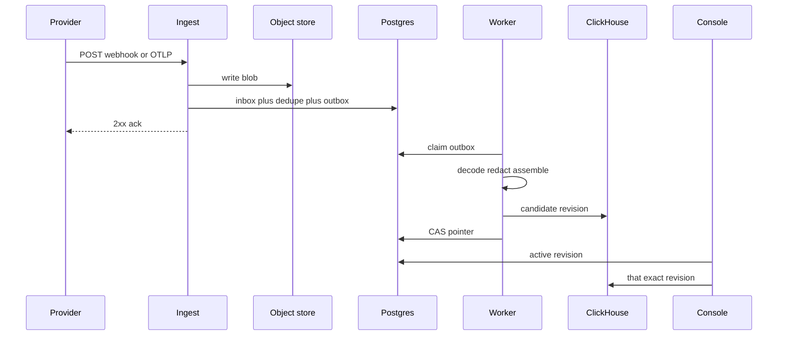
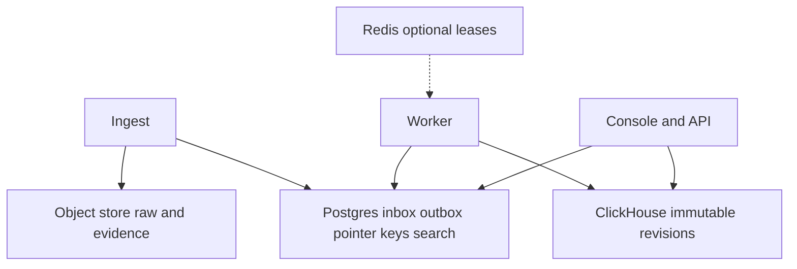
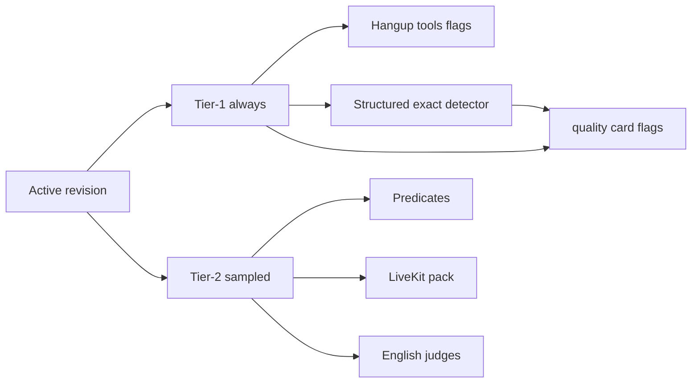

# Architecture

This page is for people who will change obsalt. If you are connecting
an agent, [Start](start.md) and the connect guides are enough.

A call enters as raw bytes. It becomes something you can query only
after it is authenticated, persisted, decoded, redacted, assembled, and
promoted. Nothing the provider is waiting on does the expensive work.

## Durability sequence

This is the load-bearing chart. Decode is **not** on the webhook
request path.



1. Provider or exporter POSTs a signed webhook or OTLP batch.
2. Ingest writes raw bytes to object storage.
3. Ingest commits inbox + dedupe + outbox in Postgres.
4. Ingest acks the provider.
5. Worker claims the outbox, decodes, redacts, assembles.
6. Worker writes a complete candidate revision to ClickHouse and waits
   until it is query-visible.
7. Worker CAS-promotes the Postgres active-revision pointer.
8. Console reads the pointer, then that exact ClickHouse revision.
   Never `SELECT latest`.

OTLP (`POST /v1/traces`) uses the same durability path. Tenancy is the
API key. obsalt is **not** a general span store. The queryable model is
the call.

A trace finalizes at
`min(root_ended_at + grace, first_seen_at + max_call_duration)`.
A still-rootless trace becomes `unrooted` and does not invent an
ending.

## Stores



| Store | Holds |
| --- | --- |
| **ClickHouse** | Immutable revisions, turns, stage measurements, tools, analysis. Append-mostly, percentile queries. |
| **Postgres** | Inbox, outbox, dedupe, active-revision pointer, keys, encrypted secrets, tombstones, search documents + pgvector. |
| **Object storage** | Org-namespaced raw blobs (unredacted, short-lived), evidence, recordings. |
| **Redis** | Lease accelerator. If it dies, workers still claim from Postgres. |

Queries always specify `(org_id, call_id, revision)`. Call-list
cursors are `{call_id}:{revision}`. There is no second storage backend.
Callers talk to ports in `obsalt.store.ports`. Memory types are test
doubles.

Retention defaults: 30 days raw, 90 days transcripts, 400 days
aggregates. Raw is unredacted on purpose — that is the replay tradeoff.

## What the console joins

Analysis is keyed by revision, not embedded in the call. Late events
create a **new** `CallRevision`. History stays put.

```
CallRevision
├── identity      org_id, call_id, source, source_call_id, agent_id
├── lifecycle     started_at, ended_at, duration_ms, pipeline, fidelity
├── hangup        reason, party, provider_code
├── Turn[]        speaker, text_ref, clocks?, interrupted?
├── StageMeasurement[]     placement + provenance
├── AggregateMeasurement[] provider p50/p95, never mixed into samples
├── ToolInvocation[]
├── Grounding     prompt / knowledge / tool results / caller text refs
├── SignalCoverage[]
└── Provenance    map of field path to stamp
```

`*_ref` values are content-addressed evidence, not inline text.

## Analysis



Detectors and predicates run on every call. The cheap path is
structured exact flags (numeric/ID match and bound said-vs-done), not
a Faithfulness Pass/Fail table. LLM judges run on a trigger, a
cascade, or an unbiased sample, behind a hard per-org monthly cap.
Missing judge output is `not_judged`, never a pass. A heuristic must
not score English rubrics. Pack `tool_use` fails only on a bound
phantom tool success, a denied successful tool (`phantom_tool_failure`),
or a detector-settled wrong tool argument (`args_mismatch`), not on
every effective tool failure.

The structured exact detector (`detector/3`) settles claim kinds the
same way in both runner scenarios: `price_claim`, `fabricated_id`,
`date_time_claim`, and `count_claim` compare a quoted span against
scalars extracted from tool results and grounding (exact match →
`grounded`, no match with tools present → `contradicted`, otherwise
`evidence_missing`). `phantom_tool_failure` fires when the agent denies
a bound tool that actually succeeded; an honest failure report is
dropped. `private_knowledge` (caller email/phone spoken back) grounds
on an exact source echo, contradicts on a near-miss misquote, and
stays a `needs_review` candidate for Tier-2 entailment when no source
exists — ungrounded PII is never a detector fail on absence alone.

Tier 1 also emits behavioral and tool-integrity flags from clocks,
argument hashes, and closed lexicons alone: agent loops, repeated
caller utterances, missed farewells, unmet escalation requests,
monologues, unrecovered barge-ins, dead air before a user hangup,
duplicate mutating tool invocations (same tool + argument hash
succeeding twice — a potential double charge, and the one integrity
flag that also fails the pack `tool_use` precheck), retry storms,
unfulfilled promises, and broken transfer promises. These are
operational signals, never eval verdicts, and they roll up per kind so
release regressions (`agent_version` deltas) are queryable.

Compliance flags are regex-grade and audit-proof: a Luhn-validated card
number or an SSN spoken by the agent (`pan_spoken`, `ssn_spoken`), and
verbal secret requests (`verbal_secret_request`) are tier-1 flags with
masked spans — a detector never republishes the secret it caught.
Required-disclosure rules need no new mechanism: a predicate rubric
clause `phrase_in_opening` fails a call whose opening agent turn lacks
the configured phrase, deterministically and without a judge.

Fleet rollups are serving generations. One `as_of_generation` per
response. A page never mixes generations.

## Measurement vs timeline

Hosted platforms send durations. They often do not send stage clocks.

- `StageMeasurement` — one duration, with `placement` (`interval`,
  `anchored_duration`, `unplaced`, `coarse_anchor`) and provenance.
- `AggregateMeasurement` — a provider p95. Stored separately. Never
  mixed into sample rollups.
- `SignalCoverage` — present / absent / unsupported / redacted /
  decode_failed.

A plugin that claims `INTERVAL` and emits a value without timestamps
fails conformance.

Speech-to-speech sources use `user_input` / `generation` / `playout`.
Cascade STT/LLM/TTS rows must not appear as empty placeholders.

## The rules we will not break

1. **Never draw what you did not measure.** A waterfall bar requires
   real start and end. Durations without clocks are chips.
2. **Provenance is a field.** Every value is `provider_reported` (with
   a source path) or `obsalt_derived` (with a derivation). Absence is
   its own fact.
3. **Raw first, then ack.** Wire bytes hit object storage and a
   Postgres inbox/outbox **before** the provider-facing success
   response. Decode is a pure function.
4. **Vendor schema, not our own reflection.** Fixtures match a vendored
   schema. No invented fields.
5. **One choke point.** Redaction happens once, on the normalized
   stream. Export policy is one place.
6. **Revisions are immutable.** Reprocess → new `CallRevision` → CAS
   promote. Never mutate a stored call in place.
7. **One storage shape.** Postgres + ClickHouse + object storage.
   Memory types are test doubles. No SQLite.
8. **Providers are packages.** Core ships none.
9. **Expensive analysis is sampled and budget-capped.** Missing Tier-2
   output is not a pass.
10. **`org_id` comes only from authenticated credentials.** Payload
    fields and OTLP attributes may corroborate. They may never select.
    No `require_auth=false`.

## Next

Span conventions: [OTLP](reference/otlp.md).
Tenancy: [Security](reference/security.md).
Changing the code: [Develop](develop.md).
