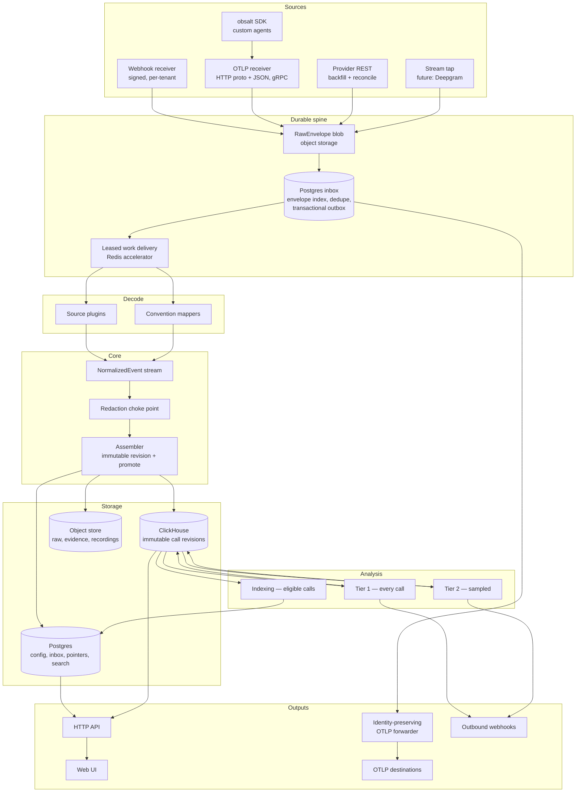

# Architecture

A call enters as raw bytes. It becomes a trusted, queryable revision only after
it is authenticated, persisted, decoded, redacted, assembled, and promoted.
Nothing provider-facing waits on decode or analysis.

## Stage contracts

| Stage | Input | Output | Idempotent? | Versioned? |
| --- | --- | --- | --- | --- |
| Receive | HTTP request | `RawEnvelope` + inbox/outbox committed; provider-specific success response | yes, by transport delivery key | — |
| Decode | `RawEnvelope` | `NormalizedEvent[]` | yes, pure function | `decoder_version` |
| Redact | `NormalizedEvent[]` | `NormalizedEvent[]` | yes | `redaction_policy_version` |
| Assemble | `NormalizedEvent[]` | immutable `CallRevision` + active-revision promotion | yes, stable fact identities | `assembler_version` |
| Analyze T1 | active call revision | analysis rows keyed by call revision | yes | `analyzer_version` |
| Index | active call revision | lexical + vector search document | yes, cached by content hash | `index_version` + `embedder_version` |
| Analyze T2 | active call revision | analysis rows keyed by call revision | yes, cached by content hash | `judge_version` + `prompt_version` |

Every stage records its version and `processing_run_id` on its output. The UI
can show that one call's latency was decoded by `vapi/3` while another was
decoded by `vapi/2`.

Late events create a new call revision. They invalidate revision-keyed analysis
and search documents without mutating historical results.

## Promotion and serving consistency

There is no cross-database transaction between ClickHouse and Postgres, so the
design does not pretend there is one:

1. Write a complete immutable candidate revision to ClickHouse and verify it is
   query-visible.
2. Compare-and-swap the Postgres active-revision pointer from the expected base
   revision to the candidate. A failed CAS rebases the candidate's accepted
   fact frontier onto the new active revision and retries. An accepted envelope
   is not marked assembled until an active revision covers its fact frontier.
3. Call-detail reads fetch the pointer first and query the exact ClickHouse
   revision. They never ask ClickHouse to guess "latest."
4. Analysis and search build revision-keyed outputs after promotion. Their
   execution state is explicit: `pending`, `sampled_out`, `budget_blocked`,
   `running`, `failed`, or `completed`.
5. Fleet rollups are immutable serving generations. A correction rebuilds
   affected partitions, verifies them, then compare-and-swaps a separate
   Postgres rollup-generation pointer. APIs expose `as_of_generation` and may
   lag call detail, but never mix generations in one response.

This is atomic selection of already-durable immutable data, not impossible
atomic writes across the two databases.

## Ingest

### Webhook

`POST /v1/ingest/{provider}/{ingest_key}`

`ingest_key` is an opaque, high-entropy, hashed-at-rest per-connection
identifier. We resolve the connection *before* authenticating, so each tenant
has its own provider credentials instead of one global secret.

Ordered pipeline, non-negotiable:

1. Read **raw bytes**. Never parse first — parsing changes the byte sequence
   and breaks authentication. Enforce compressed and expanded body limits.
2. Resolve `ingest_key` → `(org_id, provider, connection, encrypted credentials, plugin)`.
3. Fail-closed authentication. Empty secret is not "skip verification."
4. Classify the event. This endpoint accepts observational delivery only.
   Synchronous request/response events (Vapi `assistant-request`, tool
   execution, transfer, knowledge-base) must be routed to the user's
   application.
5. Derive a transport delivery key. Event identity and call identity are
   different concepts.
6. Write the raw body to an org-namespaced deterministic object key.
7. In one Postgres transaction, insert or resume the envelope index, delivery
   key dedupe row, and transactional outbox. A committed envelope can never
   exist without queued work.
8. Return the provider-specific acknowledgement.

Decode happens in a worker. Redis leases outbox work; Postgres remains the
source of truth.

### OTLP

`POST /v1/traces` — OTLP/HTTP protobuf and proto3-JSON. OTLP/gRPC is opt-in on
a separate server in the same process.

Tenancy comes from an ingest-scoped API key, connection token, or mTLS identity
bound to one org. `obsalt.org` and `service.namespace` may corroborate. They
may never establish the organization. Mixed-org assertions in one batch are
rejected.

**obsalt does not become a general span store.** Raw spans stay in the raw
archive for bounded replay and durable forwarding. The queryable model is the
Call aggregate.

Waiting for trace completion is unsolvable in general. Voice calls have a
natural upper bound that generic tracing lacks: finalize at
`min(root_ended_at + grace, first_seen_at + max_call_duration)`. A still-
rootless trace becomes an `unrooted` revision that does not invent call name,
outcome, or end time.

### Backfill, SDK, stream tap

Webhooks are lossy. `RestBackfill` scans a provider API and emits `RawEnvelope`s
with identity `(connection, upstream_entity_id, content_hash)`. Replay
re-decodes retained raw data; backfill reduces outage gaps. Neither guarantees
recovery beyond the displayed raw and provider retention horizons.

OpenAI Realtime and Gemini Live have no post-call webhook. Their telemetry
exists only in your process, so they are served by `VoiceCall` — a thin
OpenTelemetry wrapper — not an obsalt-invented JSON envelope.

Deepgram's shape is "tap the WebSocket." That is `StreamSource`, declared in
v2 with no first-party implementation. Adding it later must not require a
core change.

## Analysis

**Tier 1 — every call, deterministic, cheap.** Stage normalization, tool
telemetry, hangup classification, coverage, rule-based flags.

**Indexing — every eligible call.** Redacted lexical documents and embeddings.
Sampling search would make it silently incomplete.

**Tier 2 — sampled or triggered, expensive.** LLM evals and hallucination
entailment. Default baseline sample rate is 0%. Triggers: manual request,
Tier-1 signal, user filter, then optional baseline sample. A per-org monthly
LLM spend cap is a hard stop.

Missing analysis output is never interpreted as a passing call.

## Why this architecture and not something else

| Alternative | Why not |
| --- | --- |
| Reconstruct a waterfall from provider summary statistics | That is a chart that causes wrong conclusions. Hosted platforms ship durations without stage timestamps. See [T1](tenets.md#t1-never-draw-what-you-did-not-measure). |
| Decode on the webhook request | Adapter bugs become permanent data loss. Receive must ack fast and persist raw first. |
| One database | Transactional acceptance and billion-row percentile queries are different jobs. See [storage](storage.md). |
| Pluggable storage backends | The thing to avoid, not the thing to build. Langfuse rejected this as maintenance overhead. |
| Providers in core | The public plugin API would rot. First-party plugins use the same entry point as third-party ones. |
| Span synthesis from durations | The v0.1 category error. Even with field names fixed, there is nothing to place those values at. |
| Langfuse-compatible ingest | Tempting for Vapi's `observabilityPlan`. Deferred: a proprietary, undocumented, moving API. Breadth of first-class providers wins. |

The tenets that force this shape are in [tenets.md](tenets.md). The record of
choices is in [decisions.md](decisions.md).
