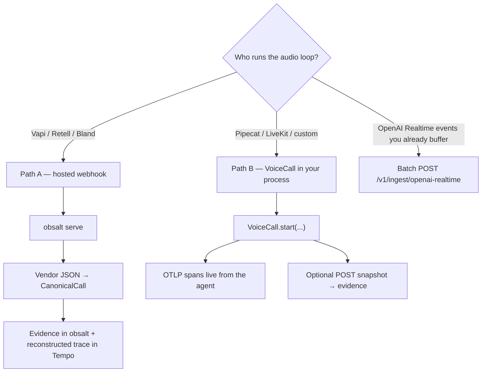

# Choose a path

obsalt is two integrations that share a data model. They are **not** interchangeable, and you almost never run both on the same call.

```
Who owns STT / LLM / TTS / the phone call?
│
├─ A hosted platform (Vapi, Retell, Bland)
│     → Path A — webhooks
│     → You do not import VoiceCall, VoiceCallTracer, or CallRecorder
│
└─ Your process (Pipecat, LiveKit, a loop you wrote)
      → Path B — SDK in the agent
      → You do not point a Vapi/Retell/Bland dashboard at obsalt
```



## Path A — hosted platform

The vendor places the call. You cannot wrap Deepgram or the LLM in your process because those hops live in their cloud.

| You run | You do not run |
| --- | --- |
| `obsalt serve` | `VoiceCall` / `VoiceCallTracer` / `CallRecorder` |
| An OTLP collector (Tempo, …) if you want waterfalls | Anything inside Vapi/Retell/Bland |

**Trigger:** their post-call webhook (`end-of-call-report`, `call_ended`, Bland post-call).

**Packet:** *their* JSON, not an obsalt snapshot. Adapters translate it.

Guides: [Vapi](providers/vapi.md) · [Retell](providers/retell.md) · [Bland](providers/bland.md).

## Path B — custom agent (Pipecat)

Your process owns VAD, STT, the LLM, tools, TTS. There is no vendor webhook, so nothing will arrive at `/v1/ingest/vapi`.

| You run | You do not run |
| --- | --- |
| `VoiceCall` (or the Pipecat `ObsaltObserver`) in the agent | Provider dashboard webhooks |
| `setup_tracing(otlp_endpoint=...)` in **this** process | Assuming `obsalt serve` emits live spans for you |
| `obsalt serve` **only if** you want search / evals / hangups | |

**Trigger:** each turn in your pipeline.

**Packet:** OpenTelemetry spans over **OTLP**, plus optionally a native snapshot (obsalt JSON) for evidence.

Guide: [Custom agents (Pipecat)](custom-agents.md).

## Side by side

| | Path A — hosted | Path B — your agent |
| --- | --- | --- |
| Who times STT / LLM / TTS | The vendor, after the fact | You, as it happens |
| Live waterfall | No — reconstructed when the webhook lands | Yes — spans export while the caller is talking |
| Transcript / search / evals | Yes, from the webhook | Yes, if `VoiceCall` POSTs a snapshot (pass `client=`) |
| STT fallback hops (Deepgram then Azure) | Not in vendor JSON — obsalt will not invent them | Yes — `stt.provider_attempt(..., fallback=True)` |
| Per-call waterfall + transcript | `/v1/ui` (reconstructed tree) | `/v1/ui` after snapshot; Tempo live during the call |
| `CallRecorder` snapshot | Never. Vendors do not speak obsalt JSON | Optional. `VoiceCall` builds it for you |
| `obsalt serve` | Required | Optional for traces-only; required for evidence |

## OpenAI Realtime

Realtime is neither a Vapi-style webhook nor a Pipecat loop. Your sidecar stamps `t_ms` on session events and POSTs a batch. [Guide](providers/openai-realtime.md). If the same process already uses `VoiceCall`, skip the batch ingest and POST a snapshot for evidence only.

## What not to combine

- Do not point Vapi at obsalt **and** wrap the same call with `VoiceCall`. You do not have the inner hops, and you would ingest twice.
- Do not use `VoiceCallTracer` plus a separate `CallRecorder` unless you are doing something advanced. `VoiceCall` is both.
- `workspace_id` on the SDK must equal the org on the API key, or Tempo `call.id` will not match `GET /v1/calls/{id}`.

Next: [What you can see](what-you-see.md) (join view vs Grafana vs the HTTP API) or [Getting started](getting-started.md).
