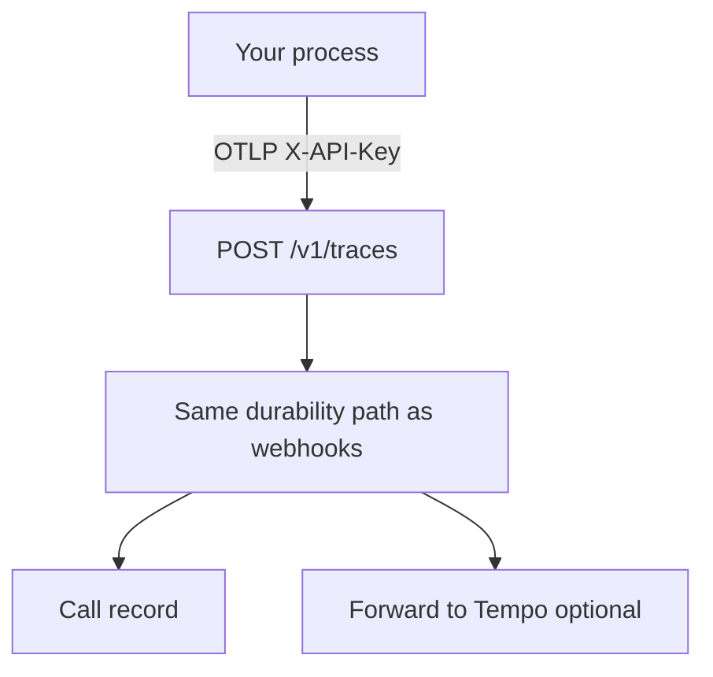

# Connect your own agent

Use this page when **your process** owns the pipeline — Pipecat,
LiveKit, OpenAI Realtime, Gemini Live, or anything you wrap with
`VoiceCall`.

obsalt receives **OTLP**. There is no private “POST us a JSON snapshot”
SDK. Hosted platforms use webhooks instead —
[Connect a hosted platform](connect-hosted.md).

Do not also fire a hosted-platform webhook for the same call. You will
get two records that do not join.



Tenancy comes from the API key, never from a span attribute.
`obsalt.org` may corroborate. It cannot choose an organization. Custom
agents do **not** create a hosted webhook connection. Settings prints
the OTLP endpoint.

## 1. Install the mapper

```bash
uv pip install obsalt-pipecat            # or obsalt-livekit
uv pip install obsalt-openai-realtime    # speech-to-speech
uv pip install obsalt-gemini-live
obsalt doctor
```

The mapper is how obsalt **recognizes** your spans. The tracer in your
process is how those spans **exist**.

## 2. Point the exporter

```bash
export OTEL_EXPORTER_OTLP_TRACES_ENDPOINT=http://localhost:8080/v1/traces
export OTEL_EXPORTER_OTLP_HEADERS="X-API-Key=${OBSALT_BOOTSTRAP_API_KEY:-dev-key}"
```

obsalt accepts `application/x-protobuf` and `application/json`.
Malformed protobuf is 400. Capacity pressure is 503 — retry the whole
batch. A partial-success body means those records are permanently
invalid; do not retry them.

```python
from obsalt import setup_tracing

setup_tracing(otlp_endpoint="http://localhost:8080", api_key="dev-key")
```

Pass the service origin. The helper appends `/v1/traces`. Pass
`emit_pii=True` only if you really want transcripts on exported spans;
the default strips `obsalt.pii.*`.

## 3. Emit low-cardinality spans

Names stay stable. Variables go on attributes.

```python
from obsalt import VoiceCall, setup_tracing

setup_tracing(otlp_endpoint="http://localhost:8080", api_key="dev-key")

with VoiceCall.start(
    call_id="call-123",
    org_id="local",          # corroborates the key; cannot pick another org
    agent_id="support",
    conversation_id="conv-123",
) as call:
    with call.turn(0, "user", "I need a refund") as turn:
        with turn.stt("deepgram") as stt:
            stt.set(**{"obsalt.stt.confidence": 0.92})
        with turn.llm("gpt-4.1"):
            pass
        with turn.tool("create_booking", "tool-1"):
            pass
        with turn.tts("cartesia"):
            pass
```

Speech-to-speech has no STT / LLM / TTS split. Do not emit empty
cascade stages:

```python
with call.user_input() as span:
    span.set_attribute("obsalt.pii.user_transcript", "I need a refund")
with call.generation() as span:
    span.set_attribute("obsalt.pii.agent_transcript", "I can help with that.")
with call.playout():
    pass
call.end("user_hangup")
```

`end` writes `obsalt.hangup.reason`. If you omit it, the console says
**Ending not reported**. Transcript text belongs on `obsalt.pii.*`,
never in the span name.

| Do not emit | Emit | Variable lives on |
| --- | --- | --- |
| `turn.7` | `turn` | `turn.index=7` |
| `stt.provider.deepgram` | `stt.provider_attempt` | `stt.provider="deepgram"` |
| `llm.tool_call.create_booking` | `execute_tool` | `gen_ai.tool.name="create_booking"` |

## Per source

**Pipecat.** A stock app with tracing on should produce a stage
waterfall when spans carry real intervals. The mapper reads
`metrics.ttfb`, `turn.*`, and `gen_ai.provider.name`.

**LiveKit.** Accepts both `gen_ai.usage.audio.input_tokens` (merged
spec) and `gen_ai.usage.input_audio_tokens` (what LiveKit ships).

**OpenAI Realtime / Gemini Live.** No post-call webhook. Emit
`user_input` / `generation` / `playout`. The console will not invent a
cascade you do not have.

Received OTLP is forwarded from the durable raw spine. Destination
failures do not fail the ingest ack. Provider aggregate latency is
exported as **metrics**, not as span widths.

## Next

[The console](console.md). Span names and PII: [OTLP](reference/otlp.md).
If traces never appear: [Operate](operate.md).
