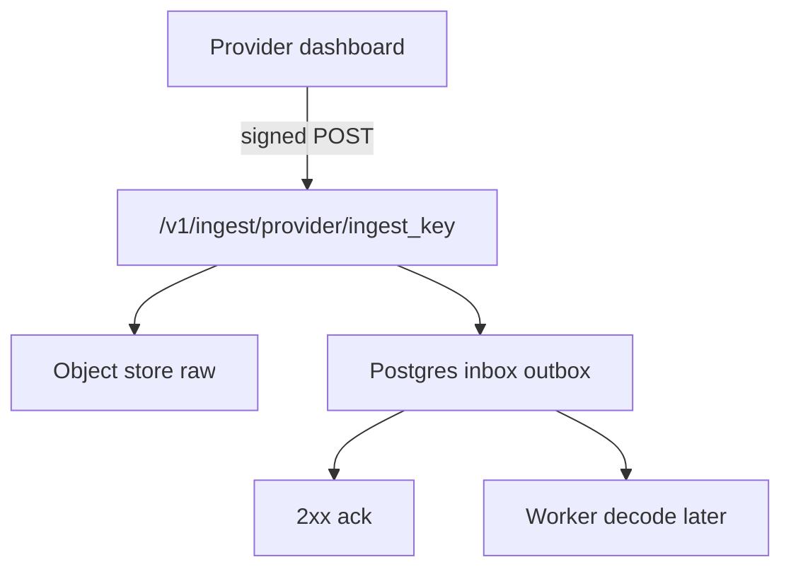

# Connect a hosted platform

Use this page when **Vapi, Retell, ElevenLabs, or Cartesia** owns
speech-to-text, the model, and text-to-speech. They POST a signed
webhook to obsalt. Do **not** import `VoiceCall` for these calls.

If you cannot answer “what is the start timestamp of the LLM stage on
turn 3?”, you will not get a stage waterfall. You will still get a
transcript, hangup, tools, evals, and latency chips. That is expected.



Decode is not on the request path. Observational events only. Do not
point `assistant-request`, tool-calls, or other application webhooks
here — obsalt answers those `400`.

The provider cannot reach `localhost`. Expose obsalt on a public
hostname with TLS, or use a tunnel while testing:
`cloudflared tunnel --url http://localhost:8080`.

Core ships no providers:

```bash
uv pip install obsalt-vapi   # or obsalt-retell / -elevenlabs / -cartesia
obsalt doctor
export KEY="${OBSALT_BOOTSTRAP_API_KEY:-dev-key}"
export BASE="https://obsalt.example.com"
```

Settings → Connections is the usual path. The ingest URL is shown
**once**. Curl below is the same data.

---

## Vapi

**Auth.** Default credential is `Authorization: Bearer <token>`. obsalt
also accepts that token in `X-Vapi-Secret`. HMAC and OAuth2 exist.

```bash
export VAPI_SECRET="$(openssl rand -hex 24)"
curl -sS -X POST "$BASE/v1/connections" \
  -H "X-API-Key: $KEY" -H "Content-Type: application/json" \
  -d "{\"provider\":\"vapi\",\"secrets\":{\"legacy_secret\":\"$VAPI_SECRET\"},\"settings\":{\"auth_mode\":\"legacy_secret\"}}"
```

Point Vapi’s **Server URL** at `$BASE/v1/ingest/vapi/<ingest_key>`.
Send `end-of-call-report`, final transcripts, `status-update`,
`user-interrupted`.

Smoke-test:

```bash
curl -sS -D- -o /dev/null -X POST "$INGEST_URL" \
  -H "Authorization: Bearer $VAPI_SECRET" \
  -H "Content-Type: application/json" \
  -d '{"message":{"type":"status-update","call":{"id":"smoke-1"}}}'
```

Expect `200` with `{"ok":true}`. **You will see** transcript, hangup,
tools without duration, chips. **You will not see** a stage waterfall.

---

## Retell

**Auth.** `X-Retell-Signature: v={unix_ms},d={hex}` where
`d = HMAC-SHA256(raw_body + v)` keyed by your Retell API key. ±5
minutes.

```bash
curl -sS -X POST "$BASE/v1/connections" \
  -H "X-API-Key: $KEY" -H "Content-Type: application/json" \
  -d '{"provider":"retell","secrets":{"api_key":"<retell-api-key>"}}'
```

Point the agent (or org) webhook at `$BASE/v1/ingest/retell/<ingest_key>`.
Subscribe to `call_started`, `call_ended`, `call_analyzed`,
transcription updates.

**You will see** transcript (words in **seconds**), hangup, tools
without duration, call-level p50/p95 as **aggregates**. Those
aggregates are never mixed into sample percentiles.

---

## ElevenLabs

**Auth.** `ElevenLabs-Signature: t={unix},v0={hex}` keyed by the
webhook secret. ±30 minutes.

```bash
curl -sS -X POST "$BASE/v1/connections" \
  -H "X-API-Key: $KEY" -H "Content-Type: application/json" \
  -d '{"provider":"elevenlabs","secrets":{"webhook_secret":"<webhook-secret>"}}'
```

Agents Platform → Settings → Webhooks: post-call URL =
`$BASE/v1/ingest/elevenlabs/<ingest_key>`. Subscribe to
`post_call_transcription` (and `post_call_audio` if you want the
recording). Those two share a conversation id and must not dedupe as
one delivery.

Expect `200` with an empty body on smoke tests. Timing is
whole-second anchors unless the OTLP-shaped hook has real span clocks.

---

## Cartesia Line

Create a Cartesia connection in Settings (or `POST /v1/connections`
with `provider: cartesia`). The secret field is `webhook_secret`;
Cartesia sends it on every request as the `x-webhook-secret` header.
Point their webhook at
`/v1/ingest/cartesia/<ingest_key>`. You get real turn intervals plus
unplaced STT/TTS TTFB chips. No stage waterfall.

---

## Next

Open the call: [the console](console.md). Empty list or 401:
[Operate](operate.md). Custom agents:
[Connect your own agent](connect-custom.md).
