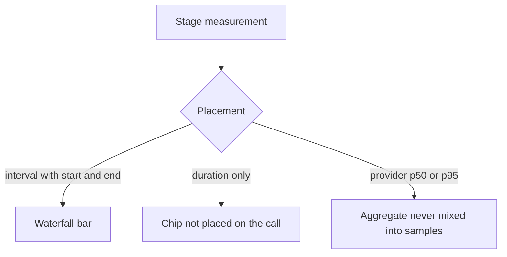

# The console

The console is the product: `/v1/ui` after a live call has been
decoded. Each screen answers one of the six questions. Call detail is
the join view. Settings is the operator surface. The HTTP API is the
same data without the HTML.

Collection pages share a UTC window. The console defaults to the last
7 days; chips cover 24 hours, 7 days, and 30 days. Source and agent
are dropdowns of plugins and agents already on the calls in that
window. The HTTP API still wants explicit ISO `start` and `end`.

## Screens

There is no query builder and no custom dashboard.

| Page | What it answers |
| --- | --- |
| **Calls** | What happened recently. The strip at the top is the six questions for this range, as numbers. |
| **Call detail** | Where time went **and** what was said. Verdict first, timeline left, transcript right, detector flags with quoted evidence when settled, grounding pack and tool results on the call, provenance under the fold. Cost and recording only when the source sent them. |
| **Latency** | Stage sample P50/P95 when measurements exist. Provider-published stats stay unmixed. Slowest calls and tools live here. |
| **Hangups** | Why we lost callers — share of endings, then clusters with last words and drill-through to the calls. The ending pill is mapped from the provider's reason code, not a diagnosed root cause. |
| **Quality** | Coverage first (calls in range / confirmed flags / candidates / evidence missing / not settled), then confirmed hallucination flags, unbound candidates, review queue. Missing judge output is never a pass. Pack `tool_use` does not fail on effective tool failure alone; that is the tool capability on call detail and Latency until a bound phantom (success claimed, failure denied, or wrong argument) or an enabled English judge. When the optional groundedness extra has run, the screen adds local groundedness spans. |
| **Search** | Calls matching a question, with the matching utterance and hangup. |
| **Settings** | Connect a source, write evals (including optional local groundedness), rotate keys, outbound webhooks, replay, export, deletion. |

A health strip on every signed-in page repeats `/ready` when something
is off (outbox backing up, DLQ, no plugins, deletion backlog).

## Chips vs waterfall

A timeline bar is drawn only from measurements with real start and end.
Durations without clocks are magnitude rows with a caption that says
so. Provider p50/p95 are labelled aggregates.

Fidelity on the call is derived from what landed:

| Fidelity | Meaning |
| --- | --- |
| `stage_level` | At least one real stage interval. Waterfall possible. |
| `turn_level` | Real turn boundaries. Stage values are duration rows, not a waterfall. |
| `message_level` | Coarse message anchors (often whole seconds). |
| `call_level` | Aggregates only. |
| `none` | We have a call and almost no clocks. |

## What each source will show you

Read your row before you expect a waterfall.

| Source | How it arrives | Transcript | Hangup | Tools | Stage waterfall | Latency you will see |
| --- | --- | --- | --- | --- | --- | --- |
| **Vapi** | Webhook | Yes | Yes | Yes, no duration | **No** | Per-turn STT/LLM/TTS/e2e chips (ms, unplaced) |
| **Retell** | Webhook | Yes, words in **seconds** | Yes | Yes, no duration | **No** | Call-level p50/p95 as aggregates |
| **ElevenLabs** | Webhook | Yes, whole-second anchors | Yes | Limited | Only if the OTLP-shaped webhook has real span clocks | Message-level timing |
| **Cartesia Line** | Webhook | Yes | Limited | Limited | **No** | Turn intervals + unplaced TTFB chips |
| **Pipecat** | OTLP | When you put text on `obsalt.pii.*` | If you emit outcome | If you emit `execute_tool` | **Yes**, where spans have real intervals | Native stages from clocks you own |
| **LiveKit** | OTLP | Same | Same | Yes | **Yes** | Real span intervals |
| **OpenAI Realtime** | OTLP | If you attach PII attrs | If you emit it | If you emit it | **Partial** — `user_input` / `generation` / `playout` | No STT/LLM/TTS split |
| **Gemini Live** | OTLP | Same | Same | Same | **Partial** | Same as Realtime |

Grounding (prompt, knowledge, tool results, caller text) is what
hallucination detection reads. Empty grounding means evals that need
it fail closed.

## Provenance legend

| Status | Meaning |
| --- | --- |
| `present` | We have the value. `source_path` says where. |
| `absent` | This source *can* send it; this call did not. |
| `unsupported` | This source structurally cannot send it. |
| `redacted` | It arrived and the redaction choke point stripped it. |
| `decode_failed` | The payload had something we could not parse. Replay after a plugin fix. |

`provider_reported` vs `obsalt_derived` travels with every number.

## Settings you will use

- **Connections** — create a hosted webhook connection. The ingest URL
  is shown **once**. Custom agents do not need a connection; Settings
  prints the OTLP endpoint. Delete a connection by typing DELETE.
- **Evals** — cheap/expensive OpenAI-compatible runners, monthly cap,
  sample rate, LiveKit pack checkboxes. API keys encrypted, never shown
  again. Enable is blocked until a runner and a cap > $0 exist.
- **Rubrics** — English judges and predicates. Editing creates a new
  version. Without a judge runner, English rows stay `not_judged`.
- **Outbound webhooks** — Standard Webhooks. Secret shown once.
- **Privacy** — replay retained raw, download `calls.jsonl`, verified
  deletion. Status `accepted` is not done.
- **Keys** — rotate the key you paste. The browser role comes from that
  key: `owner`, `admin`, `analyst`, `reviewer`. Reviewer is read-only.

Locally, **Load sample calls** (dev / test only) queues vendored
fixtures. It refuses `OBSALT_ENVIRONMENT=production`.

## Grafana vs this console

| Question | Where |
| --- | --- |
| Where did time go **and** what was said? | This console, call detail |
| Fleet waterfalls / P95 of **real** spans | Your Tempo / Grafana |
| Hangup clusters, evals, search, provenance | This console and `/v1` |

## Next

Something looks off: [Operate](operate.md). Scripts instead of HTML:
[HTTP API](api.md).
