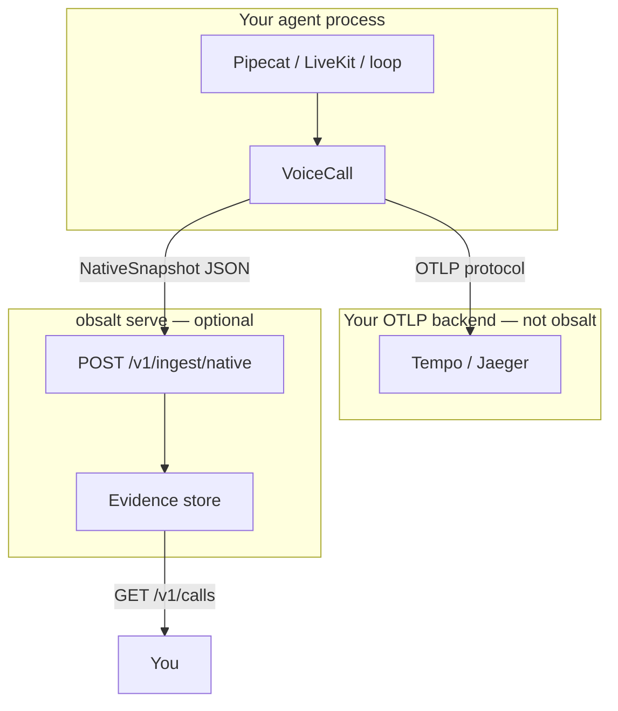

# Custom agents (Pipecat, LiveKit, your loop)

This is **Path B**. Your process owns VAD, STT, the LLM, tools, and TTS.

If Vapi / Retell / Bland places the call, stop. Use [Choose a path](choose-a-path.md) and the [provider guides](providers/index.md). You cannot see inside their STT from here.

```
Agent process (you)
├─ Pipecat pipeline / LiveKit session / while True
│    ├─ VAD
│    ├─ STT  ──┐
│    ├─ LLM  ──┼─ VoiceCall ── OTLP HTTP :4318 ──► Tempo (live waterfall)
│    ├─ tools ─┤
│    └─ TTS  ──┘         └── snapshot JSON ── POST /v1/ingest/native ──► obsalt serve
obsalt serve (optional, for evidence)
└─ GET /v1/ui and /v1/calls  transcript next to the same span tree
```



## What to import

| Class | When |
| --- | --- |
| **`VoiceCall`** | Default. Live spans + snapshot. Pass `client=` to POST evidence on exit. |
| `ObsaltObserver` | Pipecat `PipelineTask(observers=[...])`. Wraps `VoiceCall`. |
| `VoiceCallTracer` | Spans only. Low-level. Used internally by the server’s reconstruct path. |
| `CallRecorder` | Snapshot only. No OpenTelemetry in-process. |

Runnable files: [examples/instrument_agent.py](../examples/instrument_agent.py), [examples/pipecat_observer.py](../examples/pipecat_observer.py).

## 1. Export OTLP from *this* process

OTLP is a protocol. The collector is Tempo (or LGTM), not `obsalt serve`.

```python
from obsalt import setup_tracing

setup_tracing(otlp_endpoint="http://localhost:4318", environment="prod")
```

The HTTP server also calls this when `OBSALT_OTLP_ENDPOINT` is set. Agent processes must call it themselves or you will get empty Tempo.

## 2. Open a VoiceCall around the session

`call_id` is **your** id (Pipecat room, SIP Call-ID). `workspace_id` is the tenant and **must** match the org on the API key if you ingest evidence.

```python
from obsalt import VoiceCall, ObsaltClient, setup_tracing

setup_tracing(otlp_endpoint="http://localhost:4318")
client = ObsaltClient(base_url="http://127.0.0.1:8080", api_key="secret")

with VoiceCall.start(
    call_id=room_id,
    workspace_id="acme",
    agent_id="support",
    client=client,  # omit for traces-only
    system_prompt="Never invent order numbers.",
) as call:
    with call.turn(0, "user", text="book Friday") as turn:
        with turn.stt("deepgram") as stt:
            stt.set(confidence=0.91, latency_ms=412)
        with turn.llm("gpt-4o", provider="openai") as llm:
            llm.set(ttft_ms=340, tokens_in=200, tokens_out=80)
            with llm.tool("lookup_order", {"order_id": "ORD-1"}) as tool:
                tool.set(execution_ms=120, status_code=200)
                tool.set_result({"status": "ok"})
        with turn.tts("elevenlabs") as tts:
            tts.set(synthesis_ms=290, first_audio_ms=70)
    call.set_call_outcome(duration_ms=12_400, status="ended")

# Tempo: call.id == call.obsalt_call_id (uuid)
# Your id: call.provider_call_id == room_id
```

On exit, `VoiceCall` POSTs a [native snapshot](providers/native.md) with `spans_exported: true` so the server does **not** emit a second waterfall. Eval spans attach to the live trace via W3C `traceparent`.

Do not put transcript text on span `set()`. The `text=` argument on `turn()` is evidence only.

## 3. Pipecat observer

`pipecat-ai` is optional. The observer duck-types frame class names.

```python
from obsalt import ObsaltClient, setup_tracing
from obsalt.integrations.pipecat import ObsaltObserver

setup_tracing(otlp_endpoint="http://localhost:4318")
observer = ObsaltObserver.start(
    call_id=room_id,
    workspace_id="acme",
    agent_id="support",
    client=ObsaltClient(api_key="secret"),
    stt_provider="deepgram",
    tts_provider="elevenlabs",
    llm_model="gpt-4o",
    system_prompt=prompt,
)
# task = PipelineTask(pipeline, observers=[observer])
# ...
observer.close()  # always, so the snapshot is sent
```

| Frame class name | What obsalt records |
| --- | --- |
| `TranscriptionFrame` | User turn + STT timing (from `UserStoppedSpeakingFrame` if present) |
| `LLMFullResponseStartFrame` / `LLMTextFrame` / `LLMFullResponseEndFrame` | Agent turn + LLM |
| `TTSStartedFrame` / `TTSStoppedFrame` | TTS; closes the agent turn |
| `FunctionCallInProgressFrame` / `FunctionCallResultFrame` | Tool under the LLM span |
| `EndFrame` / `CancelFrame` | `close()` |

If your fork uses different frame names, call `observer.handle_frame(frame)` from your own callbacks, or wrap turns with `VoiceCall` by hand (section 2).

Keep one observer / one `VoiceCall` per room. Share it across processors so every frame hits the same root span.

## 4. LiveKit Agents

Start `VoiceCall` when `AgentSession` starts; `set_call_outcome` + exit on shutdown. Map `user_speech_committed` / `agent_speech_committed` to `turn()`, function tools to `llm.tool`. Inject `traceparent` if a worker continues the call: [Instrument an agent](instrumentation.md#3-continue-the-trace-in-another-process).

## 5. Fallback hops (only Path B can do this)

Vendors send at most one STT hop. If Deepgram fails and Azure succeeds, record **both**:

```python
with call.turn(0, "user", text=text) as turn:
    with turn.stt("deepgram") as stt:
        with stt.provider_attempt("deepgram") as attempt:
            attempt.fail("timeout")
        with stt.provider_attempt("azure", fallback=True) as attempt:
            attempt.set(latency_ms=400, confidence=0.91)
```

## 6. Traces only, or evidence only

```python
# Tempo only — no obsalt serve
with VoiceCall.start(call_id=room_id, workspace_id="acme", agent_id="support") as call:
    ...

# Evidence only — no OTel in this process
from obsalt import CallRecorder, ObsaltClient
rec = CallRecorder(call_id=room_id, agent_id="support")
with rec.turn("user", "hi") as turn:
    turn.stt_ms = 120
ObsaltClient(api_key="secret").ingest_native(rec.snapshot())
```

## What success looks like

**Tempo**

```
call.lifecycle                 call.id = uuid5(acme, native, room-42)
├── turn.0                     call.provider_id = room-42
│   ├── stt.transcription
│   │   ├── stt.provider.deepgram      ERROR timeout
│   │   └── stt.provider.fallback.azure
│   ├── llm.inference
│   │   └── llm.tool_call.check_inventory
│   ├── tts.synthesis
│   └── audio.playout
├── transcript.finalization    (if you open it)
└── evaluation.assertion_check (after snapshot ingest)
```

**Join view** — `http://localhost:8080/v1/calls/{call.obsalt_call_id}/ui`. Same tree as Tempo, plus transcript and coverage. Fallback hops survive on the snapshot (`stt_attempts`), so the page still shows Deepgram timeout → Azure after the call ends.

**HTTP** — `GET /v1/calls/{call.obsalt_call_id}` or `GET /v1/calls?provider_call_id=room-42&provider=native`.

If Tempo has a waterfall but `/v1/search` is empty, you never POSTed a snapshot (`client=` missing, or `observer.close()` not called).
