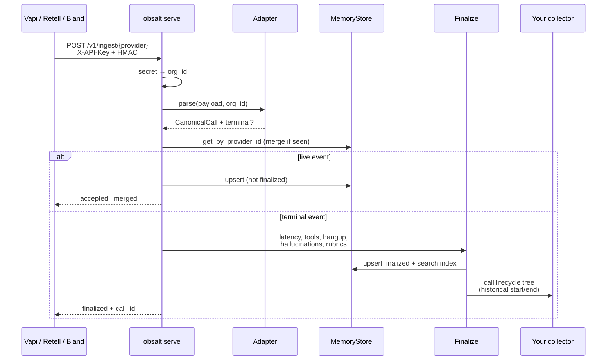
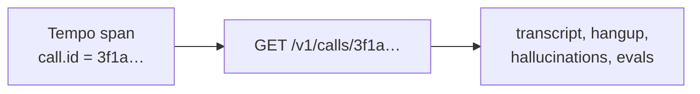
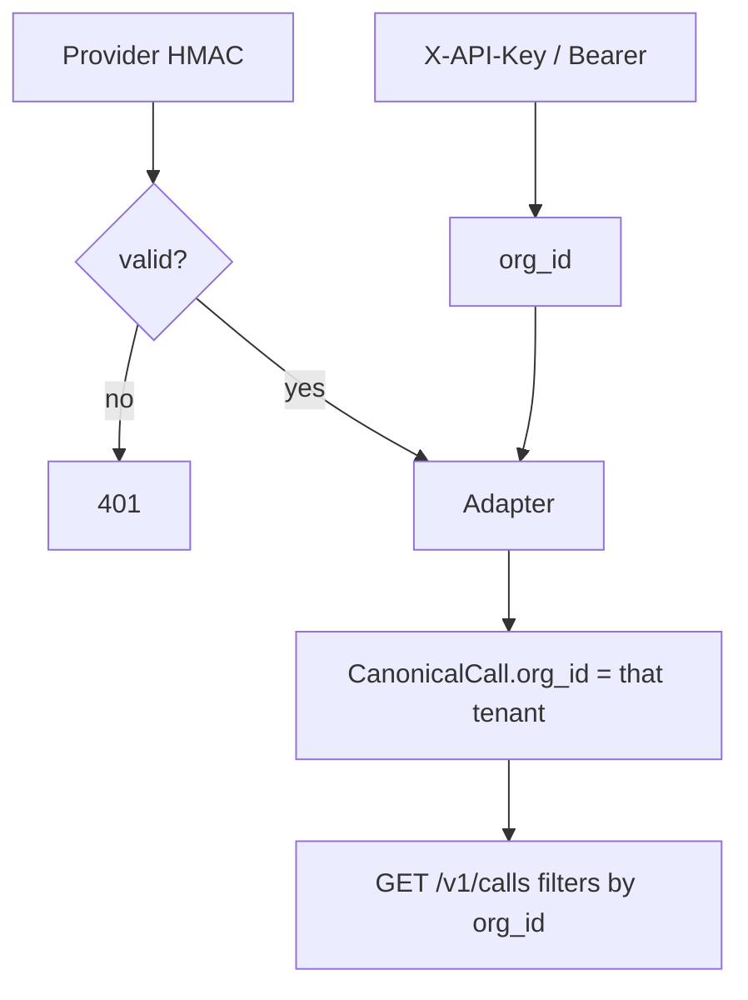

# Data flow

This page is the motion picture for [Architecture](architecture.md) and [Data model](data-model.md): what happens to a byte of JSON, and what happens to a live span.

## Path A — hosted webhook (server reconstructs the trace)



**Live** (Vapi `status-update`, `transcript`, `tool-calls`; Bland `category=latency`): merge into the existing call, do not run evals, do not emit a full tree.

**Terminal** (`end-of-call-report`, `call_ended`, Bland post-call, native `final: true`): analyze once. Re-POSTing the same terminal payload is idempotent (`created: false`) and re-finalizes.

The obsalt `call_id` in the response is what you pass to `GET /v1/calls/{id}` and what appears as `call.id` on every span.

## Path B — in-process SDK (client emits the trace)

```mermaid
sequenceDiagram
  participant Loop as Your audio loop
  participant SDK as VoiceCallTracer
  participant OTLP as Your collector

  Loop->>SDK: VoiceCallTracer.start(call_id, workspace_id, agent_id)
  SDK->>OTLP: call.lifecycle (start)
  Loop->>SDK: turn → stt / llm / tool / tts
  SDK->>OTLP: child spans as they end
  Loop->>SDK: set_call_outcome(...)
  SDK->>OTLP: root ends
```

Nothing is written to `/v1/calls` on this path. The collector sees a waterfall in real time. Search and evals need Path C as well.

## Path C — native snapshot (client records, server analyzes)

```mermaid
sequenceDiagram
  participant Loop as Your audio loop
  participant Rec as CallRecorder
  participant CLI as ObsaltClient
  participant API as obsalt serve

  Loop->>Rec: turn("user", text) / tool(...)
  Rec->>Rec: snapshot(hangup_reason="completed")
  Rec->>CLI: send(client)
  CLI->>API: POST /v1/ingest/native
  Note over API: same Path A terminal flow
```

`CallRecorder.turn("assistant", ...)` is accepted (`assistant` → agent). Tool argument values are redacted before the snapshot leaves the process.

You can run Path B and Path C on the same call. Use the **same** `call_id` / provider call id if you want humans to join them; live spans still will not appear in the evidence store automatically.

## Path D — OpenAI Realtime event batch

Your sidecar (not OpenAI) POSTs `{ "session_id", "events": [ { "type", "t_ms", ... }, ... ] }` to `/v1/ingest/openai-realtime`. The adapter derives STT, TTFA, tools from event pairs. See [OpenAI Realtime](providers/openai-realtime.md).

## Merge rules (live + terminal)

Calls are keyed by `(org_id, provider, provider_call_id)`.

| Incoming field | Merge |
| --- | --- |
| Longer transcript | Wins |
| Hangup, recording URL, cost | Filled if present |
| Turns | Deduped by speaker + text + timestamp; reindexed |
| Tools | Same tool id updated (pending → success/error) |
| Latency samples | Appended, de-duplicated by component + turn + ms |

A Bland `TTS: 218ms` live line plus a post-call transcript becomes one finalized call with both the 218 ms sample and turn-gap TTFA.

## Reconstruction timestamps

`emit_call_trace` does not use “now”. It sets span `start_time` / `end_time` from `started_at` + `seconds_from_start` + per-turn durations so Tempo shows the real call. If those fields are missing, child spans still nest correctly but may collapse toward the root window.

Eval and hallucination spans are attached to the same root after the turns.

## Join keys on every span

Copied onto **every** span (live or reconstructed):

`call.id` · `workspace.id` · `agent.id` · `gen_ai.conversation.id`

Turn-scoped spans also carry `turn.index`.



## Auth and tenancy in the flow



A Retell call ingested as org `acme` is invisible to org `beta` even if they guess the uuid. `workspace.id` on the trace is `acme`.

## What never flows onto spans

Transcript text, prompts, tool arguments, tool results, phone numbers, emails. The pipeline redacts tool argument **values** in evidence as well. Spans may carry `evidence.transcript_id` (hash of the transcript) so you can prove which recording you opened without putting the words in Tempo.
