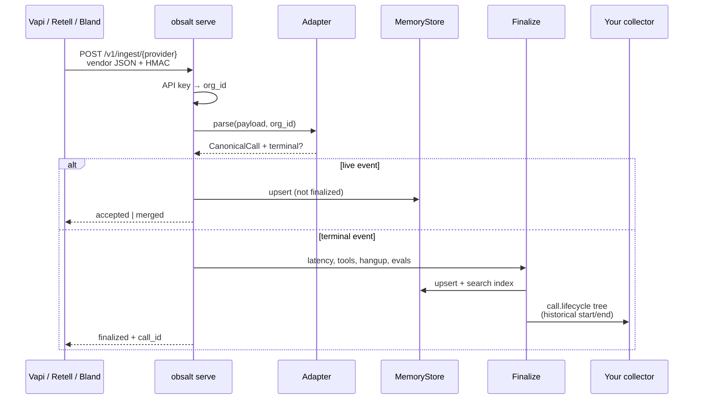
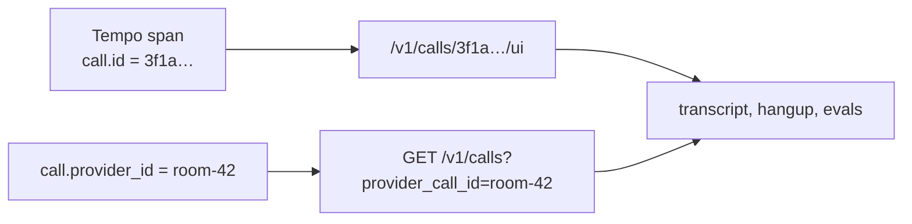
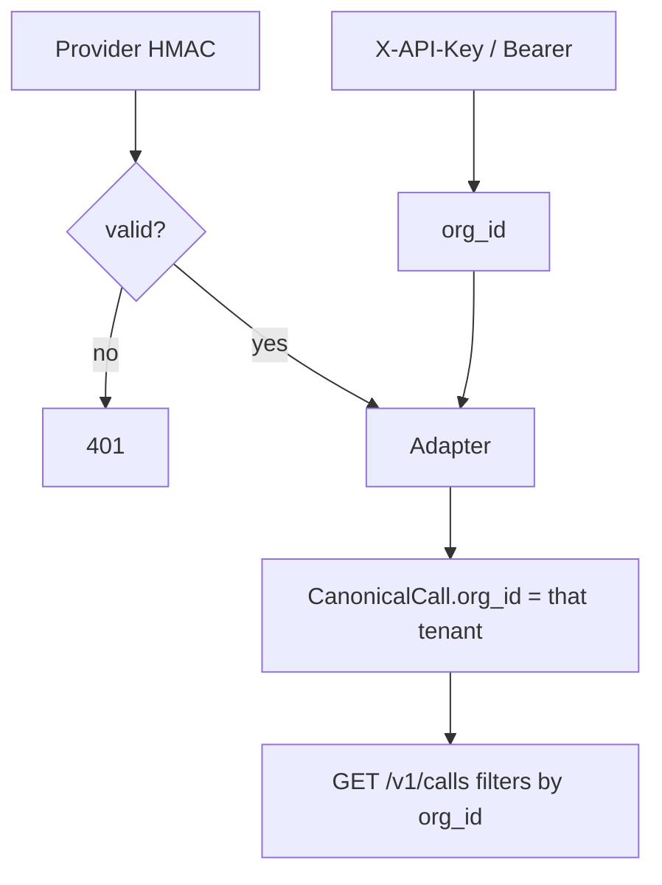

# Data flow

Motion picture for [Architecture](architecture.md). Two paths, then join keys.

## Path A — hosted webhook (server reconstructs the trace)



There is no `VoiceCall` in the vendor process. There is no CallRecorder snapshot. The vendor JSON *is* the packet.

**Live** (Vapi `status-update`, Bland `category=latency`): merge, no evals, no full tree.

**Terminal** (`end-of-call-report`, `call_ended`, Bland post-call): analyze once. Re-POST is idempotent.

## Path B — VoiceCall (live spans + optional snapshot)

```mermaid
sequenceDiagram
  participant Loop as Pipecat / your loop
  participant VC as VoiceCall
  participant OTLP as Your collector
  participant API as obsalt serve

  Loop->>VC: VoiceCall.start(call_id, workspace_id, ...)
  VC->>OTLP: call.lifecycle (live)
  Loop->>VC: turn / stt / llm / tts
  VC->>OTLP: child spans as they end
  VC->>API: POST /v1/ingest/native<br/>snapshot spans_exported=true
  Note over API: evidence + evals.<br/>No second call.lifecycle
  API->>OTLP: evaluation.assertion_check<br/>parented via traceparent
```

`workspace_id` must equal the API key’s org or `call.id` on spans will not match `GET /v1/calls/{id}`.

### Path B traces-only

Omit `client=`. Nothing is written to `/v1/calls`. Tempo still shows a waterfall.

### Path B evidence-only (no OTel in-process)

`CallRecorder` → `POST /v1/ingest/native` with `spans_exported: false`. The server reconstructs the tree (same as Path A).

## Path D — OpenAI Realtime event batch

Your sidecar POSTs `{ "session_id", "events": [ { "type", "t_ms", ... } ] }` to `/v1/ingest/openai-realtime`. See [OpenAI Realtime](providers/openai-realtime.md).

## Merge rules (live + terminal)

Calls are keyed by `(org_id, provider, provider_call_id)`.

| Incoming field | Merge |
| --- | --- |
| Longer transcript | Wins |
| Hangup, recording URL, cost | Filled if present |
| Turns | Deduped by speaker + text + timestamp; reindexed |
| Tools | Same tool id updated (pending → success/error) |
| Latency samples | Appended, de-duplicated by component + turn + ms |

## Reconstruction timestamps

`emit_call_trace` does not use “now”. It sets span `start_time` / `end_time` from `started_at` + `seconds_from_start` + per-turn durations. Path B live spans already have real times.

## Join keys on every span

`call.id` · `call.provider_id` · `workspace.id` · `agent.id` · `gen_ai.conversation.id`

Turn-scoped spans also carry `turn.index`.



## Auth and tenancy



A Retell call ingested as org `acme` is invisible to org `beta` even if they guess the uuid.

## What never flows onto spans

Transcript text, prompts, tool arguments, tool results, phone numbers, emails. Spans may carry `evidence.transcript_id` (hash of the transcript) so you can prove which recording you opened without putting the words in Tempo.
