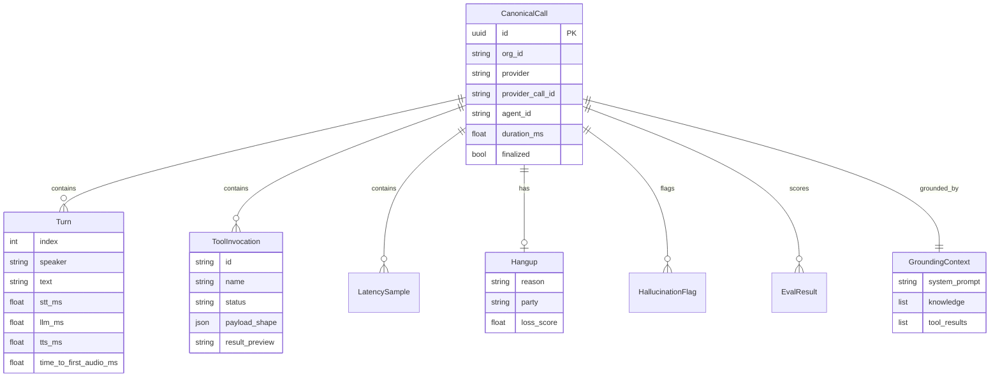

# Data model

Every provider is mapped onto one object: **`CanonicalCall`**. Adapters fill it. The pipeline analyzes it. The HTTP API returns it. The span emitter walks it.

## Identity

| Field | Meaning |
| --- | --- |
| `id` | obsalt id — `uuid5(namespace, "{org}:{provider}:{provider_call_id}")`. Stable across re-ingests. This is `call.id` on spans. |
| `org_id` | Tenant from the API key, **not** from the JSON body. |
| `provider` | `vapi` · `retell` · `bland` · `openai_realtime` · `native` |
| `provider_call_id` | Id you already have (Vapi call id, Pipecat room, Retell `call_id`, Bland `c_id`, Realtime `session_id`). This is `call.provider_id` on spans. |
| `agent_id` | Assistant / agent / pathway / model name, best-effort from the payload. |

Re-POSTing the same vendor call is idempotent: `created: false`, same `id`.

## Turns

A turn is one speaker’s utterance, not one HTTP request.

| Field | Holds |
| --- | --- |
| `index` | 0-based after merge |
| `speaker` | `user` · `agent` · `system` · `tool` · `unknown` (`assistant` / `bot` / `customer` are accepted on ingest) |
| `text` | What was said (evidence, never copied onto spans) |
| `seconds_from_start` / `started_at` / `ended_at` | Timing for reconstruction |
| `stt_ms` · `llm_ms` · `llm_ttft_ms` · `tts_ms` · `tts_ttfb_ms` | Per-stage timings when the provider or SDK supplied them |
| `time_to_first_audio_ms` | User-stop → first audio. Derived from turn gaps when missing. |
| `interrupted` | Barge-in / user-interrupted |

Adapters skip system prompt messages as turns; those go to `grounding.system_prompt`.

## Tools

| Field | Holds |
| --- | --- |
| `name` | Function name |
| `status` | `pending` · `success` · `error` · `timeout` |
| `payload_shape` | JSON **types**, not values (`{"email":"string","order_id":"string"}`) |
| `metadata.arguments` | Values with emails / phones / tokens redacted |
| `result_preview` | Short redacted string |
| `retry_count` | Consecutive failures of the same name in this call |
| `time_to_tool_ms` | From the previous user turn, when timestamps exist |

Raw secrets are stripped at ingest. Spans get `tool.name` and `tool.execution_ms` only.

## Latency samples

Points, not pre-aggregated percentiles (except Retell sometimes only sends p50/p95 — those are stored with `source=provider_p50`).

`component`: `stt` · `llm` · `tts` · `e2e` · `ttfa` · `tool` · `s2s` · `endpointing` · `knowledge_base`.

`GET /v1/latency` computes P50/P95/P99 across stored samples. Prometheus histograms are a separate export from the same numbers at finalize time.

## Hangup

Provider codes collapse to one taxonomy (`user_hangup`, `silence_timeout`, `error_stt`, `transfer`, …) plus a party (`user` / `agent` / `system`).

`loss_score` (0–1) is explainable: user hangup, negative last utterance, tool failure, hallucination, slow last turn, early hangup. Clusters (`GET /v1/hangups`) group by reason + party + last-utterance theme and pick `lost_customer_call_id`.

## Hallucinations and evals

Hallucination kinds: ungrounded price, fabricated id, phantom tool success, policy, commitment, private knowledge. The checker uses `grounding` (system prompt, knowledge snippets, successful tool previews, user text).

Evals are rubrics with a plain-English `description`. The default `HeuristicJudge` looks for words like `hallucin`, `latency`, `tool`, `hangup`. Seeded per org on first list: grounded claims, latency budget, customer kept, tools succeed.

## Grounding

Fact base for claim checks:

- `system_prompt` — Vapi assistant messages, Realtime `session.instructions`, native snapshot
- `knowledge` — Retell dynamic variables, Bland pathway decisions / citations
- `tool_results` — successful tool previews, filled at analysis time if empty
- `user_text` — concatenated user turns

If the agent says “order ORD-99999” and that token is in none of the above, you get `fabricated_id`.

## What is *not* in this model

- Span objects — those are emitted, not stored
- Prometheus time series — exported, not stored
- The vendor’s raw webhook — not persisted (only selected `metadata` / `raw_event_type`)

Path B’s on-the-wire packet **is** in-repo: `NativeSnapshot` (`POST /v1/ingest/native`). [Native snapshots](providers/native.md).

Provider-specific mapping tables: [Vapi](providers/vapi.md), [Retell](providers/retell.md), [Bland](providers/bland.md), [Realtime](providers/openai-realtime.md).
