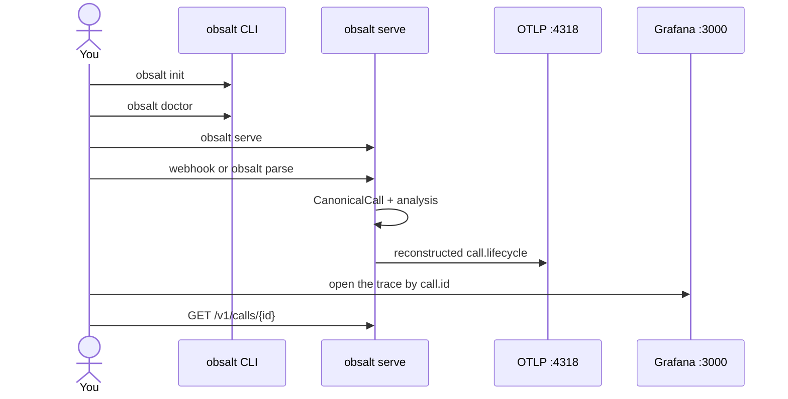

# Getting started

This page takes you from a clone to a stored call you can search. It does **not** require Vapi, Retell, or Bland — you can parse a fixture first, then wire a real webhook.

## What you will run

| Piece | Where it lives | Role |
| --- | --- | --- |
| Your agent or a hosted voice platform | Client / vendor | Places the call |
| `obsalt serve` | Your server | Ingest, evidence, analysis |
| An OTLP collector (optional but recommended) | Your infra | Receives traces and metrics |
| Grafana / Tempo / Jaeger / Honeycomb | Your infra | Waterfalls and dashboards |

obsalt does not include a UI. Grafana at `http://localhost:3000` is the usual local viewer.



## 1. Install

Python 3.11+.

```bash
git clone https://github.com/coder-with-a-bushido/obsalt.git
cd obsalt
pip install -e ".[dev]"
```

Check the CLI:

```bash
obsalt version
obsalt --help
```

## 2. Write config

```bash
obsalt init
```

That creates:

- `obsalt.toml` — host, port, OTLP, whether auth is required
- `.env.example` — copy to `.env` for secrets (`OBSALT_API_KEYS`, webhook HMAC)

Edit the API key **before** you expose the process:

```toml
[auth]
api_keys = "acme:a-long-random-secret"
require_auth = true
```

Environment variables override the file. Full reference: [Configuration](configuration.md).

## 3. (Recommended) local OpenTelemetry backend

[Grafana LGTM](https://github.com/grafana/docker-otel-lgtm) is an all-in-one collector + Grafana + Tempo + Prometheus + Loki:

```bash
docker run --rm --name lgtm \
  -p 3000:3000 \
  -p 4317:4317 \
  -p 4318:4318 \
  grafana/otel-lgtm
```

| Port | What |
| --- | --- |
| 4318 | OTLP HTTP — this is `OBSALT_OTLP_ENDPOINT` |
| 4317 | OTLP gRPC (optional) |
| 3000 | Grafana (admin / admin on a fresh LGTM) |

obsalt appends `/v1/traces` and `/v1/metrics` to the base URL. Keep `otlp_endpoint = "http://localhost:4318"`.

You can skip this step. Evidence and evals still work; reconstructed spans have nowhere to go.

## 4. Doctor, then serve

```bash
obsalt doctor
obsalt serve
```

You should see something like:

```text
obsalt 0.1.0  ingest & evidence API
  listen     http://127.0.0.1:8080
  openapi    http://127.0.0.1:8080/docs
  health     http://127.0.0.1:8080/health
  otlp       http://localhost:4318
  auth       open — set OBSALT_REQUIRE_AUTH=true before production
  orgs       acme
  store      in-memory (calls vanish on restart)
```

`GET /health` (no auth):

```json
{
  "status": "ok",
  "service": "obsalt",
  "version": "0.1.0",
  "otlp_configured": true,
  "require_auth": false,
  "environment": "dev",
  "store": "memory"
}
```

`obsalt --port 8080` is the same as `obsalt serve --port 8080`.

## 5. Ingest a call without a vendor account

The repo ships recorded provider payloads. Parse one without running the server:

```bash
obsalt parse tests/fixtures/vapi_end_of_call.json
```

You get a summary: hangup taxonomy, tools, hallucination flags, eval scores. `--json` prints the full `CanonicalCall`. `--provider` is only needed when auto-detect guesses wrong.

To store it in a running server (default key from `obsalt init` is `change-me`):

```bash
curl -X POST http://localhost:8080/v1/ingest/vapi \
  -H "X-API-Key: change-me" \
  -H "Content-Type: application/json" \
  -d @tests/fixtures/vapi_end_of_call.json

curl -H "X-API-Key: change-me" http://localhost:8080/v1/calls
curl -H "X-API-Key: change-me" "http://localhost:8080/v1/search?q=refund"
```

Interactive API: `http://localhost:8080/docs`.

## 6. Wire a real provider **or** instrument your loop

**Hosted platform** — create a public URL (ngrok, Cloudflare Tunnel, your cluster) and follow the dashboard steps:

| Platform | obsalt path | Guide |
| --- | --- | --- |
| Vapi | `/v1/ingest/vapi` | [Vapi](providers/vapi.md) |
| Retell | `/v1/ingest/retell` | [Retell](providers/retell.md) |
| Bland | `/v1/ingest/bland` | [Bland](providers/bland.md) |

Also send `X-API-Key` if `require_auth` is true. Provider HMAC is a second check (`OBSALT_VAPI_SECRET`, `OBSALT_RETELL_SECRET`, `OBSALT_BLAND_SECRET`).

**You own STT / LLM / TTS:**

```python
from obsalt import VoiceCallTracer, setup_tracing

setup_tracing(otlp_endpoint="http://localhost:4318")
```

See [Instrument an agent](instrumentation.md) and [Custom agents](providers/custom-agent.md). Copy [examples/instrument_agent.py](../examples/instrument_agent.py).

**Evidence without in-process OTel:** [examples/record_and_ingest.py](../examples/record_and_ingest.py) and [Native snapshots](providers/native.md).

## 7. Look at the result

| Question | Where |
| --- | --- |
| Where did 1.8s go on this turn? | Tempo / Jaeger — filter `call.id` |
| What did the agent say? | `GET /v1/calls/{id}` |
| Did we invent an order number? | `hallucinations[]` on that call |
| Are refunds hanging up angry? | `GET /v1/hangups` |
| Is Deepgram P95 over budget? | Prometheus `voice_response_latency_seconds` or `GET /v1/latency` |

Join key between Grafana and obsalt: **`call.id`** on every span = the id returned by ingest.

Worked stories: [Scenarios](scenarios.md).

## Common failures

| Symptom | Likely cause |
| --- | --- |
| `401 invalid api key` | Secret does not match `OBSALT_API_KEYS`; or `REQUIRE_AUTH=true` and you omitted the header |
| `401 invalid vapi/retell/bland signature` | HMAC secret set in obsalt but not on the provider, or the wrong header |
| `422 missing call id` | Payload is not that provider's webhook — `obsalt parse FILE --provider …` to debug |
| Health `otlp_configured: false` | `OBSALT_OTLP_ENDPOINT` / `[export] otlp_endpoint` unset |
| Calls vanish after restart | In-memory store — expected in v0.1 |
| Live waterfall exists, `/v1/search` is empty | `VoiceCallTracer` does not write evidence — also POST a `CallRecorder` snapshot |

Next: [Architecture](architecture.md) if you want the split of responsibilities, or [Configuration](configuration.md) if you are putting this on a real host.
