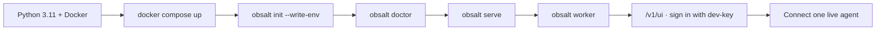

# Getting started

**Who this is for:** you are going to run obsalt on a laptop or a
dev box today.

**Question this page answers:** how do I get a signed-in console?

This does **not** connect a voice platform. That is the next page, once
you know which kind of agent you have. An empty call list at the end is
success. Fixtures in this repo are for tests. The console fills from
live traffic.

You will end with:

- Postgres, ClickHouse, Redis, and MinIO on localhost
- the service on http://localhost:8080
- a worker draining the outbox
- a browser session in the console



## Prerequisites

- Python 3.11 or newer
- Docker, for the durable stack
- A hosted voice platform **or** an agent process that can emit OTLP

There is no SQLite mode. Compose is the supported path.

## Install and run

From a clone:

```bash
python -m pip install -r requirements-dev.txt   # or: make install
docker compose up -d                            # or: make up
obsalt init --write-env
obsalt doctor
obsalt serve                                    # or: make serve
```

In a second terminal:

```bash
obsalt worker                                   # or: make worker
```

`serve` is the API and the console. `worker` decodes. Webhook
acknowledgement never waits on decode. In development, `serve` also
drains the inbox after ack so a single process can demo; production is
both.

`obsalt doctor` probes Postgres, ClickHouse, object storage, and Redis.
Exit 2 means a required store is down — start compose and wait until
`docker compose ps` is healthy. Exit 1 means no plugins loaded. Redis is
optional. `--json` is for scripts; `--skip-network` prints plugins only.

`obsalt plugins` lists what `serve` will actually accept.

From packages, once they are on an index:

```bash
pip install "obsalt[vapi,retell]"
docker compose up -d
obsalt serve
```

`obsalt init` writes `.env.example`. `--write-env` also writes `.env`
when it is missing (it will not overwrite an existing file). Replace
every `change-me` and `dev-key` before the box is reachable from a
network you do not trust. The committed example lists every `OBSALT_*`
key; see [Configuration](reference/configuration.md).

`obsalt demo` is the same compose stack with a loud banner: **not for
production, data is not durable.**

## Sign in

Local bootstrap uses `OBSALT_BOOTSTRAP_API_KEY` (default `dev-key`) and
`OBSALT_BOOTSTRAP_ORG_ID` (default `local`). The key is hashed at rest
and bound to that org. There is no “auth off” switch.

```bash
curl -sS -H "X-API-Key: dev-key" http://localhost:8080/ready
```

Open http://localhost:8080/v1/ui, paste the same key, continue.

You should see an empty call list, plus Latency / Hangups / Quality /
Search / Settings in the header. Settings lists installed plugins. If
the plugin you need is missing, you installed core without it.

## Did it work?

| Check | Command / URL |
| --- | --- |
| Process is up | `curl -sS http://localhost:8080/health` → `{"status":"ok",…}` |
| Stack + plugins | `obsalt doctor` and `GET /ready` |
| Console renders | http://localhost:8080/v1/ui after login |
| Interactive API | http://localhost:8080/docs (OpenAPI) |

An empty call list is success. obsalt has nothing to show until a
**live** agent sends a call. If serve failed, the list is empty *and*
`/health` fails, or doctor reports `FAIL`, see
[Troubleshooting](troubleshooting.md).

## Words you will trip over

Worth thirty seconds now. Full list: [Glossary](reference/glossary.md).

| Word | Means |
| --- | --- |
| **Chip** | A duration we measured but cannot place on a timeline. Not a waterfall bar. |
| **Revision** | An immutable snapshot of a call. Late events create a new one. |
| **Ingest key** | The secret in the webhook URL. Shown once. Per connection, per tenant. |
| **Provenance** | Where a number came from — or why it is missing. |

## What's next

obsalt is running. It has nothing to look at until a **live** agent
sends it a call.

| I run… | Next page |
| --- | --- |
| Vapi, Retell, ElevenLabs, or Cartesia | [Connect a hosted platform](connect-hosted.md) |
| Pipecat, LiveKit, OpenAI Realtime, or Gemini Live | [Connect your own agent](connect-custom.md) |

After the first call lands, [The console](console.md) is the page that
tells you what you are looking at — and what that provider will never
send.
