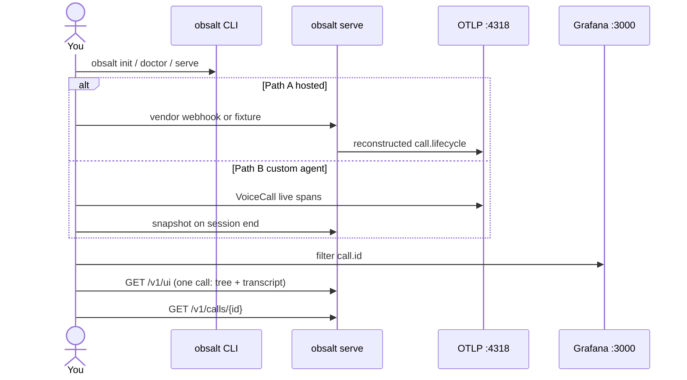

# Getting started

Pick a path **before** you install: [Choose a path](choose-a-path.md). This page gets you to a stored call you can search, or a live span you can open in Tempo.

## What you will run

| Piece | Kind | Role |
| --- | --- | --- |
| Your agent **or** a hosted voice platform | Client / vendor | Places the call |
| `obsalt serve` | HTTP `:8080` | Ingest + evidence + `/v1/ui`. Required for Path A. Optional for Path B traces-only |
| An OTLP collector | Protocol `:4318` | Receives traces. Not obsalt. Grafana LGTM is the usual local one |
| Grafana | UI `:3000` | Fleet waterfalls. Per-call join is `/v1/ui` |



## 1. Install

Python 3.11+.

```bash
git clone https://github.com/coder-with-a-bushido/obsalt.git
cd obsalt
pip install -e ".[dev]"
obsalt version
```

## 2. Write config

```bash
obsalt init
```

Creates `obsalt.toml` and `.env.example`. Set a real API key before you expose the process:

```toml
[auth]
api_keys = "acme:a-long-random-secret"
require_auth = true
```

[Configuration](configuration.md).

## 3. Local OpenTelemetry backend (recommended)

```bash
docker run --rm --name lgtm \
  -p 3000:3000 \
  -p 4317:4317 \
  -p 4318:4318 grafana/otel-lgtm
```

| Port | What |
| --- | --- |
| 4318 | OTLP HTTP — `OBSALT_OTLP_ENDPOINT` and `setup_tracing(otlp_endpoint=...)` |
| 3000 | Grafana (admin / admin on a fresh LGTM) |
| 8080 | obsalt serve — ingest, evidence, `/v1/ui` |

obsalt appends `/v1/traces` and `/v1/metrics`. Keep `otlp_endpoint = "http://localhost:4318"`.

Skip this and evidence still works; spans have nowhere to go.

## 4. Doctor, then serve

```bash
obsalt doctor
obsalt serve
```

`GET /health` (no auth) reports `otlp_configured`, `require_auth`, `store: memory`. Interactive API: `http://localhost:8080/docs`. Join view: `http://localhost:8080/v1/ui`.

## 5. Path A — ingest without a vendor account

```bash
obsalt parse tests/fixtures/vapi_end_of_call.json
```

Store it:

```bash
curl -X POST http://localhost:8080/v1/ingest/vapi \
  -H "X-API-Key: change-me" \
  -H "Content-Type: application/json" \
  -d @tests/fixtures/vapi_end_of_call.json

curl -H "X-API-Key: change-me" http://localhost:8080/v1/calls
# open http://localhost:8080/v1/ui
```

Real dashboards: [Vapi](providers/vapi.md) · [Retell](providers/retell.md) · [Bland](providers/bland.md).

## 6. Path B — instrument your loop

```python
from obsalt import VoiceCall, ObsaltClient, setup_tracing

setup_tracing(otlp_endpoint="http://localhost:4318")

with VoiceCall.start(
    call_id="room-1",
    workspace_id="acme",
    agent_id="support",
    client=ObsaltClient(api_key="change-me"),
) as call:
    with call.turn(0, "user", text="hello") as turn:
        with turn.stt("deepgram") as stt:
            stt.set(latency_ms=120, confidence=0.9)
    call.set_call_outcome(status="ended")
```

Copy [examples/instrument_agent.py](../examples/instrument_agent.py). Pipecat: [Custom agents](custom-agents.md).

`workspace_id` must be the org for that API key (`acme` above).

## 7. Look at the result

| Question | Where |
| --- | --- |
| This call, waterfall + transcript | `http://localhost:8080/v1/ui` |
| Where did 1.8s go? (fleet) | Tempo — filter `call.id` |
| What did the agent say? | Join view, or `GET /v1/calls/{id}` |
| Invented an order number? | `hallucinations[]` |
| Refund hangups? | `GET /v1/hangups` |
| Deepgram P95? | Prometheus or `GET /v1/latency` |

Join key: **`call.id`**. Your room id is `call.provider_id`. [What you can see](what-you-see.md).

## Common failures

| Symptom | Likely cause |
| --- | --- |
| `401 invalid api key` | Secret ≠ `OBSALT_API_KEYS` |
| `401 invalid vapi/retell/bland signature` | HMAC secret mismatch |
| `422 missing call id` | Wrong provider payload — `obsalt parse FILE` |
| Health `otlp_configured: false` | `OBSALT_OTLP_ENDPOINT` unset (server reconstruct path) |
| Tempo empty on Path B | Agent never called `setup_tracing` |
| Live waterfall exists, `/v1/search` empty | No snapshot POST — pass `client=` to `VoiceCall` or `observer.close()` |
| Two `call.lifecycle` roots for one call | Old dual `VoiceCallTracer` + `CallRecorder` without `spans_exported`. Use `VoiceCall` |
| `GET /v1/calls/{id}` 404 but Tempo shows the room id | You filtered Tempo on `call.provider_id`. Use `call.id`, or `GET /v1/calls?provider_call_id=` |
| Calls vanish after restart | In-memory store — expected in v0.1 |
