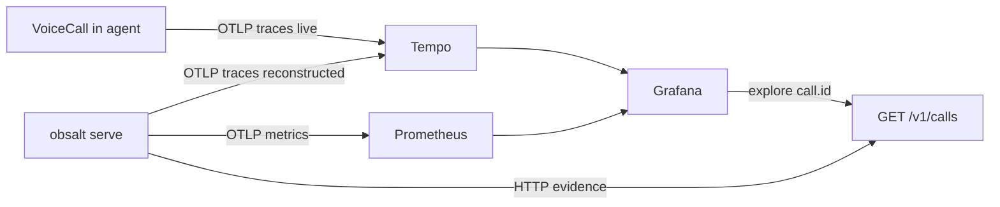

# Metrics and Grafana

obsalt does not ship dashboards. Point Grafana at the OpenTelemetry backends you already run. For “what is user-facing”, see [What you can see](what-you-see.md).

Local all-in-one (Tempo + Prometheus + Grafana + Loki):

```bash
docker run --rm -p 3000:3000 -p 4317:4317 -p 4318:4318 grafana/otel-lgtm
```

Set `OBSALT_OTLP_ENDPOINT=http://localhost:4318`. Open Grafana at `http://localhost:3000`. [Getting started](getting-started.md).

Do not put every signal in Prometheus. Use each backend for what it is good at:

| Signal | Backend | Example |
| --- | --- | --- |
| Counts / histograms | Prometheus / Mimir | `voice_calls_total{agent,environment,outcome}` |
| Stage timings (debug a cascade) | Tempo via traces | `stt.transcription`, `llm.inference` |
| Searchable call facts | Loki (optional) | JSON body with `canonical_call_id` |
| Transcript / audio / QA | Evidence store | `GET /v1/calls/{id}` via `call.id` on the span |



## Prometheus

Implemented as OpenTelemetry metrics (exportable to Prometheus when `OBSALT_OTLP_ENDPOINT` is set):

| Metric | Labels |
| --- | --- |
| `voice_calls_total` | `agent`, `environment`, `outcome` |
| `voice_response_latency_seconds` | `agent`, `environment`, `stage` (`stt`, `llm`, `tts`, `e2e`, `ttfa`, `tool`) |
| `voice_tool_failures_total` | `agent`, `tool_name`, `failure_type` |
| `voice_low_confidence_turns_total` | `agent`, `stt_provider` |
| `voice_assertion_failures_total` | `agent`, `assertion_type` |

`environment` comes from `OBSALT_ENVIRONMENT` / `[export] environment` (default `dev`) on the server, or the `environment=` argument to `emit_call_trace` / `setup_tracing`.

**Never** label with `call_id`, `user_id`, phone, transcript, or prompt. High-cardinality ids belong on spans (`call.id`) or in Loki JSON bodies.

P95 by pipeline stage:

```
histogram_quantile(0.95,
  sum by (le, stage) (rate(voice_response_latency_seconds_bucket{environment="prod"}[5m])))
```

Histogram buckets follow voice SLAs (50ms–8s), not generic HTTP buckets.

## Tempo

Filter on join keys: `call.id`, `call.provider_id`, `workspace.id`, `agent.id`, `turn.index`. Span names are listed in [Trace model](trace-model.md).

From a span, open evidence with `GET /v1/calls/{call.id}`. The span will not contain the transcript.

Reconstructed webhooks use the call’s historical timestamps, so a call that happened at 12:00 UTC does not appear as “just now” in the waterfall.

## Loki (optional)

If you also log turn-level events, keep high-cardinality ids in the **JSON body**, not as Loki labels. `obsalt.tracing.events.turn_completed_event` builds that envelope: `canonical_call_id`, `trace_id`, `redaction_state`. The ingest server does not emit these automatically — call the helper from your agent if you want them.
