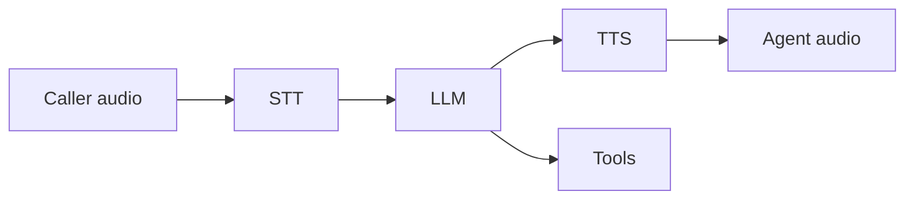
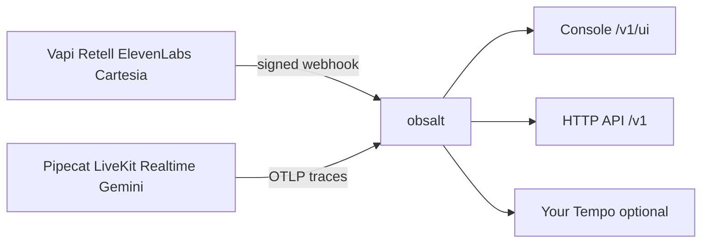

# What obsalt does

obsalt is a **self-hosted call record and quality system for live AI
voice agents**. You already have Vapi, Retell, Pipecat, LiveKit, or
something similar. obsalt sits next to it. Live calls flow in. You
open a console when a call went wrong, or when you want to know which
agent is losing customers.

Ready to install? [Start](start.md).

---

## A voice agent, in one screen

A **voice agent** talks to a person on a live call. The person speaks.
The agent listens, decides, and speaks back. It may call **tools**
(lookup an order, book, refund).

Most agents are a **cascade**: speech-to-text (STT) → language model
(LLM) → text-to-speech (TTS). One caller utterance plus the agent
reply is a **turn**.

**OpenAI Realtime** and **Gemini Live** skip that split. They are
**speech-to-speech**: `user_input` / `generation` / `playout`. obsalt
will not invent STT / LLM / TTS stages that do not exist.

obsalt does **not** build the agent. It records what happened.

---

## Two ways in

Pick **one** path per call. Mixing a hosted webhook and OTLP on the
same conversation gives you two partial records that do not join.

| You already run | How it connects | Guide |
| --- | --- | --- |
| **Vapi, Retell, ElevenLabs, Cartesia** | They POST a signed webhook | [Connect a hosted platform](connect-hosted.md) |
| **Pipecat, LiveKit, OpenAI Realtime, Gemini Live** | Your process emits OTLP | [Connect your own agent](connect-custom.md) |

---

## Three pieces

| Piece | Role |
| --- | --- |
| **Service** | HTTP API + worker. Receives calls, stores them, scores them. |
| **Console** | Seven screens at `/v1/ui`. Call detail is the join view. Settings is how you connect, eval, replay, and delete. |
| **`VoiceCall`** | A thin OpenTelemetry tracer. Import it only if **you** own the agent process. |

Core ships **no** providers. `obsalt-vapi` and `obsalt-pipecat` are
ordinary extras. Memory stores are test doubles, not a backend.

It is **not** a hosted SaaS, an agent builder, a Grafana replacement,
a simulation platform, or a dashboard builder.

---

## The six capabilities

| Capability | Question |
| --- | --- |
| **Latency** | Where did time go — and is this agent slower than last week? |
| **Hangups** | Why did we lose this caller? |
| **Hallucination** | Did the agent invent a price, an order id, or a completed tool? |
| **Tools** | Which function calls fail, retry, or stall the turn? |
| **Evals** | Did this call meet *our* bar, in plain English? |
| **Search** | Show me calls where customers asked about refunds. |

**Latency.** Per-call timing that matches what the source measured.
Fleet P50 / P95 of **real samples**. A stage waterfall **only** when
we have real start and end timestamps. Hosted platforms often send
durations without clocks — those are **chips**, not invented bars.

**Hangups.** Every call classified into a stable list (`user_hangup`,
`silence_timeout`, `error_llm`, `voicemail`, …). Clusters drill through
to last words. Voicemail is a mailbox outcome, not a lost caller.
Missing endings stay **Ending not reported**.

**Hallucination.** Deterministic flags on every call: invented prices,
fabricated ids, and a completed tool the result contradicts. Empty
grounding is **evidence missing**, not a confirmed hallucination. A
confirmed flag quotes the agent span and the tool or knowledge span.
Coverage (transcript, ending, grounding, clocks) is not a score.
Missing judge output is never a pass. There is no Faithfulness
scorecard without a judge.

**Tools.** Every invocation: name, **effective** status (a `success`
body with `error`/`not_found` is a failure), result snippet, retries,
duration when the source measured one. Missing or zero duration is
**not reported**.

**Evals.** Versioned scorers. Predicates (phrase, tool, hangup) run on
every call with no LLM. English judges need a runner and a monthly
cap > $0. Default budget is **$0**. There is no heuristic judge.
English rubrics stay `not_judged` until a runner is enabled.

**Search.** Hybrid (lexical + vector) over **redacted** content. Time
range required.

---

## What each source can deliver

Full notes: [The console](console.md).

| Source | Path | Stage waterfall | Latency you will see |
| --- | --- | --- | --- |
| Vapi | Webhook | **No** | Per-turn STT/LLM/TTS/e2e chips (ms, no clocks) |
| Retell | Webhook | **No** | Call-level p50/p95 as aggregates; words in **seconds** |
| ElevenLabs | Webhook | Only if their OTLP-shaped hook has clocks | Whole-second message anchors |
| Cartesia Line | Webhook | **No** | Turn intervals + unplaced TTFB chips |
| Pipecat / LiveKit | OTLP | **Yes**, where *you* emit intervals | Native stages from your clocks |
| OpenAI Realtime / Gemini Live | OTLP | **Partial** — `user_input` / `generation` / `playout` | No fake STT/LLM/TTS split |

---

## Who uses it

| You are… | You will… |
| --- | --- |
| On **Vapi / Retell / ElevenLabs / Cartesia** | Point their webhook at obsalt. Own a call console those dashboards do not give you. |
| Building on **Pipecat / LiveKit / Realtime / Gemini** | Emit OTLP. Keep Tempo. Get a voice-aware join view. |
| A **product manager** | Hangup clusters, eval fail rates, search — without SQL. |
| A **voice engineer** | Transcript, timing, and provenance on one page. |
| A **quality lead** | Rubrics, hallucination flags, deletion that completes. |

`org_id` comes from the API key or the ingest URL, never from a field
the provider sent.

---

## Privacy and cost

- Raw webhooks stay unredacted ~30 days so a decoder bug is a replay.
  Queryable transcripts are redacted first.
- Deletion completes. A request that never sets `completed_at` is not
  a deletion. Warehouse copies cannot be revoked.
- LLM spend is capped. Default monthly budget is $0.
- No “auth off.” Local bootstrap is `dev-key` bound to org `local`.

---

## Next

| I am… | Next |
| --- | --- |
| Installing | [Start](start.md) |
| Connecting Vapi / Retell / … | [Connect a hosted platform](connect-hosted.md) |
| Connecting Pipecat / LiveKit / … | [Connect your own agent](connect-custom.md) |
| Checking what a source will show | [The console](console.md) |
| Operating | [Operate](operate.md) |
| Changing the code | [Develop](develop.md) |
