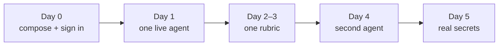

# Product

For founders, PMs, and the engineer who has to explain this without
opening the architecture doc.

**Question this page answers:** is obsalt the thing we should run next
to our voice agents — and what will we actually get?

If you already know: [Getting started](getting-started.md).

---

## What it is

obsalt is a **self-hosted call record and quality system for live AI
voice agents**. You run it next to the stack you already have. Live
calls flow in. You open a console when a call went wrong, or when you
want to know which agent is losing customers.

It is the thing an engineer opens at 2 a.m. *and* the thing a product
owner opens on Monday morning.

It is **not**:

| Not this | Why that matters |
| --- | --- |
| A hosted SaaS you log into | You keep the transcripts, recordings, and evals. |
| An agent builder or prompt manager | You already have Vapi, Retell, Pipecat, LiveKit, … |
| A better Grafana / Tempo | Traces still go to your OpenTelemetry backend. obsalt owns the **call**. |
| A testing / simulation platform | Hamming, Coval, Cekura generate callers. obsalt observes **production**. |
| A dashboard builder | Seven screens. No query builder. No custom charts. |

Three pieces ship together: the **service** (API + worker), the
**console** (`/v1/ui`), and a thin **`VoiceCall` tracer** you import
only if *you* own the agent process.

---

## The six capabilities

Everything in obsalt exists to make these true. If a feature does not
serve one of them, it does not ship.

```mermaid
flowchart TB
  call["A live call lands"]
  call --> lat["Latency — where did time go?"]
  call --> hang["Hangups — why did we lose them?"]
  call --> hall["Hallucination — did we invent a fact?"]
  call --> tools["Tools — what failed or stalled?"]
  call --> evals["Evals — did we meet our bar?"]
  call --> search["Search — show me the refund calls"]
```

### 1. Latency breakdown

**Question:** Where did time go on this call — and is this agent slower
than last week?

**What you get**

- Per-call timing that is honest about what the source actually measured.
- Fleet percentiles (P50 / P95) of **real samples**, by agent, over time.
- A stage waterfall **only** when we have real start and end timestamps.

**What you will not get**

- A pretty waterfall invented from Vapi or Retell summary statistics.
  Those platforms send durations without stage clocks. The console shows
  them as **chips**, and says so. That is the product working, not a
  bug.

**Who uses it:** voice engineers chasing “the bot feels slow”; PMs
comparing agents after a model swap.

### 2. Hangup analyzer

**Question:** Why are we losing this caller?

**What you get**

- Every call classified into a stable, provider-agnostic hangup taxonomy
  (`user_hangup`, `silence_timeout`, `error_llm`, `voicemail`, …).
- Clusters with drill-through to the ugly calls — last speaker, last
  user text, last agent text, a loss score.
- The original provider code is preserved, so you can audit the mapping.

**Who uses it:** PMs looking at “customers hang up after the hold
music”; support leads hunting error-class outages.

### 3. Hallucination detection

**Question:** Did the agent invent a price, an order id, or a “I’ve
booked that” when the tool failed?

**What you get**

- Deterministic flags on **every** call: ungrounded prices, fabricated
  ids, commitments, phantom tool success.
- Optional LLM entailment (Tier 2) against prompt, knowledge, tool
  results, and what the caller said — only if you set a budget and a
  judge.
- Fail-closed evals. Missing judge output is **never** a pass.

**What you need:** grounding. Hosted plugins populate it when the
payload has it. Custom agents populate it when you emit it. Empty
grounding → flags that need it do not silently succeed.

**Who uses it:** quality and compliance; anyone who has been burned by a
confident wrong refund amount.

### 4. Function-call telemetry

**Question:** Which tools fail, retry, or stall the conversation?

**What you get**

- Every tool invocation: name, status, retries, payload shape, duration
  when the source measured one.
- Fleet tool success / error / timeout rollups.

**Caveat:** Vapi and Retell often report that a tool ran **without a
duration**. The console shows the invocation and says duration was not
reported. It will not draw a fake bar.

**Who uses it:** platform engineers owning the tool layer; PMs after a
broken booking API weekend.

### 5. Custom evals

**Question:** Did this call meet *our* bar — empathy, disclosure, no
over-promise — in plain English?

**What you get**

- Rubrics you write in English. Editing a rubric creates a **new
  version**; historical scores stay attached to the version they were
  judged under.
- On-demand “evaluate this call” in the console, plus an optional
  unbiased fleet sample behind a hard monthly USD cap.
- A review queue: humans can agree or disagree with the judge.

**What you need:** `OBSALT_JUDGE_*` pointed at an OpenAI-compatible
endpoint, and `OBSALT_LLM_MONTHLY_BUDGET_USD` > 0 if you want paid
spend. Default budget is **$0** — no surprise bill.

**Who uses it:** product and QA defining “good”; ops watching spend.

### 6. Semantic search

**Question:** Show me calls where customers asked about refunds.

**What you get**

- Hybrid search (lexical + vector) over **redacted** content.
- Filters: agent, source, hangup reason, time range (required).

Default embedder is a local ONNX model. You do not have to send
transcripts to a third-party embedding API.

**Who uses it:** anyone who has grepped a CSV of transcripts and given
up.

---

## Who it is for

| You are… | You will… |
| --- | --- |
| A team on **Vapi / Retell / ElevenLabs / Cartesia** | Point their webhook at obsalt. Own a call console those dashboards do not give you. |
| A team building on **Pipecat / LiveKit / OpenAI Realtime / Gemini Live** | Emit OTLP. Keep Tempo. Get a voice-aware join view on top. |
| A **product manager** | Read hangup clusters, eval fail rates, and search — without SQL. |
| A **platform / voice engineer** | Debug one call with transcript + timing + provenance in one page. |
| A **quality / compliance lead** | Rubrics, hallucination flags, deletion that actually completes. |

Multi-workspace is a **constraint** (tenancy and per-tenant credentials
are correct from day one). Agency / reseller features are not a v2 goal.

---

## What a week of adoption looks like



1. **Day 0.** Clone, `docker compose up`, sign in with `dev-key`. Empty
   console. Confirm `/ready`.
2. **Day 1.** Connect **one** live agent — [hosted](connect-hosted.md)
   or [your own](connect-custom.md). Place three real calls. Open them.
3. **Day 1, continued.** Read the provenance panel. If Vapi latency is a
   chip, you are looking at the truth. Brief the team with
   [the console](console.md) table so nobody files “waterfall missing.”
4. **Day 2–3.** Write one rubric that matches how you already QA calls.
   Leave the LLM budget at $0 until you are ready; deterministic flags
   still run.
5. **Day 4.** Point a second agent or a staging cohort. Compare hangup
   clusters.
6. **Day 5.** If this is going near production: rotate the bootstrap
   key, set real `OBSALT_MASTER_KEY` / `OBSALT_SESSION_SECRET`, read
   [Operate](ops.md) and [Security](reference/security.md).

Mixing a hosted webhook and OTLP on the **same** call is almost always a
mistake. Two partial records. No join.

---

## How this compares

| Need | Provider dashboard | Grafana / Tempo | Hamming / Coval | **obsalt** |
| --- | --- | --- | --- | --- |
| Transcript + timing on one page | Partial | No (traces ≠ transcript) | Lab only | **Yes** |
| Honest “we don’t have stage clocks” | Rarely | N/A | N/A | **Yes** |
| Hangup clusters you own | Vendor-specific | DIY | No | **Yes** |
| Hallucination vs *your* grounding | Limited | No | Sometimes, in test | **Yes**, production |
| Plain-English rubrics | Rarely | No | Yes, synthetic | **Yes**, live |
| “Calls about refunds” | Keyword-ish | No | Corpus you generated | **Yes** |
| Pre-launch load / personas | No | No | **Yes** | No |
| Infra correlation (CPU, k8s) | No | **Yes** | No | Link out |

Use Hamming to break the agent before launch. Use Grafana for fleet
waterfalls of **real** spans you emitted. Use obsalt for the production
call record.

---

## What each source can actually deliver

This is the table that prevents a wasted quarter. Full notes:
[The console](console.md).

| Source | Path | Stage waterfall | Honest latency you *will* see |
| --- | --- | --- | --- |
| Vapi | Webhook | **No** | Per-turn STT/LLM/TTS/e2e chips (ms, no clocks) |
| Retell | Webhook | **No** | Call-level p50/p95 as aggregates; words in **seconds** |
| ElevenLabs | Webhook | Only if their OTLP-shaped hook has clocks | Whole-second message anchors |
| Cartesia Line | Webhook | **No** | Turn intervals + unplaced TTFB chips |
| Pipecat / LiveKit | OTLP | **Yes**, where *you* emit intervals | Native stages from your clocks |
| OpenAI Realtime / Gemini Live | OTLP | **Partial** — `user_input` / `generation` / `playout` | No fake STT/LLM/TTS split |

---

## Privacy, tenancy, and cost — the PM version

- **Tenant boundary is `org_id`.** It comes from the API key or the
  ingest URL, never from a field the provider sent.
- **Raw webhooks are stored unredacted** for ~30 days so a decoder bug
  is a replay, not a hole. Queryable transcripts are redacted first.
  That tradeoff is explicit.
- **Deletion completes.** A request that never sets `completed_at` is
  not a deletion. External warehouse copies cannot be revoked; the API
  says so.
- **LLM spend is capped.** Default monthly budget is $0. Cheap
  deterministic analysis always runs.
- **No “auth off.”** Local bootstrap is `dev-key` bound to org `local`.

---

## What we are not promising yet

Useful, not a roadmap ceremony:

- No first-party Bland or Deepgram plugin (Deepgram is designed for as a
  stream source).
- No OIDC / SSO login. Bootstrap key + hashed service keys + session
  cookies.
- OTLP gRPC is opt-in (`obsalt[grpc]`). HTTP `/v1/traces` is the path.
- Parquet export exists; warehouse-native sync does not.
- The UI is functional, not a design system. The join view is the
  product.

---

## What's next

| I am… | Next |
| --- | --- |
| Deciding | This page + [the console](console.md) fidelity table |
| Installing | [Getting started](getting-started.md) |
| Connecting Vapi / Retell / … | [Connect a hosted platform](connect-hosted.md) |
| Connecting Pipecat / LiveKit / … | [Connect your own agent](connect-custom.md) |
| Operating | [Operate](ops.md) |
| Changing the code | [Developing](developing.md) and [Conventions](conventions.md) |
