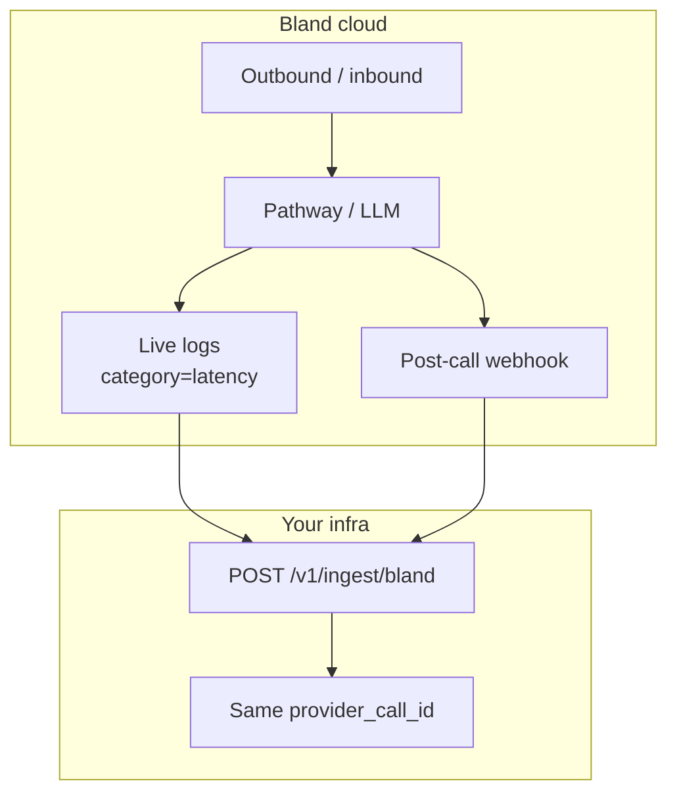

# Bland

Use this page when **Bland** places the call (pathways or prompts). obsalt accepts Bland’s **post-call** webhook and optional **live** log events (`category` + `message`).

## Architecture



Live events are **not** terminal. The post-call body is. They merge if `call_id` matches.

## Dashboard / API setup

1. Public `obsalt serve` URL.
2. Bland **webhook URL** (send-call `webhook` parameter, pathway webhook, or account webhook):

   ```text
   https://obsalt.example/v1/ingest/bland
   ```

3. **Webhook secret** → `OBSALT_BLAND_SECRET`. Bland may send `x-webhook-secret` or `Authorization: Bearer <secret>`. obsalt accepts both.
4. Enable the **post-call** payload (completed call). Optionally enable live performance logs so `TTS: 218ms` lines arrive during the call.
5. Auth: same pattern as other vendors — HMAC/secret on the Bland side; `X-API-Key` only if you add a proxy.

## Two payload shapes

### Post-call (terminal)

Top-level `call_id` or `c_id` is required. Typical fields:

| Field | Use |
| --- | --- |
| `pathway_id` / `metadata.agentName` / `voice_id` | `agent_id` (first present) |
| `inbound` | Direction |
| `from` / `to` | Numbers (evidence) |
| `concatenated_transcript` / `transcripts[]` | Turns; `user: agent-action` becomes a tool row |
| `corrected_duration` (seconds) or `call_length` (minutes) | `duration_ms` |
| `recording_url` | Evidence pointer |
| `disposition_tag` / `call_ended_by` / `transferred_to` / `answered_by` | Hangup |
| `variables`, `pathway_logs[].decision`, `citations` | Grounding knowledge |
| `queue_status` in `queued` / `started` | Forced **non**-terminal |

User→agent timestamp gaps become e2e **and** TTFA samples (`source=derived`).

### Live (`category` + `message` + `call_id`)

| Category | Example message | Result |
| --- | --- | --- |
| `latency` | `TTS: 218ms` / `LLM: 266ms` / `STT:` / `ASR:` / `E2E:` | One sample; LLM also fills `ttft_ms`; E2E also fills TTFA |
| `tool` | `Executing custom tool: NAME with input: …` | Pending tool |

## Hangup mapping

| Bland | obsalt |
| --- | --- |
| `disposition_tag=COMPLETED_ACTION` | `completed` |
| `TRANSFERRED` / `transferred_to` set | `transfer` (overrides) |
| `call_ended_by=USER` | party `user`; reason `user_hangup` if it was completed/unknown |
| `call_ended_by=ASSISTANT` | party `agent` |
| `answered_by=voicemail` | `voicemail` |
| `NO_ANSWER` / `BUSY` / `FAILED` | `no_answer` / `busy` / `error_unknown` |

## Try it

```bash
obsalt parse tests/fixtures/bland_post_call.json
```

Transfer fixture: 30 s duration, hangup `transfer`, e2e 1200 ms from transcript clock. Merge demo (same `call_id`):

```json
{"call_id": "bland-call-transfer-1", "category": "latency", "message": "TTS: 218ms"}
```

POST that first (`accepted`), then the post-call body (`finalized`). [Scenario](../scenarios.md).
