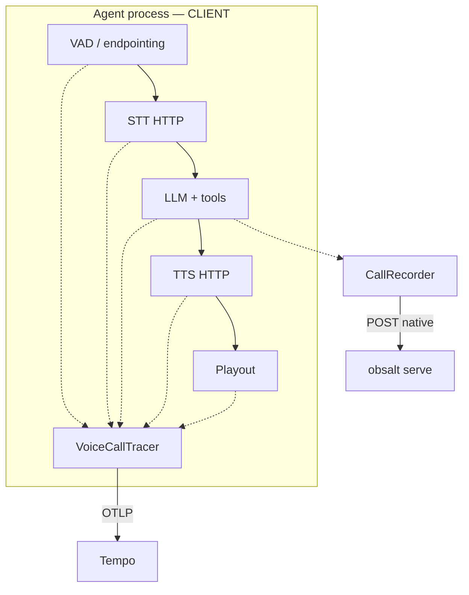

# Custom agents (Pipecat, LiveKit, your loop)

Use this page when **your process** owns VAD, STT, the LLM, tools, TTS, and playout. Hosted Vapi/Retell/Bland dashboards do not apply.

You will emit OpenTelemetry from the agent. Optionally you will also POST evidence. obsalt serve is optional for traces-only.



Full span API: [Instrument an agent](../instrumentation.md). Conventions: [Trace model](../trace-model.md).

## 1. Export

```python
from obsalt import setup_tracing

setup_tracing(otlp_endpoint="http://localhost:4318", environment="prod")
```

Production uses a batch processor. Tests pass `span_exporter=` + `batch=False`.

## 2. Open a call around the session

Use a stable `call_id` (your room id, SIP call id, or uuid). `workspace_id` is the tenant you also use as an obsalt org if you ingest evidence later.

```python
from obsalt import VoiceCallTracer

with VoiceCallTracer.start(call_id=room_id, workspace_id="acme", agent_id="support") as call:
    ...
    call.set_call_outcome(duration_ms=elapsed, status="ended")
```

## 3. One child span per independently failing hop

If Deepgram can fail and Azure can succeed, record **both** attempts. obsalt ingest **will not** invent that structure from a Vapi webhook.

```python
with call.turn(i, "user") as turn:
    with turn.stt("deepgram") as stt:
        with stt.provider_attempt("deepgram") as attempt:
            try:
                text = await deepgram.transcribe(...)
            except TimeoutError:
                attempt.fail("timeout")
            else:
                stt.set(confidence=conf, latency_ms=ms)
        if need_fallback:
            with stt.provider_attempt("azure", fallback=True) as attempt:
                ...
```

LLM / tools / TTS / playout / VAD helpers: `turn.llm`, `llm.tool`, `turn.tts`, `turn.playout`, `turn.vad`. Shortcut kwargs for `set()` are listed in [Instrument an agent](../instrumentation.md).

Do not `set(transcript=...)`. Put words in `CallRecorder`.

## Pipecat (sketch)

Hook the tracer where the pipeline already has turn boundaries — typically after a `TranscriptionFrame` / LLM context update / TTS start.

```python
# session start
call = VoiceCallTracer.start(call_id=call_id, workspace_id=org, agent_id=agent)

# on final user transcript
with call.turn(n, "user") as turn:
    with turn.stt(stt_vendor) as stt:
        stt.set(confidence=frame.confidence, latency_ms=stt_ms)

# on LLM + tool
with call.turn(n, "agent") as turn:
    with turn.llm(model, provider="openai") as llm:
        llm.set(ttft_ms=ttft, tokens_in=tin, tokens_out=tout)
        with llm.tool(tool_name) as tool:
            tool.set(execution_ms=tool_ms, status_code=200)

# on TTS audio start
    with turn.tts(tts_vendor) as tts:
        tts.set(first_audio_ms=ttfb, synthesis_ms=synth)
```

Keep the `VoiceCallTracer` on the pipeline context object so frames in different callbacks share the same root.

## LiveKit Agents (sketch)

Start the tracer when the `AgentSession` starts; end it on shutdown. Map `user_speech_committed` / `agent_speech_committed` to `turn()`, and function tools to `llm.tool`.

Inject `traceparent` if a worker process continues the same call: [Instrument an agent — continue the trace](../instrumentation.md#3-continue-the-trace-in-another-process).

## Evidence

```python
from obsalt import CallRecorder, ObsaltClient

rec = CallRecorder(call_id=room_id, agent_id="support", system_prompt=prompt)
# fill turns/tools alongside the tracer
ObsaltClient(api_key=secret).ingest_native(rec.snapshot())
```

[Native snapshots](native.md).

## What success looks like in Tempo

```
call.lifecycle
├── turn.0
│   ├── stt.transcription
│   │   ├── stt.provider.deepgram      (ERROR timeout)
│   │   └── stt.provider.fallback.azure
│   ├── llm.inference
│   │   └── llm.tool_call.check_inventory
│   ├── tts.synthesis
│   └── audio.playout
└── transcript.finalization
```

Every span has `call.id`, `workspace.id`, `agent.id`. No transcript text in attributes. [Scenario 2](../scenarios.md).
