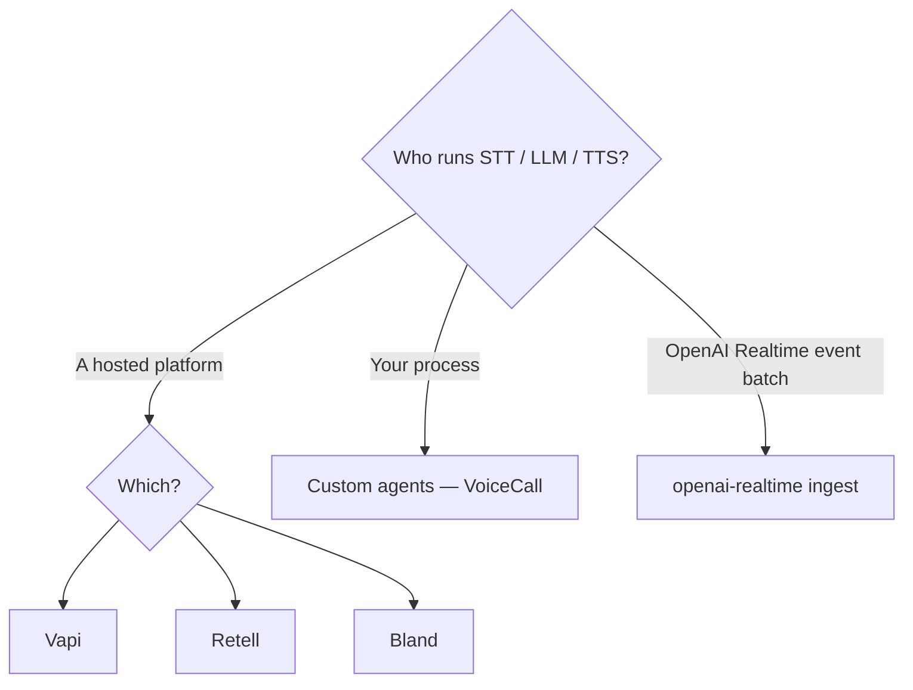

# Providers

These pages are **Path A**: a hosted platform owns STT / LLM / TTS. You run `obsalt serve` and point their webhook at it.

If **you** run Pipecat, LiveKit, or a custom loop, this folder is the wrong place. Go to [Custom agents](../custom-agents.md). [Choose a path](../choose-a-path.md).

| Provider | obsalt path | Typical trigger | Guide |
| --- | --- | --- | --- |
| [Vapi](vapi.md) | `POST /v1/ingest/vapi` | Server URL · `end-of-call-report` | Dashboard Server URL + `x-vapi-secret` |
| [Retell](retell.md) | `POST /v1/ingest/retell` | Agent webhook · `call_ended` | HMAC of the raw body |
| [Bland](bland.md) | `POST /v1/ingest/bland` | Post-call webhook; live `category=latency` | `x-webhook-secret` |
| [OpenAI Realtime](openai-realtime.md) | `POST /v1/ingest/openai-realtime` | Your batch of session events | You stamp `t_ms`; OpenAI does not call obsalt |

The native snapshot (`POST /v1/ingest/native`) is **not** a hosted provider. It is the Path B evidence packet: [Native snapshots](native.md).

All ingest routes share [API auth](../api.md). Provider HMAC is extra.

`obsalt parse FILE` auto-detects these payload shapes (and native snapshots). Use it on a captured webhook before you open a firewall hole.
