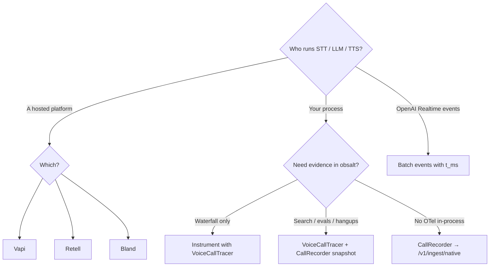

# Providers

Pick the page that matches who owns the audio loop.

| Provider | obsalt path | Typical trigger | Guide |
| --- | --- | --- | --- |
| [Vapi](vapi.md) | `POST /v1/ingest/vapi` | Server URL · `end-of-call-report` | Dashboard Server URL + `x-vapi-secret` |
| [Retell](retell.md) | `POST /v1/ingest/retell` | Agent webhook · `call_ended` | HMAC of the raw body |
| [Bland](bland.md) | `POST /v1/ingest/bland` | Post-call webhook; live `category=latency` | `x-webhook-secret` |
| [OpenAI Realtime](openai-realtime.md) | `POST /v1/ingest/openai-realtime` | Your batch of session events | You stamp `t_ms`; OpenAI does not call obsalt |
| [Native](native.md) | `POST /v1/ingest/native` | `CallRecorder.snapshot()` | Same analysis as a vendor webhook |
| [Custom agent](custom-agent.md) | OTLP from your process | Each turn in Pipecat / LiveKit / your loop | Optional native snapshot for evidence |

All ingest routes share [API auth](../api.md). Provider HMAC is extra.

`obsalt parse FILE` auto-detects these payload shapes. Use it on a captured webhook before you open a firewall hole.
