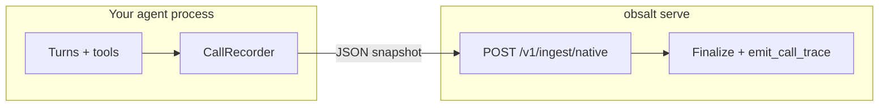

# Native snapshots

Use **`CallRecorder`** when you own the conversation in your process but you want obsalt’s **evidence store** (search, hangups, hallucinations, evals) without — or in addition to — in-process OpenTelemetry.

The server reconstructs traces from this packet the same way it does for Vapi.

## Architecture



`VoiceCallTracer` is the other SDK surface. It emits spans **now**. It never writes `/v1/calls`. Combine both if you want a live waterfall and evals.

## Record

```python
from obsalt import CallRecorder, ObsaltClient

rec = CallRecorder(
    provider="openai-realtime",  # or vapi / retell / bland / native
    call_id="session-1",
    agent_id="concierge",
    system_prompt="Rooms are $189. Confirmation codes come from the booking tool.",
)
with rec.turn("user", "book Friday") as turn:
    turn.stt_ms = 120
with rec.tool("create_booking", {"night": "Friday", "email": "ada@example.com"}) as tool:
    tool.set_result({"confirmation": "HTL-1"})
with rec.turn("assistant", "Booked HTL-1") as turn:
    turn.llm_ms = 300
    turn.tts_ms = 90

payload = rec.snapshot(hangup_reason="completed")
```

Notes:

- `turn("assistant", …)` and `turn("user", …)` work; you do not need the `Speaker` enum.
- `provider="openai-realtime"` is stored as `openai_realtime` (hyphens accepted).
- Tool **values** are redacted in the snapshot (`email` → `<string:redacted>`). Shapes are kept.
- `org_id=` on the recorder is **not** the tenant. The API key is.

`snapshot(final=False)` merges as a live event (no evals yet). Default `final=True`.

## Send

```python
with ObsaltClient(base_url="http://127.0.0.1:8080", api_key="secret") as client:
    result = rec.send(client)          # POST /v1/ingest/native
    call = client.get_call(result["call_id"])
    print(call["hangup"], call["evals"])
```

Equivalent curl: `POST /v1/ingest/native` with the snapshot JSON and `X-API-Key`.

Runnable copy: [examples/record_and_ingest.py](../../examples/record_and_ingest.py).

## Snapshot fields the adapter reads

`call_id` (required), `provider`, `agent_id`, `started_at`, `ended_at`, `duration_ms`, `turns[]`, `tools[]`, `latency_samples[]`, `transcript_text`, `grounding`, `hangup_reason`, `final`, `recording_url`.

Turns include the timing fields you set on the context manager (`stt_ms`, `llm_ttft_ms`, …). Missing `duration_ms` at the top level is derived from start/end timestamps.

## When to use which SDK class

| Goal | Class |
| --- | --- |
| Live Tempo waterfall | `VoiceCallTracer` + `setup_tracing` |
| Search / evals / hangup clusters | `CallRecorder` + server |
| Both | Both, same provider call id |
| Debug a vendor JSON file | `obsalt parse` (no SDK) |
