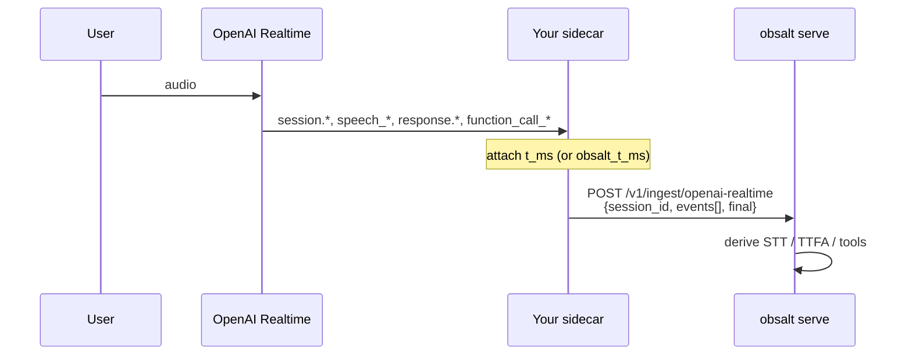

# OpenAI Realtime

OpenAI Realtime does **not** offer a post-call webhook like Vapi. Your process receives WebRTC / WebSocket events. obsalt expects you to **batch** those events, stamp a monotonic `t_ms` on each, and POST once (or at session end).



| Piece | Where |
| --- | --- |
| Audio + model | OpenAI |
| Event transport | Your sidecar (not obsalt) |
| `t_ms` clock | **You** — milliseconds from session start, or `obsalt_received_at` timestamps |
| Evidence + reconstructed trace | `obsalt serve` |

If you already wrap each event in `VoiceCallTracer` live, you may skip this ingest path and only POST a `CallRecorder` snapshot for evidence. This adapter is for teams that collect the official event stream and want obsalt to infer timings.

## Setup

1. `obsalt serve` reachable from the sidecar (often localhost).
2. No OpenAI dashboard webhook. Configure **your** code to POST:

   ```text
   POST /v1/ingest/openai-realtime
   X-API-Key: <secret>
   ```

3. Body:

   ```json
   {
     "session_id": "rt-session-1",
     "agent_id": "realtime-concierge",
     "final": true,
     "hangup_reason": "user_hangup",
     "events": [
       {"type": "session.created", "t_ms": 0, "session": {"instructions": "...", "model": "gpt-realtime"}},
       {"type": "input_audio_buffer.speech_stopped", "t_ms": 1800, "item_id": "user-1", "audio_end_ms": 1750}
     ]
   }
   ```

4. `session_id` (or `call_id`) is required. A single event object with `type` is accepted and treated as a one-element batch.

There is no HMAC unique to OpenAI; use `OBSALT_REQUIRE_AUTH=true`.

## How timings are derived

| Metric | Event pair |
| --- | --- |
| STT | `input_audio_buffer.speech_stopped` → `conversation.item.input_audio_transcription.completed` |
| LLM TTFT / TTS TTFB proxy | `response.created` → first `response.audio.delta` (or output_audio / audio_transcript delta) |
| TTFA / e2e | last `speech_stopped` → first audio delta |
| TTS duration | first audio delta → `response.audio.done` |
| Tools | `response.function_call_arguments.done` + `conversation.item.*` `function_call_output` |
| Barge-in | `speech_started` marks the previous agent turn `interrupted` |
| Terminal | `obsalt.session_end` / `session.ended`, or body `final` / `hangup_reason` |

`session.created` / `session.updated` `instructions` become the grounding prompt (needed so `$189` in the script is not flagged as a price hallucination).

## Clock rules

Prefer explicit `t_ms` (or `obsalt_t_ms`) on **every** event, milliseconds from an origin you choose (session start is easiest).

If `t_ms` is missing, obsalt uses `obsalt_received_at` / `received_at` relative to the first such timestamp. Events without any time stamp contribute `0` and will collapse timings — stamp them.

## Try it

```bash
obsalt parse tests/fixtures/openai_realtime_session.json
```

You should see STT 170 ms, a successful `create_booking`, grounded `HTL-4421` / `$189`, and two user turns (barge-in). [Scenario](../scenarios.md).

## Related

- Live spans from the same sidecar: [Instrument an agent](../instrumentation.md)
- Snapshot without event algebra: [Native](native.md)
