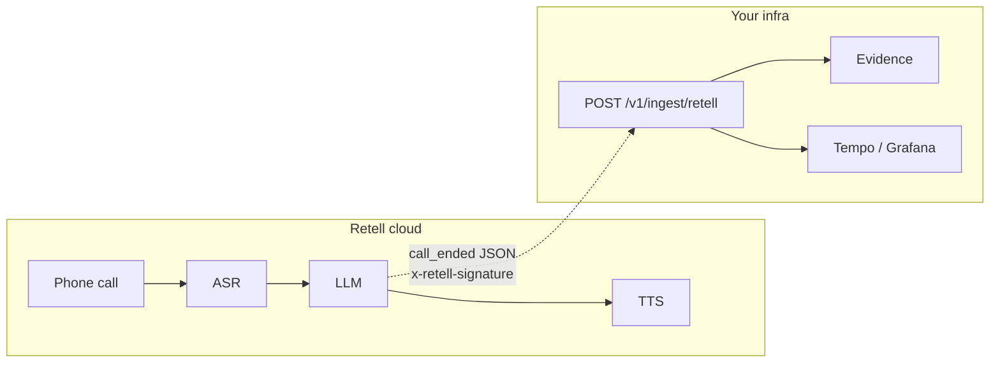

# Retell

Use this page when **Retell AI** places the call (**Path A**). obsalt consumes Retell’s agent webhooks. It does not sit in Retell’s media path.

If you run Pipecat yourself, this is the wrong page — [Custom agents](../custom-agents.md).

## Architecture



| Piece | Where |
| --- | --- |
| Audio pipeline, LLM, tools | Retell |
| Webhook URL + signing secret | Retell dashboard → obsalt |
| Percentile **and** raw `latency.*.values[]` | Parsed into per-turn samples (values preferred) |
| Waterfall | Reconstructed on `call_ended` / `call_analyzed` |

Inside-Retell spans are not available. obsalt will not invent STT fallbacks.

## Dashboard setup

1. Public base URL for `obsalt serve`.
2. Retell dashboard → **Agents** → your agent → **Webhook** (or account-level webhook, depending on your Retell plan).
3. URL:

   ```text
   https://obsalt.example/v1/ingest/retell
   ```

4. Copy the **signing secret**. Set `OBSALT_RETELL_SECRET`. obsalt computes `HMAC-SHA256(secret, raw_body)` as hex and compares it to `x-retell-signature` (constant-time).
5. Subscribe at least to **`call_ended`**. `call_started` is stored as live (`terminal=false`). `call_analyzed` is treated as terminal and refreshes summary metadata.
6. Same auth caveat as Vapi: Retell will not send `X-API-Key`. Use HMAC + network isolation, or a proxy that injects the API key.

## Auth headers

| Header | Purpose |
| --- | --- |
| `x-retell-signature` | Hex HMAC-SHA256 of the **raw** JSON bytes |
| `X-API-Key` | Tenant, if you add it yourself |

Empty `OBSALT_RETELL_SECRET` skips the HMAC (local only). Do not skip it in production — anyone who can POST could forge `call_ended`.

## Payload shape

Retell sends `{ "event": "call_ended", "call": { ... } }`. A bare `call` object also parses.

| Field | Use |
| --- | --- |
| `call.call_id` | Required; becomes `provider_call_id` |
| `agent_id` / `agent_name` | `agent_id` / `agent_name` |
| `direction`, `from_number`, `to_number` | Telephony metadata (evidence) |
| `start_timestamp` / `end_timestamp` / `duration_ms` | Call window (unix ms accepted) |
| `transcript` / `transcript_with_tool_calls` | Turns + tools (tool_call_invocation / tool_call_result) |
| `latency.asr.values[]` etc. | Per-turn STT/LLM/TTS/e2e; e2e also copied to TTFA |
| `latency.*.p50` | Used only when `values` is missing |
| `disconnection_reason` | Hangup taxonomy |
| `call_cost.combined_cost` | USD (cents ÷ 100) |
| `retell_llm_dynamic_variables` | Grounding knowledge |
| `call_analysis` | Summary metadata, not eval scores |

## Hangup mapping (`disconnection_reason`)

| Retell | obsalt |
| --- | --- |
| `user_hangup` | `user_hangup` |
| `agent_hangup` | `agent_hangup` |
| `call_transfer` / `transfer_bridged` | `transfer` |
| `inactivity` | `inactivity` |
| `max_duration_reached` | `max_duration` |
| `error_asr` | `error_stt` |
| `error_llm_websocket_*` | `error_llm` |
| `error_no_audio_received` | `error_tts` |
| `dial_no_answer` / `dial_busy` / `dial_failed` | `no_answer` / `busy` / `dial_failed` |

Unknown `error_*` codes become `error_unknown`.

## What can be reconstructed

| Present | Result |
| --- | --- |
| `latency.asr/llm/tts/e2e.values` | One sample per turn index, `source=provider` |
| Word-level `start`/`end` on utterances | `seconds_from_start`, duration |
| Tool invocation + result | Status, payload shape, preview |
| `disconnection_reason` | Hangup + loss score after finalize |

**Often unknown:** STT vendor name, TTFB vs full TTS (Retell TTS values are stored as duration **and** `ttfb_ms` when they are the only number).

## Try it

```bash
obsalt parse tests/fixtures/retell_call_ended.json
```

Happy-path fixture: invoice lookup succeeds, agent hangup, ASR values `[100, 140]`. See [Scenarios — billing bot](../scenarios.md).
