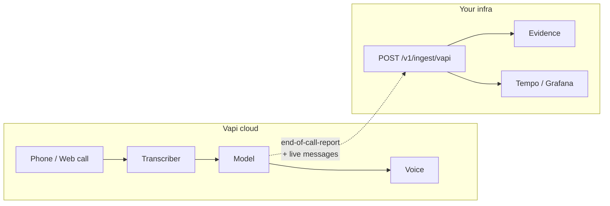

# Vapi

Use this page when **Vapi** places the call (**Path A**). Your agent prompt, transcriber, and voice live in Vapi. obsalt only sees what Vapi puts on the Server URL.

If you built the loop yourself (Pipecat talking to Deepgram), this is the wrong page — that is **Path B**: [Custom agents](../custom-agents.md).

## Architecture



| Piece | Where |
| --- | --- |
| Audio, STT, LLM, TTS, telephony | Vapi |
| Server URL, HMAC secret | You configure in the Vapi dashboard; obsalt verifies |
| CanonicalCall, hangup, hallucinations, evals | `obsalt serve` |
| Waterfall | Your OTLP backend, reconstructed **after** the terminal event |

There is no `VoiceCallTracer` in the Vapi process. You cannot see Deepgram’s internal spans. You see one `stt.provider.{name}` child when `assistant.transcriber.provider` is present — never a fake fallback chain.

## Dashboard setup

1. Run obsalt with a public URL (`https://obsalt.example` or a tunnel to `localhost:8080`).
2. In Vapi: **Assistants** (or the **Phone number** that should notify you) → **Server URL**.
3. URL:

   ```text
   https://obsalt.example/v1/ingest/vapi
   ```

4. **Server URL secret** — generate a random string. Set the same value as `OBSALT_VAPI_SECRET` / `[webhooks] vapi_secret`. Vapi sends it as `x-vapi-secret`.
5. If `OBSALT_REQUIRE_AUTH=true`, Vapi cannot send `X-API-Key` unless you put the secret in the query string yourself. Practical patterns:
   - Put obsalt on a private network and `REQUIRE_AUTH=false` **plus** Vapi HMAC, or
   - Put a proxy in front that adds `X-API-Key`, or
   - Keep `REQUIRE_AUTH=true` and only ingest from your own relay that adds the header.
6. Message types: enable at least **end-of-call-report**. Optional live types (`status-update`, `transcript`, `tool-calls` / `function-call`, `user-interrupted`) merge onto the same call and finalize when the report arrives.

`obsalt doctor` should show `vapi HMAC configured` once the secret is set.

## Auth headers

| Header | Purpose |
| --- | --- |
| `x-vapi-secret` | Must match `OBSALT_VAPI_SECRET` when that setting is non-empty |
| `X-API-Key` / `Authorization: Bearer` | Tenant (org) when you send it |

Empty `OBSALT_VAPI_SECRET` skips the HMAC (local only).

## Events

| `message.type` | terminal? | What obsalt keeps |
| --- | --- | --- |
| `end-of-call-report` | yes | Full turns, tools, prompt, recording, cost, `endedReason` |
| `status-update` | no | Status (`ended` / in-progress) |
| `transcript` (non-partial) | no | One turn to merge |
| `tool-calls` / `function-call` | no | Pending tools |
| `user-interrupted` | no | `interrupted` on an agent turn |

A payload may be `{ "message": { "type": "...", ... } }` (Vapi’s wrap) or the inner object. Both parse.

Terminal is `type == end-of-call-report` **or** any message that includes `endedReason`.

## What can be reconstructed

| Present in the report | Span / field |
| --- | --- |
| `artifact.messages[]` with roles `bot`/`user`, `secondsFromStart`, metadata `sttDuration` / `llmLatency` / `ttsLatency` / `e2eLatency` | Turns + per-turn timings |
| `toolCalls` + `tool_call_result` | `llm.tool_call.{name}` |
| `assistant.transcriber.provider` | `stt.provider` + one `stt.provider.{name}` child |
| `assistant.voice.provider` / `model.provider` / `model.model` | TTS / LLM attributes when reconstructing |
| `performanceMetrics.turnLatencies` | Extra STT/LLM/TTS/e2e/ttfa samples |
| `endedReason` | Hangup taxonomy (see below) |
| `artifact.transcript` / recording URLs | Evidence only |
| `assistant.model.messages` role=system | Grounding prompt |

**Often unknown:** STT vendor if `transcriber` is omitted; inside-Vapi retries; TTFB vs synthesis split if only e2e is present.

## Hangup mapping (Vapi `endedReason`)

Examples (prefix rules cover `pipeline-error-…`):

| Vapi | obsalt |
| --- | --- |
| `customer-ended-call` | `user_hangup` / user |
| `assistant-ended-call` | `agent_hangup` / agent |
| `assistant-forwarded-call` | `transfer` |
| `voicemail` | `voicemail` |
| `silence-timed-out` | `silence_timeout` |
| `exceeded-max-duration` | `max_duration` |
| `pipeline-error-…stt…` | `error_stt` |
| `pipeline-error-…llm…` | `error_llm` |

## Try it without Vapi

```bash
obsalt parse tests/fixtures/vapi_end_of_call.json
curl -X POST http://localhost:8080/v1/ingest/vapi \
  -H "X-API-Key: change-me" \
  -H "Content-Type: application/json" \
  -d @tests/fixtures/vapi_end_of_call.json
```

Expected on that fixture: hangup `user_hangup`, tool `lookup_order` error, hallucinations on `ORD-99999` and `$48.50`. Walkthrough: [Scenarios — Ada’s refund](../scenarios.md).

## After the call

```bash
curl -H "X-API-Key: change-me" http://localhost:8080/v1/calls
curl -H "X-API-Key: change-me" http://localhost:8080/v1/calls/$CALL_ID
```

In Grafana/Tempo, filter `call.id` = the ingest `call_id` (not Vapi’s `call.id` — that is `provider_call_id`).
