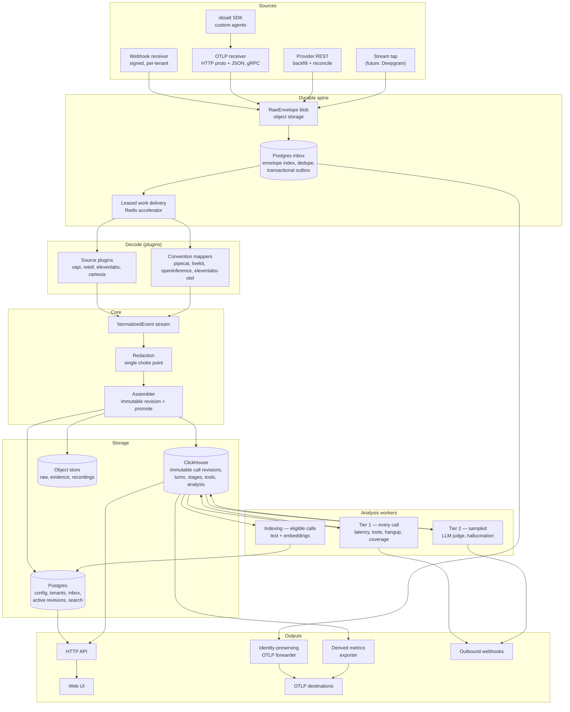

# obsalt v2 — architecture and rewrite plan

Status: **revised proposal, awaiting approval**
Supersedes: the current `main` implementation (v0.1)
Written: 2026-08-22
Revised: 2026-08-22 after architecture, security, and provider-contract review

---

## 0. How to read this

Section 1 defines what the product is, because every other decision depends on it. Section 2
is the evidence that forced the rewrite. Section 3 states the design tenets that fall out of
that evidence — these are the load-bearing claims, and if one of them is wrong the plan below
it changes shape. Sections 4–13 are the design. Section 14 is the build sequence. Section 15
lists what is still open.

Reviewers should attack Section 3 first. Everything else is downstream.

---

## 1. Product definition

### 1.1 What obsalt is

**obsalt is a self-hosted call analytics and quality system for AI voice agents.** It owns the
call record and the analysis on top of it. It is the thing an engineer opens when a call went
wrong, and the thing a product owner opens to ask which agent is losing customers.

The product is these six capabilities. Everything in this plan exists to make them true:

| Capability | What it must actually deliver |
| --- | --- |
| **Latency breakdown** | Native pipeline stages isolated per call where the source supplies them. P50/P95 per agent across the fleet, without inventing cascade stages for speech-to-speech systems. |
| **Hangup analyzer** | Cluster calls by why they ended. Surface the call that lost the customer. |
| **Hallucination detection** | Flag agent claims not grounded in prompt, knowledge, tool results, or the caller. |
| **Function call telemetry** | Every tool invocation: success rate, retries, payload shape, time-to-tool. |
| **Custom evals** | Quality rubrics in plain English, judged by an LLM against every sampled call. |
| **Semantic search** | Find calls by meaning. "Customers asking about refunds" works. |

### 1.2 What obsalt is not

Stating this precisely is what makes the UI and storage scope decidable.

- **Not a general APM or tracing backend.** We export OTLP to Grafana/Tempo/Datadog/Honeycomb.
  We do not try to be a better Tempo. Infrastructure correlation stays in your APM.
- **Not a testing or simulation platform.** Generating synthetic callers, load testing, and
  pre-launch regression suites are Hamming/Coval/Cekura territory. obsalt observes production.
  (Production-to-test replay is a plausible later adjacency, explicitly out of v2 scope.)
- **Not a dashboard builder.** We ship the views the six capabilities need, not a query builder.
- **Not a prompt management or agent-building tool.**

### 1.3 Who it is for

1. **Teams on one hosted platform** (Vapi, Retell, ElevenLabs, …) who want a call console they
   own, with analysis their provider's dashboard does not do.
2. **Teams building custom agents** (Pipecat, LiveKit, OpenAI Realtime, Gemini Live) who want
   voice-aware call analysis and want their spans in their existing observability backend.

Multi-workspace operation is a **constraint** — the data model, auth, and per-tenant provider
credentials must be correct from day one — but agency/reseller features are not a v2 goal.

### 1.4 Scope of the UI (resolves Q17)

Latency and tool metrics can be graphed in Grafana, but the product as a whole cannot be reduced
to Grafana dashboards. Hangup clusters, hallucination flags, eval results, semantic search, and
the per-call transcript-plus-timing join are domain-specific views over a domain-specific
aggregate. So obsalt ships a real UI, scoped to exactly these surfaces:

1. **Call list** — filter by agent, outcome, time, latency threshold, flag, eval result.
2. **Call detail** — the join view: timeline on the left, transcript on the right, tools,
   flags, evals, and an explicit provenance/coverage panel.
3. **Latency** — stage distributions and percentiles, by agent, over time.
4. **Hangups** — clusters with drill-through.
5. **Quality** — eval results and hallucination flags, with a review queue.
6. **Search** — semantic + filtered.
7. **Settings** — provider connections, rubrics, retention, plugins, keys.

No general charting. No custom dashboards. Fleet-wide infrastructure correlation is a link out
to your OTLP backend.

---

## 2. Why a rewrite (the evidence)

Three independent investigations converged on one root cause. Summary; the detail is in the PR
discussion.

### 2.1 The adapters were written against invented payloads

Provider adapters were validated against hand-written fixtures that were reverse-engineered
from the adapters themselves. All 62 tests pass. On real payloads:

| Provider | Real state |
| --- | --- |
| **Vapi** | The schema-conformant latency path is dead. It reads `turnLatencies[].stt/llm/tts/e2e`; the published keys are `transcriberLatency`/`modelLatency`/`voiceLatency`/`turnLatency`. It reads `artifact.messages[].metadata.llmLatency`, although published `BotMessage` does not define that metadata. Fixtures contain the invented fields, so tests pass while real provider stage measurements are discarded. Reason-code coverage is incomplete and must be measured against a pinned schema revision rather than a hard-coded enum count. |
| **Retell** | Worse, because it is silent. `words[].start/end` are **seconds**, read as milliseconds. Correct provider values (580ms, 900ms) get averaged with 1000×-low derived values (0.2ms, 0.6ms), yielding a P50 of 290ms where the truth is ~740ms. Direct tool duration is unavailable, although `transcript_with_tool_calls` can provide coarse utterance/word association. |
| **Bland** | The prior adapter audit found it the most faithful implementation in the repo. The log-line regex initially assumed fabricated is documented. Its one real defect: the `category == "tool"` branch is unreachable because Bland sends `category: "call"`. |
| **OpenAI Realtime** | Barge-in detection is a 100% false positive — every agent turn followed by any user speech is flagged as an interruption. One measured interval is written into three different fields (`llm_ttft_ms`, `llm_ms`, `tts_ttfb_ms`) and then rendered as three sequential spans. |

### 2.2 Webhook security is non-functional for Retell and Bland

Retell and Bland implement the wrong algorithms, and the Retell test verifies our formula
against itself:

```python
sig = hmac.new(b"secret", body, hashlib.sha256).hexdigest()
assert verify_retell({"x-retell-signature": sig}, body, "secret")   # tautology
```

Real Retell sends `X-Retell-Signature: v={ms},d={hex}` where the digest is
`HMAC-SHA256(raw_body + timestamp)` keyed by the **API key**. Real Bland sends
`X-Webhook-Signature` as an HMAC digest, not a plaintext secret. `verify_retell` approximately
implements Bland's body-HMAC shape and `verify_bland` implements a plaintext shared-secret
check. Vapi's legacy `X-Vapi-Secret` path can work, but it does not support Vapi's configurable
Bearer, OAuth2, or HMAC modes.

Set a Retell or Bland secret and real webhooks fail verification. Leave any provider secret
blank and `verify_*` returns `True` unconditionally. Retell and Bland therefore have no
configuration in which webhook security both works and is enabled; all providers fail open
when their secret is absent.

### 2.3 Retroactive span synthesis cannot be fixed

Not a bug — a category error. `emitter.py` anchors synthesized child spans at a containing turn
boundary and lays them out by duration arithmetic:

```python
stt_end = _shift(t_start, stt_ms)     # STT starts at turn start
llm_end = _shift(t_start, llm_ms)     # LLM also starts at turn start
```

User STT and agent LLM/TTS stages are independently anchored to their respective turn starts,
not to measured stage timestamps. Even with the field names fixed, Vapi stage values have no
stage timestamps or turn association, and Retell publishes call-level latency distributions
plus approximate word intervals. There is nothing to place those stage values at. A waterfall
drawn from summary statistics is not observability; it is a chart that causes wrong conclusions.

### 2.4 We tell users data is unobtainable while discarding it

`assess_coverage` reports VAD/endpointing timing and STT confidence as **structural** gaps —
"hosted platforms do not send this." Vapi sends `endpointingLatency` per turn,
`numAssistantInterrupted`, `numUserInterrupted`, and word-level confidence, in the payload we
already receive and throw away. Retell publishes `llm_websocket_network_rtt`. Bland can publish
`corrected_transcript[]` with real second-precision timings and per-utterance confidence when
delayed post-call enrichment is enabled.

This is the finding that determines the architecture. Our own honesty mechanism could not
distinguish "the provider did not send it" from "we failed to parse it," so it confidently
reported the wrong one.

### 2.5 The rest is prototype scaffolding

In-memory store (restart loses everything, so no adapter bug is ever recoverable);
`merge_calls` mutating stored objects in place with a dead variable in the middle;
all analysis running synchronously inside the webhook request; one global secret per provider
across all tenants; `require_auth=false` collapsing every unknown key into the first org;
`_call_summary` rebuilding a full span tree per call per list request; hangup clustering
re-embedding every call in the org on every request.

### 2.6 Half the premise was inverted

The dated provider survey found no surveyed hosted voice platform that pushes standard OTLP to
an arbitrary collector. ElevenLabs comes closest: it delivers OTLP-*shaped JSON* over a signed
webhook that users must still receive. The survey matrix, provider list, URLs, and retrieval
dates must live beside the plugin fixtures so this negative claim remains reproducible.

So the webhook receiver is not the redundant part; for the committed hosted providers it is
the ingest path that exists, and being a correct authenticated receiver across incompatible
schemes is real, security-sensitive work that every user would otherwise reimplement.

What is redundant is the span synthesis on top of it.

### 2.7 Evidence standard for this rewrite

Provider documentation is necessary but not sufficient. Published schemas often omit units,
leave metadata untyped, or lag deployed payloads. Every provider claim in this document and in
plugin code must therefore identify:

1. the pinned schema or documentation revision;
2. a captured, redacted payload where legally available;
3. semantic assertions for units and cross-field meaning; and
4. the date the claim was last verified.

Schema validation catches structural drift. It does not prove unit correctness, stage
placement, tool pairing, or interruption semantics.

---

## 3. Design tenets

These are the claims the plan rests on. Each one is a direct response to evidence above.

> **T1. Never draw what you did not measure.**
> A timeline is only rendered where real timestamps exist. Durations without timestamps are
> stored and displayed as *measurements* — distributions, percentiles, per-turn chips — never
> as span positions. Fidelity is derived from the measurements present on each call, not merely
> declared once per source.

> **T2. Provenance is a first-class field, not metadata.**
> Every value carries where it came from: `provider_reported` (with the source path),
> or `obsalt_derived` (with the derivation). Absence is represented by a separate
> `SignalCoverage` fact with a reason. This is the only mechanism that distinguishes §2.1
> from §2.4, and it is the product's trust surface.

> **T3. Raw first, durable, replayable.**
> Every inbound payload is persisted verbatim before it is acknowledged, and decode is a pure
> function from raw to normalized. Adapter bugs become replays, not permanent data loss. Given
> §2.1, we must assume adapter bugs are the *steady state*, not an exception. Replayability is
> bounded by configured raw retention and upstream provider retention; the UI states that
> horizon explicitly.

> **T4. Decoders are validated against published schemas, not against themselves.**
> A provider fixture that does not validate against the vendor's published OpenAPI/JSON Schema
> fails CI. Captured payloads, golden normalized outputs, unit assertions, and semantic
> invariants cover what schemas cannot express.

> **T5. One choke point per cross-cutting concern.**
> All sources funnel through one normalization and assembly path. Queryable normalized content
> crosses one core-owned redaction boundary before persistence; forwarded telemetry crosses one
> core-owned export-policy boundary before egress. Plugins cannot bypass either boundary.

> **T6. Decode, assemble, and analyze are separate stages with separate versions.**
> Adapters emit small normalized events; core owns assembly; analysis runs async on the
> assembled aggregate. Reprocessing builds a complete revision side by side and atomically
> promotes it. This is what kills `merge_calls` and makes reprocessing tractable.

> **T7. Pick the storage engine once, for the target scale, and do not abstract it.**
> A pluggable-backend layer is the thing to avoid, not the thing to build.

> **T8. Providers are separately installable packages against a versioned contract.**
> Core ships no providers. First-party providers use the same public plugin API as third-party
> ones, so the API cannot rot.

> **T9. Expensive analysis is sampled, cached, and budget-bounded.**
> Deterministic analysis and search indexing necessarily scale linearly with eligible call
> volume. At millions of calls, LLM-judging every call against every rubric is financially
> impossible. Cheap deterministic analysis runs on 100%; expensive LLM analysis runs on a
> sampled or triggered subset.

> **T10. Tenant identity comes only from authenticated credentials.**
> Payload fields, span attributes, trace resources, and object keys may corroborate an
> authenticated organization. They may never select one.

---

## 4. Target architecture



### 4.1 Stage contracts

| Stage | Input | Output | Idempotent? | Versioned? |
| --- | --- | --- | --- | --- |
| Receive | HTTP request | `RawEnvelope` + inbox/outbox committed; provider-specific success response | yes, by transport delivery key | — |
| Decode | `RawEnvelope` | `NormalizedEvent[]` | yes, pure function | `decoder_version` |
| Redact | `NormalizedEvent[]` | `NormalizedEvent[]` | yes | `redaction_policy_version` |
| Assemble | `NormalizedEvent[]` | immutable `CallRevision` + active-revision promotion | yes, stable fact identities | `assembler_version` |
| Analyze T1 | active call revision | analysis rows keyed by call revision | yes | `analyzer_version` per analyzer |
| Index | active call revision | versioned lexical + vector search document | yes, cached by content hash | `index_version` + `embedder_version` |
| Analyze T2 | active call revision | analysis rows keyed by call revision | yes, cached by content hash | `judge_version` + `prompt_version` |

Every stage records its version and `processing_run_id` on its output. Reprocessing builds a
complete candidate revision for all matching envelopes, validates it, and promotes it through
the serving protocol below. The UI can show that a call's latency was decoded by `vapi/3` while
another was decoded by `vapi/2`.

Late events create a new call revision. They invalidate revision-keyed analysis and search
documents without mutating historical results. Outbound events include both a stable event id
and the call revision that caused them.

### 4.2 Promotion and serving consistency

There is no cross-database transaction between ClickHouse and Postgres, so the design does not
pretend there is one:

1. Write a complete immutable candidate revision to ClickHouse and verify it is query-visible.
2. Compare-and-swap the Postgres active-revision pointer from the expected old revision to the
   candidate. A failed CAS means the candidate is historical, not active.
3. Call-detail reads fetch the pointer first and query the exact ClickHouse revision; they never
   ask ClickHouse to guess "latest."
4. Analysis and search build revision-keyed outputs after promotion. Their execution state is
   explicit: `pending`, `sampled_out`, `budget_blocked`, `running`, `failed`, or `completed`.
5. Fleet rollups are immutable serving generations. A correction rebuilds affected partitions,
   verifies them, then compare-and-swaps a separate Postgres rollup-generation pointer. APIs
   expose `as_of_generation` and may lag call detail, but never mix generations in one response.

This provides atomic selection of already-durable immutable data, not impossible atomic writes
across the two databases.

---

## 5. Domain model

### 5.1 The core insight: separate measurement from timeline

This resolves the tension between "latency breakdown per call" (a required product capability)
and "hosted providers ship durations without timestamps" (an unfixable data limitation).

A **`StageMeasurement`** is an individual measured duration. An
**`AggregateMeasurement`** is a provider-published statistic such as p95. Placement is recorded
per measurement, and call fidelity is derived from the facts actually present. Absence is a
separate coverage fact rather than a fake zero-valued measurement.

```python
class TimelineFidelity(StrEnum):
    STAGE_LEVEL   = "stage_level"    # at least one real stage interval
    TURN_LEVEL    = "turn_level"     # real turn boundaries, stage values unplaced
    MESSAGE_LEVEL = "message_level"  # coarse message anchors, no complete intervals
    CALL_LEVEL    = "call_level"     # aggregates only
    NONE          = "none"

class MeasurementPlacement(StrEnum):
    INTERVAL          = "interval"           # real start and end
    ANCHORED_DURATION = "anchored_duration"  # real anchor plus measured duration
    UNPLACED          = "unplaced"           # duration only
    COARSE_ANCHOR     = "coarse_anchor"      # low-resolution timestamp

class PipelineArchitecture(StrEnum):
    CASCADE         = "cascade"          # discrete STT -> LLM -> TTS
    SPEECH_TO_SPEECH = "speech_to_speech" # no stage decomposition exists
    HYBRID          = "hybrid"

class Provenance(StrEnum):
    PROVIDER_REPORTED = "provider_reported"
    OBSALT_DERIVED    = "obsalt_derived"

class SignalCoverageStatus(StrEnum):
    PRESENT       = "present"
    ABSENT        = "absent"
    REDACTED      = "redacted"
    DECODE_FAILED = "decode_failed"
    UNSUPPORTED   = "unsupported"

class StageMeasurement(BaseModel):
    fact_id: str
    stage: Stage                    # vad|stt|llm|tts|playout|tool|e2e|ttfa|transport|endpointing
    metric: Metric                  # duration|ttft|ttfb|first_audio
    value_ms: float
    turn_index: int | None          # None => call-level
    placement: MeasurementPlacement
    started_at: datetime | None
    ended_at: datetime | None
    resolution_ms: float | None
    provenance: Provenance
    source_path: str | None         # "artifact.performanceMetrics.turnLatencies[0].modelLatency"
    derivation: str | None          # "turn_gap(prev.ended_at, this.started_at)"

class AggregateMeasurement(BaseModel):
    fact_id: str
    stage: Stage
    metric: Metric
    statistic: Statistic            # mean|p50|p90|p95|p99|min|max
    value_ms: float
    population: int | None
    window: str | None
    provenance: Provenance
    source_path: str | None

class SignalCoverage(BaseModel):
    signal: Signal
    status: SignalCoverageStatus
    reason: str | None
    source_path: str | None
    decoder_version: str
```

Two consequences:

- The **latency breakdown is architecture-aware**. Cascade stages appear only when the source
  reports them; speech-to-speech sources show their native input/generation/playout stages.
- A stage waterfall renders only `INTERVAL` measurements. At `TURN_LEVEL` the UI shows turn
  bars with unplaced stage chips. `ANCHORED_DURATION` is visibly distinguished from an interval.
  At `MESSAGE_LEVEL` it shows coarse anchors; at `CALL_LEVEL` it shows distributions and says why.
- Provider-published percentiles are `AggregateMeasurement`s. They never enter sample-derived
  percentile rollups.

Per-source fidelity, from the provider survey:

| Source | Architecture | Fidelity | Waterfall | Notes |
| --- | --- | --- | --- | --- |
| Pipecat (OTLP) | cascade or S2S | `stage_level` | yes | real spans |
| LiveKit (OTLP) | cascade or S2S | `stage_level` | yes | real spans |
| obsalt SDK | either | `stage_level` | yes | we control the clock |
| Cartesia Line | cascade | `turn_level` | no | real turn intervals + unplaced STT/TTS TTFBs |
| Vapi | cascade | `turn_level` | no | `secondsFromStart`+`duration` real; stage durations unplaced |
| Retell | cascade | `turn_level` | no | approximate word intervals in seconds; stage distributions are call-level |
| ElevenLabs post-call JSON | cascade | `message_level`¹ | no | whole-second message anchors, no documented end timestamps |
| ElevenLabs OTLP-shaped webhook | cascade | derived per span | where interval contract passes | provider spans include start/end; mapper validates each span's semantics |
| OpenAI Realtime | speech_to_speech | `stage_level`² | partial | S2S shape: no STT/LLM/TTS split exists |
| Gemini Live | speech_to_speech | `stage_level`² | partial | same |

¹ one-second resolution, flagged in the UI. ² client-stamped by our SDK; genuinely
`stage_level` for the stages that exist
(`user_input`, `generation`, `playout`), but the cascade stages do not exist and must not be
shown as empty.

### 5.2 Aggregate

```
Call
├── identity      org, call_id (uuid5), source, source_call_id, agent_id, agent_version
├── telephony     direction, from/to (redacted), sip/provider ids
├── lifecycle     started_at, ended_at, duration_ms, status, pipeline_architecture,
│                 timeline_fidelity, cost
├── outcome       Hangup { reason, party, provider_code, provenance }
├── Turn[]        index, speaker, text_ref, started_at?, ended_at?, interrupted?, confidence?
├── StageMeasurement[]
├── AggregateMeasurement[]
├── ToolInvocation[]  id, name, turn_index?, started_at?, duration_ms?, status, retry_count,
│                     payload_shape, argument_hash, result_ref, error
├── Grounding     system_prompt_ref, knowledge_refs[], tool_result_refs[], user_text_ref
├── Evidence      transcript_ref, recording_ref { uri, channels[], duration_ms }
├── SignalCoverage[]  per-call presence/absence/redaction/decode status
└── Provenance    map<field_path, Provenance + source_path>
```

Notes:

- **`*_ref` not inline text.** Transcripts, prompts, tool payloads and recordings are content-
  addressed references into the evidence store. Keeps the hot tables narrow and gives
  redaction and retention a single object to act on.
- **`Grounding` is populated.** In v0.1 `tool_results` and `user_text` were never set by any
  provider, which silently crippled hallucination detection. Populating grounding is a decoder
  conformance requirement (§13).
- **Analysis is associated, not embedded.** `AnalysisExecution` and additive
  `AnalysisResult` rows are keyed by call revision, analyzer/rubric version, and prompt/model
  version. The call revision remains immutable while users can see that it failed rubric v1
  and passed v2.

### 5.3 Normalized events

Decoders emit small facts, not whole-call snapshots. This is what removes `merge_calls`.

```python
CallObserved(source_call_id, agent_id, direction, started_at, architecture, provenance_by_field, ...)
TurnObserved(turn_index, speaker, text, started_at?, ended_at?, confidence?, interrupted?,
             provenance_by_field)
StageObserved(stage, metric, value_ms, turn_index?, placement, started_at?, ended_at?,
              resolution_ms?, provenance, source_path, derivation?)
AggregateObserved(stage, metric, statistic, value_ms, population?, window?, provenance, source_path)
ToolObserved(tool_id, name, turn_index?, started_at?, ended_at?, status, args, result,
             provenance_by_field)
OutcomeObserved(provider_code, reason?, party?, ended_at, cost?, provenance_by_field)
GroundingObserved(kind, content, provenance, source_path)
EvidenceObserved(kind, uri, metadata, provenance, source_path)
InterruptionObserved(turn_index?, count?, kind)   # Vapi numAssistantInterrupted lands here
SnapshotBoundaryObserved(authoritative_domains, source_revision)
FactRetracted(fact_id, source_revision)
CallFinalized(reason)
```

Core, not plugin code, stamps every event with `(org_id, call_key, fact_id, envelope_id,
decoder_version, processing_run_id, event_occurred_at, envelope_sequence)`. `fact_id` is
deterministic for a source fact.

`source_revision` is present only when the provider supplies an ordered sequence, revision, or
documented update timestamp. A content hash identifies content but does not establish which
content is newer. For the same `fact_id`, identical content dedupes; a greater ordered source
revision wins; differing content without a comparable revision becomes a visible conflict
instead of an arbitrary overwrite. Snapshot decoders emit `SnapshotBoundaryObserved` and may
retract omitted facts only for domains the provider documents as authoritative. Delta events
never imply retraction by omission.

With those rules, merging independent facts is associative, commutative, and idempotent; any
delivery order produces the same candidate revision. Conflicts block automatic promotion until
the plugin's documented resolution policy or an operator resolves them.

---

## 6. Ingest

### 6.1 Webhook receiver

Route: `POST /v1/ingest/{provider}/{ingest_key}`

`ingest_key` is an opaque, high-entropy, hashed-at-rest per-connection identifier. It is what
makes per-tenant secrets possible: we resolve the connection *before* authenticating, so each
tenant has its own provider credentials instead of one global `OBSALT_VAPI_SECRET`.

Ordered pipeline, non-negotiable order:

1. Read **raw bytes** (never a parsed model — parsing changes the byte sequence and breaks
   authentication). Enforce compressed and expanded body limits.
2. Resolve `ingest_key` → `(org_id, provider, connection, encrypted credentials, plugin)`.
3. Core retains raw multi-valued headers, rejects duplicates for headers the plugin declares
   singleton, and passes the remaining values to
   `plugin.authenticate(raw_bytes, raw_headers, connection_config)`. Fail closed when required
   credentials are absent and enforce any replay window.
4. Classify the event using the authenticated body. This endpoint accepts observational
   delivery events only. Vapi `assistant-request`, tool execution, transfer, knowledge-base,
   and other synchronous request/response events must be routed to the user's application;
   connection validation prevents configuring obsalt as their handler.
5. Derive a transport delivery key: native delivery id where documented, otherwise a
   plugin-defined semantic composite or deterministic raw-body digest. Event identity and call
   identity are different concepts. Extract authenticated tombstone hints such as provider call
   id and event time where available.
6. Write the raw body to an org-namespaced deterministic object key. Persist only an allowlist
   of diagnostic headers; never archive authorization or cookie headers.
7. In one Postgres transaction, insert or resume the `RawEnvelope` index, delivery-key dedupe
   row, and transactional outbox record, while rechecking all known tombstones under the same
   transaction. An object without a committed index is a sweepable orphan; a committed envelope
   can never exist without queued work. A tombstoned orphan is purged before acknowledgement.
8. Generate the provider/event/format-specific acknowledgement from the classified
   observational event. Some ElevenLabs webhook guides require `200`, while its OTLP-shaped
   endpoint accepts any `2xx`; the plugin contract pins the applicable response.

Decode happens in a worker. The worker rechecks call, caller, and range tombstones after full
identity extraction and before normalized persistence. Deletion jobs also suppress matching
inbox/outbox work, closing the race where deletion begins after receive commits. A dispatcher
leases outbox work through Redis, but Postgres remains the source of truth. Nothing
provider-facing waits on decode or analysis.

Dedupe retention is provider- and connection-specific. Automatic retry horizons may be unknown,
and manual resends can occur much later. This is a persisted Postgres table, not a short Redis
TTL. Duplicate requests inspect envelope state and resume incomplete acceptance instead of
blindly returning "already processed."

Provider authentication is a **plugin capability**, because the schemes are genuinely
incompatible and some are operator-configurable:

| Provider | v2 status | Header | Scheme |
| --- | --- | --- | --- |
| Vapi | committed | configurable | Distinct static Bearer, OAuth2, and HMAC validation paths. HMAC configuration includes algorithm, signature header, optional timestamp header, and payload canonicalization. Legacy `X-Vapi-Secret` shared secret. |
| Retell | committed | `X-Retell-Signature` | `v={unix_ms},d={hex}`; `HMAC-SHA256(raw_body + timestamp)` keyed by the **API key**; ±5 min |
| ElevenLabs | committed | `ElevenLabs-Signature` | `t={unix},v0={hex}`; `HMAC-SHA256("{t}.{body}")`; 30-min tolerance (one-sided upstream — we enforce both sides) |
| Cartesia Line | committed | `x-webhook-secret` | plain shared secret (weakest; documented as such) |
| Bland | surveyed future | `X-Webhook-Signature` | `HMAC-SHA256(body)` hex, no timestamp → no replay protection |
| Telnyx | surveyed future | `telnyx-signature-ed25519` + `telnyx-timestamp` | Ed25519 over `"{timestamp}|{raw_body}"`; enforce timestamp freshness |

Core provides tested primitives (`hmac_hex`, `hmac_base64`, `parse_kv_header`, `ed25519_verify`,
`enforce_window`, `constant_time_eq`, JWT validation) so plugins compose rather than
reimplement. `VerifyResult` has explicit malformed, missing-credential, bad-signature, stale,
and replayed outcomes; no authentication capability may silently disable itself.

### 6.2 OTLP receiver

`POST /v1/traces` — OTLP/HTTP protobuf **and** proto3-JSON. OTLP/gRPC on a separate
`grpc.aio` server in the same process, opt-in by config.

Implementation notes drawn from Phoenix's receiver:

- Parse with `opentelemetry-proto`. Do not hand-roll stubs.
- `Content-Type` must be `application/x-protobuf` or `application/json`; 415 otherwise.
  Handle `gzip` and `deflate`, with compressed and expanded size, span-count, attribute-count,
  nesting, and string-length limits.
- Respond with a serialized `ExportTraceServiceResponse`, not an empty 200. A populated partial
  success response is for permanently invalid records or a warning with zero rejections; OTLP
  clients **must not retry** it. For transient capacity pressure, reject the entire unaccepted
  batch with HTTP 503 or gRPC `UNAVAILABLE`. If `RESOURCE_EXHAUSTED` is used for recoverable
  throttling, it must include `google.rpc.RetryInfo`; without that detail clients treat it as
  non-retryable.
- Decode in a threadpool so protobuf work never blocks the event loop.
- Malformed protobuf is 400, not 500.
- Tenancy comes from an ingest-scoped API key, connection token, or mTLS identity bound to one
  org. `obsalt.org` and `service.namespace` may corroborate or route within that org, never
  establish it. Reject mixed-org assertions in one batch.
- Delivery identity is `(org_id, trace_id, span_id, content_fingerprint)`, so identical exporter
  retries dedupe. Different content for the same trace/span identity is a conflict unless a
  mapper supplies a comparable source revision; a hash alone cannot identify the newer span.

Accepted batches use the same object-store + inbox/outbox durability path as webhooks. Spans
are decoded into `NormalizedEvent`s by a **convention mapper** and then take the same path as
everything else. **obsalt does not become a general span store.** Raw spans are kept in the raw
archive for bounded replay and durable forwarding; the queryable model is the Call aggregate.

### 6.3 Trace assembly — never wait

Waiting for trace completion is unsolvable in general. The industry answer, and ours:

1. On the first span of an unseen trace, create a Postgres assembly record keyed by
   `(org_id, trace_id)` with `first_seen_at`; do not insert a partial ClickHouse call snapshot.
2. Fold incoming immutable facts into a candidate revision. A non-root span may not win
   root-owned semantic fields such as call name, outcome, or end time.
3. When the root arrives (`parent_span_id` empty, or explicit `obsalt.as_root=true` for
   frameworks that emit orphan roots), mark the candidate rooted.
4. Finalize at `min(root_ended_at + grace, first_seen_at + max_call_duration)`. **Voice calls
   have a natural upper bound that generic tracing lacks** — use the configured platform bound.
5. Validate and promote the complete revision through §4.2. Late spans build a candidate newer
   revision and increment `obsalt_late_spans_after_finalize_total`; conflicting replacements
   require a comparable source revision or explicit resolution.

### 6.4 Provider REST backfill (Q6 — including it)

Webhooks are lossy: providers disable endpoints after consecutive failures and retries expire.
Backfill is provider-specific scanning plus optional detail hydration: some APIs have time
filters, some require an agent id, some use cursors, and some list endpoints omit transcripts
or recordings. `RestBackfill` emits `RawEnvelope`s with identity
`(connection, upstream_entity_id, content_hash)` and a separate comparable upstream revision or
update timestamp when one exists. Different snapshots without an ordered revision become a
conflict rather than silently treating the latest arrival as authoritative.

Backfill runs on a schedule and on demand, but it is bounded by provider retention, zero-data
retention settings, deletion, pagination, and field availability. Replay re-decodes retained
raw data; backfill reduces outage gaps. Neither guarantees recovery beyond the displayed raw
and provider retention horizons.

### 6.5 SDK sources

OpenAI Realtime and Gemini Live are bidirectional streaming APIs with no post-call webhook.
The only place their telemetry exists is your process. So they are served by the obsalt SDK
(a thin OTel wrapper) emitting OTLP, with a documented S2S span shape. This replaces the v0.1
"batch a JSON array of events and POST it," which was an obsalt-invented envelope.

### 6.6 Stream tap (Q29 — designed for, not built)

Deepgram Voice Agent has the richest per-turn latency data of anything surveyed (a seven-field
`LatencyReport` per turn) and no webhooks at all. Its integration shape is "tap the WebSocket,
persist every non-audio frame." That is an additional capability, `StreamSource`, declared in
the plugin API in v2 with no first-party implementation. Adding Deepgram later must not require
a core change.

### 6.7 The Langfuse-compatible endpoint (deferred, with rationale)

Vapi natively pushes traces to Langfuse via `assistant.observabilityPlan`, and it is currently
their only observability provider. Exposing a Langfuse-shaped ingest endpoint would let a Vapi
user point at obsalt with zero webhook configuration. It is genuinely tempting.

**Deferred, not rejected.** It is a compatibility surface for a proprietary, undocumented,
moving API. Given the answer to Q5 prioritized breadth of first-class provider support, the
effort is better spent on four committed hosted source plugins and four SDK/convention
integrations. Revisit if Vapi's webhook path proves insufficient.

---

## 7. Plugin system and packaging

### 7.1 Separate distributable packages (Q9)

Core ships **no** providers.

```
obsalt                      core: domain, assembly, analysis, API, UI, plugin host
obsalt-testkit              conformance test base classes (dev dependency for plugin authors)
obsalt-vapi                 ┐
obsalt-retell               │
obsalt-elevenlabs           ├ first-party hosted source plugins, released independently
obsalt-cartesia             ┘
obsalt-openai-realtime      SDK instrumentation + matching OTLP mapper
obsalt-gemini-live          SDK instrumentation + matching OTLP mapper
obsalt-pipecat              first-party convention mapper + optional Pipecat observer
obsalt-livekit              first-party convention mapper
```

Convenience extras: `pip install "obsalt[vapi,retell]"`. Bundle: `obsalt-providers-all`.

A company can publish `acme-obsalt-salesforce-voice` against the public contract and install it
alongside. Nothing in core changes.

### 7.2 Discovery and contract

Entry-point group `obsalt.plugins`, via `importlib.metadata.entry_points`. First-party
providers register through the **same** group — no privileged path, so the public API cannot rot.

```python
class ObsaltPlugin(Protocol):
    API_VERSION: ClassVar[int]           # checked against core's supported range
    name: ClassVar[str]                  # "vapi" — free-form, not a core enum
    display_name: ClassVar[str]
    capabilities: ClassVar[frozenset[Capability]]
    manifest: ClassVar[PluginManifest]   # config schema, secret fields, trust + fidelity metadata

class Capability(StrEnum):
    WEBHOOK_SOURCE     = "webhook_source"
    OTLP_MAPPER        = "otlp_mapper"
    REST_BACKFILL      = "rest_backfill"
    STREAM_SOURCE      = "stream_source"     # declared in v2, unimplemented
    SDK_INSTRUMENTATION = "sdk_instrumentation"
    AUTHENTICATION     = "authentication"
    JUDGE              = "judge"
    EMBEDDER           = "embedder"
    REDACTOR           = "redactor"
```

Capability protocols:

```python
class WebhookSource(Protocol):
    singleton_headers: ClassVar[frozenset[bytes]]
    def authenticate(self, raw: bytes, headers: RawHeaderList, cfg: ConnectionConfig) -> VerifyResult: ...
    def classify(self, raw: bytes) -> ObservationalEventKind: ...
    def delivery_key(self, raw: bytes, headers: RawHeaderList) -> str | None: ...
    def tombstone_hints(self, raw: bytes) -> TombstoneHints: ...
    def acknowledgement(self, kind: ObservationalEventKind) -> WebhookResponse: ...
    def decode(self, envelope: RawEnvelope) -> Iterable[NormalizedEvent]: ...

class OtlpMapper(Protocol):
    def claims(self, span: ReadableSpan) -> int: ...          # priority; 0 = not mine
    def decode(self, spans: Sequence[ReadableSpan]) -> Iterable[NormalizedEvent]: ...

class RestBackfill(Protocol):
    def scan(self, cfg: ConnectionConfig, cursor: BackfillCursor) -> BackfillPage: ...
    def hydrate(self, cfg: ConnectionConfig, item: BackfillItem) -> RawEnvelope: ...

class StreamSource(Protocol):
    async def frames(self, cfg: ConnectionConfig) -> AsyncIterator[RawEnvelope]: ...

class SdkInstrumentation(Protocol):
    def instrument(self, client: object, cfg: SdkConfig) -> InstrumentedClient: ...

class Judge(Protocol):
    async def judge(self, request: JudgeRequest) -> JudgeResult: ...

class Embedder(Protocol):
    async def embed(self, documents: Sequence[RedactedDocument]) -> Sequence[Vector]: ...

class Redactor(Protocol):
    def redact(self, events: Sequence[NormalizedEvent], policy: RedactionPolicy) -> RedactionResult: ...
```

Plugins also declare their **fidelity contract**, which the UI reads directly rather than
hardcoding prose (this replaces v0.1's hand-written `assess_coverage` if/else blocks):

```python
class FidelityDeclaration(BaseModel):
    source_format: str
    possible_architectures: frozenset[PipelineArchitecture]
    possible_placements: frozenset[MeasurementPlacement]
    provides: frozenset[Signal]      # stt_duration, llm_ttft, tool_timing, barge_in, ...
    structurally_absent: dict[Signal, str]   # signal -> why this provider cannot supply it
    schema_source: str               # URL of the published schema fixtures validate against
    schema_revision: str
    verified_at: date
```

The declaration states what a plugin *can* produce; actual call fidelity and
`SignalCoverage` are derived from decode output.

Plugins are trusted, operator-installed code in v2. They are pinned, inventoried, vulnerability
scanned, and receive only the credentials needed for their capability. Loading is defensive:
version mismatches and ordinary exceptions are isolated with deadlines and clear diagnostics.
Exception wrapping is not a security sandbox and the product does not claim that an arbitrary
wheel cannot read process memory, block, or exit. Tenant-installable plugins require a future
out-of-process runtime with IPC validation, resource limits, network policy, and per-job
credentials.

### 7.3 Hand-written Python, not a DSL (Q10/Q23 confirmed)

Decoders are Python, with a small declarative field-mapping helper for the boring majority:

```python
MAP = FieldMap({
    "source_call_id": "message.call.id",
    "agent_id":       ["message.call.assistantId", "message.assistant.id"],
    "started_at":     Ts("message.startedAt"),
    "cost":           "message.cost",
})
```

Not a DSL. Prior art is decisive: dbt shipped a YAML-spec adapter test framework
(`pytest-dbt-adapter`) and reversed out of it to inheritable Python classes; Airbyte's low-code
CDK retains a Python custom-component escape hatch that gets heavy use. And here the decision
is forced anyway — Vapi's signature algorithm and header names are operator-configured at
runtime, which is code, not a mapping table. Event discrimination, turn reconstruction from
heterogeneous transcript shapes, unit normalization, and tool-call/result pairing are all
likewise real logic.

---

## 8. Semantic conventions and OTLP

### 8.1 Position

OTel GenAI conventions live in `open-telemetry/semantic-conventions-genai`, have **zero tagged
releases**, and every attribute is `Development`. There is an **active voice-agent convention
effort** (PRs #390, #393, #394) whose open questions are literally this product's architecture.
So: adopt what is merged, track what is proposed, and own only what the spec explicitly leaves
open.

**Emit** (three tiers, in priority order):

1. **Merged and spec-blessed — adopt now.**
   `gen_ai.conversation.id` as the preferred scoped call join key when a native conversation id
   exists; never synthesize it from a UUID, trace id, or content hash.
   `gen_ai.usage.audio.input_tokens`,
   `.output_tokens`, `.cache_read.input_tokens`. `gen_ai.output.type=speech`.
   `gen_ai.operation.name`, `gen_ai.provider.name`, `gen_ai.request.model`,
   `gen_ai.usage.{input,output}_tokens`, `gen_ai.tool.name`, `gen_ai.tool.call.id`,
   `error.type`.
2. **Proposed, behind a version flag.** `gen_ai.operation.name ∈ {speech_to_text,
   text_to_speech, generate_live_content}`, `gen_ai.speech.voice`,
   `gen_ai.speech.input.language`, `gen_ai.agent.invocation.end_reason`,
   `gen_ai.token.modality`. Pin the exact proposal revision. Flag defaults off; flip when
   merged.
3. **`obsalt.*` for what the spec leaves open.** Barge-in vs client cancel, endpointing/VAD,
   STT confidence, perceived end-to-end latency, TTFA, transport legs, recording reference with
   channel layout, timeline fidelity, provenance.

**Accept** all of: `gen_ai.*`, OpenInference (`openinference.span.kind`, `input.value`),
OpenLLMetry (`llm.*`, `traceloop.*`), LiveKit (`lk.*`), Pipecat (`metrics.ttfb`, `turn.*`),
`elevenlabs.*`, Azure Voice Live (`gen_ai.voice.*`), and `obsalt.*`. Priority-ordered mapper
registry, `obsalt.*` highest.

Two collisions we must handle explicitly:

- LiveKit ships `gen_ai.usage.input_audio_tokens` while merged spec says
  `gen_ai.usage.audio.input_tokens`. **Accept both.**
- Pipecat's docs say `gen_ai.system`; its code emits `gen_ai.provider.name`. Azure Voice Live
  uses `gen_ai.system`. **Accept both.** Instrument against code, not docs.

### 8.2 Span naming — deliberate divergence from the Hamming model

The Hamming guide recommends `turn.{index}`, `stt.provider.{name}`, `llm.tool_call.{name}` as
span *names*. `conventions.py` implements that faithfully. **We diverge.**

Span names must be low-cardinality: backends group by name and derive span metrics from it. A
200-turn call currently mints 200 unique span names, which degrades the index in Tempo/Datadog
and makes "P95 across turns" unaskable. Hamming can afford this inside their own backend; a
tool whose output lands in *your* backend cannot.

| v0.1 span name | v2 span name | Variable moves to |
| --- | --- | --- |
| `turn.7` | `turn` | `turn.index=7` |
| `stt.provider.deepgram` | `stt.provider_attempt` | `stt.provider="deepgram"` |
| `stt.provider.fallback.azure` | `stt.provider_attempt` | `stt.provider="azure"`, `stt.fallback=true` |
| `llm.tool_call.create_booking` | `execute_tool` | `gen_ai.tool.name="create_booking"` |
| `evaluation.assertion_check` | unchanged | — |

### 8.3 PII — marked namespace, not a denylist (Q28)

v0.1 uses a denylist of ~13 literal attribute keys, which fails **open** on anything
unanticipated. LiveKit's approach fails **safe**: sensitive content goes in a marked namespace
so a collector can strip by prefix.

- All conversational content lives under `obsalt.pii.*` (`obsalt.pii.user_transcript`,
  `obsalt.pii.tool.arguments`).
- Content never appears in a span **name**, because names are not redactable.
- Default exporter config strips `obsalt.pii.*`. Emitting it is opt-in.
- Received foreign OTLP may place content in other attributes, so forwarding also applies a
  configurable incoming-attribute/content policy before export.
- The denylist is retained as a **belt-and-braces assertion in tests**, not the mechanism.

### 8.4 Export

OTLP received from custom agents is forwarded from the durable raw spine through a
per-destination queue, preserving trace ids, span ids, parents, links, resources, and measured
timestamps while applying the configured export redaction policy. It is never reconstructed
from the Call aggregate. Destination failures do not block other destinations.

obsalt-derived metrics export alongside it: `voice.call.duration`, `voice.stage.duration` (by
stage), `voice.turn.count`, `voice.interruption.count`, `voice.tool.failures`,
`voice.eval.failures`.

**Critically: provider aggregate latency is exported as metrics, not spans.** Vapi's
`turnLatencyAverage` and Retell's `p50/p95/p99` are real measurements. They become
labelled gauges/distribution summaries distinct from obsalt-computed histograms. They do not
become span widths. This is T1 in practice.

---

## 9. Analysis engine

### 9.1 Analysis and indexing cost model (T9)

At 1M calls/month, LLM-judging every call against six rubrics is ~6M LLM calls/month. That is
not a product; it is a bankruptcy. So:

**Tier 1 — every call, deterministic, cheap.**
Stage measurement normalization and rollups; tool outcome/retry/shape telemetry; hangup
classification from provider codes; coverage and provenance computation; rule-based flags
(silence, dead air, tool failure, low STT confidence, truncated LLM response,
`finish_reason=length`).

**Indexing — every eligible call, asynchronous and content-hash cached.**
Redacted lexical search documents and embeddings. An organization may disable semantic
indexing, but sampling it would make search silently incomplete.

**Tier 2 — sampled or triggered, expensive.**
LLM eval judging; LLM-based hallucination entailment.

Triggers, in order of precedence:
1. Manual request (a user opens a call and clicks "evaluate").
2. Tier-1 signal (tool failure, hangup reason in a watched set, latency over threshold,
   negative closing sentiment).
3. User-defined filter (agent, disposition, time window, custom predicate).
4. Baseline random sample at a configured rate, for unbiased fleet statistics.

Results are cached by `(call_revision, call_content_hash, rubric_version, judge_version,
prompt_version)` so re-runs are free unless something actually changed. A per-org monthly LLM
spend cap with a visible burn-down, because silent cost overruns are how self-hosted tools get
uninstalled.

Every eligible `(call_revision, analyzer_or_rubric_version)` has an `AnalysisExecution` state:
`pending`, `sampled_out`, `budget_blocked`, `running`, `failed`, or `completed`. Missing output
is never interpreted as a passing call. Fleet quality views select an explicit published
analyzer/rubric version, show completed and eligible denominators, and separate unbiased
baseline-sample statistics from trigger-biased review queues.

### 9.2 Latency breakdown

Stage measurements land from decoders as immutable facts with provenance and call revision.
Candidate facts never feed fleet rollups directly. After a successful first promotion, a
worker writes immutable contribution facts for `(org, agent, stage, metric, time bucket)`.
Replay and late-data corrections rebuild affected rollup partitions from the exact active
revisions, verify them, and publish a new serving generation. Rollups are not computed by
scanning every call per request as v0.1 does. Incremental materialized views are used only for
immutable contribution facts that will never need in-place replacement.

Approximate percentiles come from ClickHouse `quantileTDigestState` aggregate states, so an
estimated P95 over 12 months is a merge of pre-aggregated states rather than a full scan. The
API labels the approximation and does not promise bit-for-bit deterministic results.

Provider-published percentiles (Retell's `p50/p90/p95/p99`) are
`AggregateMeasurement`s stored **separately** from samples and never entered into
`quantileTDigestState`. Mixing them is what produced the 290ms-vs-740ms error. The UI can show
both and label them.

### 9.3 Hangup analyzer

Two layers:

**Classification.** Provider code → normalized reason. This requires actually complete mapping
tables, generated from the provider's published enum and CI-checked for drift:

- The Vapi `endedReason` denominator is generated from the pinned current schema rather than
  hard-coded in documentation. The current table is materially incomplete. The fix includes
  prefix rules for the modern `call.in-progress.error-vapifault-*`, `call.start.error-*`,
  `call.ringing.*`, `call.ending.*` families, plus reordering the token match so `*-voice-failed`
  resolves to TTS before the provider-name token resolves it to STT/LLM. CI reports
  `(mapped_count / current_enum_count)` and targets >95%.
- A CI job diffs the published enum against our table, reports unmapped values, and fails below
  the configured coverage threshold. Provider taxonomy drift becomes a visible test failure
  instead of a silent `unknown`.
- Bland's `disposition_tag` is **user-definable** and LLM-assigned, so it is unsound as a
  primary key; `call_ended_by` is the reliable signal. Noted for whoever adds Bland back.

**Clustering.** Group by `(reason, party, closing-utterance semantics)` using real embeddings,
computed as a scheduled job into a materialized table. v0.1 re-embedded every call in the org
on every `/v1/hangups` request; that is O(n) per pageview and unusable past a few thousand calls.

"The call that lost you the customer" is a ranked score combining hangup reason, closing
sentiment, unresolved tool failures, hallucination flags, and abnormal latency on the final
turn — with the contributing factors shown, not just a number.

### 9.4 Hallucination detection (real implementation, Q16)

v0.1 is regex over money patterns and a verb→tool map. Replaced with:

1. **Claim extraction** — segment agent turns into checkable assertions.
2. **Grounding corpus assembly** — system prompt, knowledge base content, tool results, and
   caller statements. This is the part that was quietly broken: `grounding.tool_results` and
   `grounding.user_text` were never populated by any provider, so the detector was checking
   claims against a nearly empty corpus. Populating grounding is now a decoder conformance
   requirement.
3. **Entailment check** — LLM verdict per claim: `grounded` / `contradicted` / `unsupported`,
   with the supporting span quoted.
4. **Deterministic pre-filter** — Tier 1 finds candidate claims (numbers, identifiers,
   commitments, policy statements) cheaply; only candidates reach the LLM.

Every flag carries the quote, the grounding evidence considered, the model and prompt version,
and a confidence. A flag with no evidence trail is worse than no flag.

### 9.5 Function call telemetry

Mostly a data-completeness problem, not an algorithm problem.

Success rate, retry rate, duration percentiles, payload-shape drift, and time-to-tool, per tool
per agent. Retries detected by consecutive same-name failures with matching argument hashes.

Retell does not provide direct invocation/result timestamps, so exact duration is unsupported;
`transcript_with_tool_calls` can still associate a call with a corresponding utterance/word for
coarse placement. The UI labels that placement and shows `duration: not reported by Retell`
rather than an empty bar. If Bland is restored, its `agent-action` rows ("Ended call",
"Transferred call") must not be counted as tools; that polluted v0.1's rollup with fake 0ms
100%-success entries.

### 9.6 Custom evals

Rubrics in plain English, judged by an LLM. Requirements:

- **Versioned rubrics.** Editing a rubric creates a version; results reference the version they
  were judged under. Otherwise the fleet trend line is meaningless.
- **Pluggable judge**, defaulting to Claude, configurable to any OpenAI-compatible endpoint or
  a local model. The judge is a plugin capability so an org can bring its own.
- **Structured output** — score, pass/fail, rationale, and quoted evidence spans. Free-text-only
  verdicts are unauditable.
- **Calibration harness.** A labelled set of calls the user can run a rubric against to see
  agreement before turning it loose on the fleet. Without this, "Claude evaluates every call"
  is a number nobody trusts.
- **Human review queue** with agree/disagree, feeding the calibration set.

### 9.7 Semantic search

Real embeddings, not v0.1's MD5 hashing trick.

- **Pluggable embedder.** Default a local ONNX model (no torch dependency, no API key, works
  air-gapped); optional OpenAI/Voyage/Cohere.
- **One Postgres search projection.** `search_documents` holds org, call id, active call
  revision, redacted transcript text, `tsvector`, embedding, index version, and the filter
  facets needed for retrieval. Lexical and vector candidates therefore share tenant and
  structured filters; call bodies hydrate from ClickHouse.
- **pgvector with HNSW, benchmarked rather than assumed.** Phase 4 tests target dimensions,
  tenant selectivity, filtered recall, write/delete rate, iterative scans, vacuum, and reindex
  behavior. Partitioning or partial indexes are selected from those results.
- **Hybrid retrieval.** Reciprocal-rank fusion combines Postgres vector and lexical candidates.
  Pure vector search is bad at proper nouns and order numbers; pure keyword is bad at
  "customers asking about refunds."
- Embedded content is redacted content, and re-embedding is a versioned reprocessing job.

---

## 10. Storage and system design

### 10.1 Resolving the conflict in the answers

The instructions conflict here, and this is load-bearing enough to state plainly:

- **Q24** accepted "Postgres only for production, no pluggable-backend abstraction, Parquet
  export for analytics."
- **Q13** said "assume millions and use the right db that we don't want to change in future at
  all, think from system design perspective."

Langfuse's Postgres architecture hit IOPS exhaustion at "tens of thousands of events per
minute" and moved its analytical workload to ClickHouse. That is relevant evidence, not proof
that every million-call workload requires the same design. Our projected narrow fact-table
volume and percentile/group-by workload make ClickHouse the selected architecture; Phase 1
establishes representative ingest and Phase 4 validates analytical-query benchmarks before the
schema is considered stable.

**Resolution: keep Q24's *principle* — commit to one architecture, build no pluggable-backend
abstraction — and apply Q13's *criterion* to choose it.** That yields a committed, non-optional
two-store architecture. ClickHouse is not an "optional analytics backend"; it is in the
compose file and there is no Postgres-only mode. That is precisely the multi-database adapter
Langfuse explicitly rejected as maintenance overhead, and I am not building it.

### 10.2 The three stores

| Store | Holds | Why |
| --- | --- | --- |
| **ClickHouse** | immutable call revisions, turns, stage measurements, aggregate measurements, tool invocations, analysis results, immutable-fact rollups | Append-mostly, billions of rows, percentile and group-by-agent-over-time queries. `quantileTDigestState` makes long-window sample percentiles cheap. |
| **Postgres** | raw-envelope inbox, delivery dedupe, transactional outbox, processing runs, active-call revision/query index, rollup-generation pointers, orgs, users, hashed API/ingest keys, encrypted provider credentials, agents, rubrics, plugin config, retention/deletion/audit, **search documents + pgvector** | Transactional acceptance, constraints, revision promotion, current-call listing, authorization, search filtering, and synchronous privacy-control state. |
| **Object storage** (S3/MinIO/GCS) | org-namespaced raw payload blobs, redacted transcripts, tool payloads, recordings, OTLP forwarding payloads | Lifecycle-managed and encrypted at rest. Raw blobs are unredacted by definition and have a shorter access and retention boundary. |

Redis accelerates leased work delivery and may cache dedupe hits, but Postgres is authoritative.
One worker process type is horizontally scalable; org-level admission and fair scheduling
prevent one tenant from exhausting it.

### 10.3 Sizing at the target

At 1M calls/month, ~40 turns/call, and OTLP sources contributing ~10 stage rows/turn:

| Table | Rows/month | Notes |
| --- | --- | --- |
| `call_revisions` | 1M plus corrections | complete immutable snapshots; identity `(org_id, call_id, revision)` |
| `turns` | 40M | partition by month, order by `(org_id, call_id, turn_index)` |
| `stage_measurements` | 100–400M | the volume driver; narrow rows, heavily compressible |
| `tool_invocations` | ~5M | |
| `analysis_results` | 5–10M | additive, versioned |

Billions of rows within a year. This is the number that decides the engine, and it is why
`stage_measurements` is a narrow fact table with references rather than nested JSON.

### 10.4 Schema principles

- **Append-only facts and complete revisions.** No shallow ClickHouse call rows and no
  `ReplacingMergeTree` claim of per-column last-write-wins. Candidate revisions are complete;
  Postgres atomically chooses the active revision. Call-list queries use the Postgres
  active-call index and hydrate exact immutable ClickHouse revisions. Fleet endpoints use one
  published rollup serving generation from §4.2. No query depends on an asynchronously
  synchronized ClickHouse "latest" projection.
- **Attribute promotion is automated schema evolution.** Unmapped attributes go to a
  `Map(String, String)` catch-all; a config list can request typed columns and indexes. That
  still requires `ALTER`, historical materialization, and monitored backfill — configuration
  drives a migration rather than pretending no migration exists.
- **Provenance travels with the value.** `stage_measurements` carries `provenance`,
  `source_path`, `derivation` as columns. Call-level provenance is a `Map(String, String)`.
- **Derived storage matches mutability.** Incremental materialized views consume only immutable
  facts. Revision-sensitive rollups use refreshable views or partition rebuild-and-swap so
  replay and late corrections retract obsolete contributions.

### 10.5 Dev and demo mode

Requiring ClickHouse for `pip install obsalt && obsalt serve` is hostile. But building a second
storage backend is worse. Compromise:

- `docker compose up` is the supported path and brings up everything.
- `obsalt demo` launches an ephemeral, container-managed full stack with a loud "not for
  production, data is not durable" banner. It is one command, not a second storage
  implementation.
- No SQLite/Postgres-only production mode. Documented as a deliberate non-goal with reasoning.

### 10.6 Parquet export

Finalized calls/turns/measurements export to Parquet on a schedule for teams that want their
own warehouse. This is the escape valve that means committing to ClickHouse internally does not
lock anyone's data in. Export manifests record call revision and deletion status. obsalt
propagates deletion to managed exports; it cannot revoke copies moved to an external warehouse,
which the API and documentation state explicitly.

---

## 11. API and UI

### 11.1 API

Versioned at `/v1`. Every collection endpoint is paginated with cursors and requires a bounded
time range — v0.1's unbounded `list_calls` and per-call span-tree rebuild in the list response
are the shape of bug that only appears in production.

```
POST   /v1/ingest/{provider}/{ingest_key}   webhook
POST   /v1/traces                           OTLP HTTP (proto + JSON)
GET    /v1/calls                            cursor paginated, filtered, time-bounded
GET    /v1/calls/{id}                       aggregate + provenance
GET    /v1/calls/{id}/timeline              timeline w/ per-call derived fidelity
GET    /v1/calls/{id}/evidence/{ref}        transcript / tool payload / recording (authz'd)
POST   /v1/search                           hybrid semantic + filter
GET    /v1/latency                          precomputed rollups
GET    /v1/hangups                          precomputed clusters
GET    /v1/tools                            precomputed rollups
GET    /v1/quality                          evals + flags
POST   /v1/calls/{id}/analyze               request tier-2 analysis
CRUD   /v1/rubrics                          versioned
CRUD   /v1/connections                      provider connections + secrets
POST   /v1/replay                           reprocess by filter (admin)
POST   /v1/backfill                         trigger provider pull (admin)
POST   /v1/privacy/deletion-requests        delete by caller / call / range
GET    /v1/plugins                          installed plugins + fidelity declarations
GET    /health  /ready  /metrics
```

Call-list cursors include the active revision. Fleet responses include `as_of_generation`.
Neither endpoint mixes serving generations inside one page or response.

Authentication distinguishes human and service principals:

- Service API and ingest keys are high-entropy, hashed at rest, org-bound, scoped (`ingest`,
  `read`, `analyze`, `admin`), expiring or explicitly non-expiring, revocable, and rotatable
  with overlap.
- Browser users authenticate through secure server-side sessions, with local bootstrap auth and
  optional OIDC. Sessions use secure/HTTP-only/SameSite cookies and CSRF protection.
- Roles (`owner`, `admin`, `analyst`, `reviewer`) map to an endpoint authorization matrix.
- Every resource lookup includes the authenticated `org_id`; cross-org identifiers return 404.
- Recoverable provider, judge, embedder, and outbound-webhook secrets are envelope-encrypted,
  narrowly decrypted, redacted from logs, audited on use, and never returned after creation.

`require_auth=false` is deleted — it silently collapsed every unknown key into the first org.

### 11.2 UI

Server-rendered with progressive enhancement, or a small SPA — decided in Phase 5. Not a
hand-rolled HTML string builder like v0.1's `view.py`.

The **provenance panel** on call detail is the differentiating surface. For every signal it
shows reported values with source path, derived values with derivation, and
`SignalCoverage` status — absent, unsupported, redacted, or decode failed — with a reason.
Examples: "Retell does not timestamp tool utterances" and "Vapi reports stage durations without
timestamps, so no stage waterfall is drawn." This is §2.4 turned into a feature.

---

## 12. Reliability, security, tenancy

### 12.1 Tenancy

`org_id` is the boundary and is in the identity/order key of every ClickHouse fact and every
query path — not applied as a post-filter. Provider connections, secrets, rubrics, retention,
search documents, queues, and LLM budgets are all per-org. Core stamps `org_id` from the
authenticated connection; plugins and telemetry cannot choose it. Cross-tenant reads and writes
are prevented at the repository/query layer and asserted in tests.

### 12.2 Reliability

Fast acknowledgement with object durability plus a committed Postgres inbox/outbox before the
provider-specific success response. Atomic delivery dedupe. Bounded, idempotent workers with
leases, heartbeats, attempt limits, and org-fair scheduling. The dead-letter queue references
the raw envelope and carries only allowlisted diagnostics, decoder version, and error history —
with an alert on insert, not just a log line. Replay creates and promotes a new revision.
Backpressure rejects unaccepted OTLP batches with a retryable response. Reconciliation is
bounded by provider API capabilities.

Health signals worth having from day one: inbox/outbox age, orphan-blob count, decode failure
rate by plugin, DLQ depth, late-root frequency, active-revision promotion failure,
unmapped-provider-code rate, unmapped-attribute rate, per-org queue pressure, deletion backlog,
and tier-2 spend burn-down.

### 12.3 PII and retention

- **Redaction is synchronous, at one choke point, before durable write of normalized data.**
  This improves on Langfuse deliberately: their masking runs in an async worker, so unmasked
  payloads land in blob storage first. Ours runs inline on the normalized event stream, which
  every source traverses (T5).
- **Raw blobs are unredacted by definition.** So: encrypted at rest, short retention (default
  30 days, tunable), separately access-controlled, and excluded from normal read paths. This is
  the honest tradeoff for T3's replayability, and it must be documented prominently.
- **Retention defaults are finite.** 90 days for transcripts/recordings, 30 for raw, 400 for
  aggregates. "Indefinite by default" is how self-hosted tools accumulate liability.
- **Evidence is org-namespaced.** Content addressing occurs inside an org and retention-policy
  namespace; objects are never deduplicated across tenants. References resolve through an
  org-bound row rather than acting as bearer capabilities.
- **Deletion cannot be undone.** Durable tombstones are checked by receive, replay, backfill,
  indexing, analysis, and export. Caller lookup uses a per-org keyed HMAC token retained only
  for privacy operations.
- **Deletion is verified across every managed store.** Postgres control rows and search
  documents delete synchronously. ClickHouse rows are masked promptly, then physically removed
  by a monitored mutation or deleted-mask application across replicas. Object storage purges
  current and noncurrent versions. Queues, DLQ references, rollups, caches, Parquet manifests,
  and backup expiry are included in the job. External copies cannot be revoked and are disclosed.
- Every privacy request and completion state is audited. A deletion job that was never exercised
  is a deletion job that does not work — baseline delete-by-call ships with the durable spine;
  full delete-by-caller and backup-expiry drills follow before production readiness.
- **Pluggable redactor** so an operator can supply their own policy.

### 12.4 Outbound webhooks (Q25)

`call.finalized`, `eval.failed`, `flag.raised`, `slo.breached`, emitted per the
[Standard Webhooks](https://www.standardwebhooks.com/) spec (`webhook-id`, `webhook-timestamp`,
`webhook-signature`, symmetric profile). The stored secret uses the `whsec_` prefix plus
base64-serialized key material; the signature header contains one or more space-delimited
`v1,<base64-HMAC>` values. We configure a two-sided five-minute tolerance to match common
reference libraries; it is a product setting, not a normative requirement of the spec.

Signing is only one part of delivery. Events use an org-scoped transactional outbox, stable id,
schema version, call revision, bounded exponential retries, and a DLQ. Payloads are PII-minimal.
Secrets rotate with overlap. Destination validation is HTTPS-only, blocks private/link-local/
loopback/metadata targets, revalidates DNS and redirects, and bounds response size and time.
Finalization retries never create a second logical outbound event.

### 12.5 Egress and resource boundaries

Backfill, judges, embedders, OTLP destinations, recording retrieval, and outbound webhooks share
one egress policy. It validates schemes and ports, blocks internal address ranges by default,
re-resolves DNS after redirects, and applies per-destination credentials without exposing them
to unrelated plugins.

Ingest has compressed/expanded byte, item-count, nesting, attribute-length, deadline, and
concurrency limits. Storage, analysis, search, and delivery have per-org quotas and fair queues.
High-cardinality attribute promotion requires an explicit budget and observed-cardinality check.

---

## 13. Testing and conformance

This section is the actual fix for §2.1 and §2.2. Everything else is a consequence.

### 13.1 Schema-validated fixtures as a CI gate (Q11)

Every provider plugin ships:

```
fixtures/
  schema/            vendored provider OpenAPI/JSON Schema + the commit/revision + date fetched
  schema_overlays/   reviewed additive patches for observed upstream behavior missing from schema
  raw/               real-shaped payloads, one per event type
  expected/          the NormalizedEvent[] each raw payload must produce
  ignore_fields      volatile values excluded from comparison
  bypass_reasons     written justification for any unasserted signal
```

CI does three things v0.1 never did:

1. **Validates every `raw/` fixture against the vendored provider schema.** When a captured
   deployed payload is ahead of vendor documentation, a narrowly additive overlay may admit it
   only with the original validation failure, redacted capture evidence, owner, review date,
   and expiry condition recorded. CI validates the base-plus-overlay and continues reporting
   divergence from the untouched vendor schema. This catches structural fiction without making
   documented upstream lag impossible to represent; golden outputs and semantic assertions
   catch unit and interpretation errors.
2. **Drift check** — a scheduled job refetches the provider's published schema and reports when
   it diverges from the vendored copy. Normal CI remains reproducible and offline. Updating the
   pin requires a reviewed schema, fixture, and expected-output diff.
3. **Enum coverage** — diffs the provider's published reason-code enum against our mapping
   table and reports `(mapped_count / current_enum_count)`. Unmapped values fail the plugin's
   coverage threshold.

### 13.2 Conformance test kit

`obsalt-testkit` ships inheritable base classes. Plugin authors subclass; skipping a required
test needs an explicit marker plus a written reason.

**Required for every decoder/mapper:** idempotent decode; stable fact ids; unknown event types
tolerated without crashing; call identity extraction; declaration matching possible decode
output; **grounding populated where the provider supplies it**; no PII in span names; explicit
unit tests (including a dedicated seconds-vs-milliseconds class); and semantic invariants for
stage placement, tool pairing, and interruption signals.

**Required by capability:** authentication tests use captured header shapes, negative cases,
missing-credential fail-closed behavior, duplicate/malformed headers, and replay windows;
webhooks test delivery-key fallback and provider-specific success responses; backfill tests
pagination, hydration, corrections, tombstones, and retention truncation; judges, embedders,
redactors, stream sources, and SDK instrumentation each have their own contract suite.

**Optional signals** (declared and covered): recordings, per-turn stage timing, tool timing,
cost, interruption counts, and backfill fields.

The critical rule: **the fidelity declaration and per-call coverage are tested against decode
output.** A plugin that claims `INTERVAL` placement but produces a value without real start/end
fails. A plugin cannot mark a signal structurally unsupported while fixtures contain an
unconsumed source field for it.

### 13.3 Golden-file ergonomics

A `record` mode writes a new expected-output file from a raw payload, so adding an event type is
one command plus a reviewed diff. Golden-file testing that is tedious to update rots; this is
what keeps the corpus alive.

### 13.4 Other layers

Property tests on the assembler (any permutation and duplicate delivery of an event stream
folds to the same candidate revision — the direct antidote to `merge_calls`). Crash-point tests
cover every receive step. Contract tests cover OTLP retry/partial-success semantics and real
Pipecat/LiveKit output. Replay tests prove atomic revision promotion and correction-aware
rollup serving generations. Load tests target §10.3. Cross-tenant read/write assertions, deletion-tombstone tests,
SSRF tests, secret-redaction tests, and ClickHouse migration/physical-deletion tests are gates.

---

## 14. Build sequence

Clean rewrite on `main`, no compatibility promises (Q18a). v0.1 is unreleased and in-memory.
Before deleting its API or fixture contracts, confirm that no external deployment requires a
migration path; otherwise this assumption changes. Each phase has an exit criterion that is
demonstrable, not "code written." Phases 0–5 form the usable product; Phase 6 adds source
breadth and Phase 7 proves target-scale operations.

### Phase 0 — Foundations
Repo restructure into `obsalt` core + plugin packages + testkit. Domain model (§5), normalized
event types, plugin contract (§7.2), `obsalt-testkit` skeleton. CI: lint, type-check (strict),
schema-validation harness. Document the trusted operator-installed plugin model.
**Exit:** a trivial example plugin in a separate package is discovered, loaded, and passes the
conformance kit.

### Phase 1 — Durable spine
Postgres inbox/dedupe/outbox, object storage, initial ClickHouse schemas, and migrations. Raw
envelope state machine. Minimal `obsalt-vapi` authentication/delivery capability. Per-tenant
connections with hashed keys and envelope-encrypted secrets. Redis lease delivery, worker,
replay skeleton, synchronous redaction choke point, raw TTL, header allowlist, audit, and
delete-by-call tombstones.
**Exit:** a captured signed Vapi webhook is authenticated, blob-persisted, transactionally
queued, acknowledged with Vapi's accepted response in <50ms p99, and processed after a full
restart. Crash injection after every receive step loses no accepted envelope. Missing
credentials fail closed, expired raw data reports its replay horizon, and an exercised
delete-by-call cannot be undone by replay.

### Phase 2 — Decode and assemble
`obsalt-vapi` decode and `obsalt-retell` rebuilt from pinned published schemas, captured
payloads, and semantic assertions. Deterministic fact identities, complete candidate
revisions, the §4.2 promotion protocol, finalization, provenance, and per-call coverage.
**Exit:** a real Vapi payload yields correct `transcriberLatency`/`modelLatency`/`voiceLatency`
measurements with `provider_reported` provenance; a real Retell payload yields correct
sample and aggregate measurements with no unit error. Backend timeline view-model tests produce
turn bars and no invented stage intervals. Replaying either decoder creates one promoted
revision while retaining the prior revision for later revision-keyed consumers.

### Phase 3 — OTLP in and out
OTLP receiver (HTTP proto + JSON; gRPC opt-in). Mapper registry. `obsalt-pipecat` and
`obsalt-livekit`. Foreign convention support (OpenInference, OpenLLMetry, `lk.*`). Durable,
identity-preserving OTLP forwarding with per-destination redaction and queues. Implement the
shared egress/credential boundary from §12.5 before enabling any configurable destination.
**Exit:** a stock Pipecat app with `enable_tracing=True` and no obsalt-specific code produces a
complete call with a true `stage_level` waterfall. Its original trace/span identity reaches a
test OTLP destination unchanged, while transient overload produces a retryable whole-batch
failure and an unauthenticated resource attribute cannot choose an organization.
SSRF, DNS-rebinding, redirect, credential-isolation, and destination-timeout tests are green.

### Phase 4 — Analysis
Tier 1 analyzers and correction-aware rollups. All-call eligible indexing lane. Tier 2
framework with sampling, triggers, revision-keyed caching, and budget. LLM judge with versioned
rubrics and a calibration harness. Hallucination detection with real grounding. Postgres
lexical/vector hybrid search. Hangup classification to >95% pinned-enum coverage plus scheduled
clustering. Representative ClickHouse and filtered-HNSW benchmarks.
**Exit:** backend contracts for all six capabilities pass on real data from Vapi and Retell;
rollups remain correct after replay and late data; filtered-search recall meets a declared
target; tier-2 spend is enforced by a hard cap.

### Phase 5 — API and UI
API per §11.1. UI per §1.4, provenance panel included. Implement caller/range deletion through
all live stores and queues; backup-expiry verification remains the production-readiness drill.
**Exit:** a user can go from "which agent regressed this week" to the specific call and the
specific turn, and can see whether every signal was provider-reported, derived, unsupported,
redacted, absent, or failed to decode. All six product capabilities now work end to end. This
is the v2 functional product milestone; Phase 7 remains the production-release gate.

### Phase 6 — Provider breadth
`obsalt-elevenlabs` (webhook + its OTel-shaped format), `obsalt-cartesia` (true turn intervals
with unplaced stage TTFBs), `obsalt-openai-realtime`, and `obsalt-gemini-live` (SDK sources with
a correct S2S shape and barge-in from real signals). Outbound webhooks.
**Exit:** four hosted source plugins (Vapi, Retell, ElevenLabs, Cartesia), two SDK
instrumentation-plus-mapper packages (OpenAI Realtime, Gemini Live), and two convention mappers
(Pipecat, LiveKit) pass their capability-specific conformance suites. `StreamSource` is declared
and tested with an example implementation so Deepgram is additive.

### Phase 7 — Target-scale operations
Full retention and physical-deletion jobs, backup-expiry handling, key rotation, restore and
disaster-recovery runbooks, target load tests, provider-specific backfill/reconciliation
schedules, noisy-neighbor controls, and alerting.
**Exit:** restore-from-raw within the configured horizon, delete-by-caller through every managed
store and backup lifecycle, secret rotation without downtime, and the §10.3 load/query target
are all exercised and documented.

### Explicit non-goals for v2
Simulation/synthetic testing. Production-to-test replay. Custom dashboard building. Non-voice
channels. A hosted control plane. Deepgram. Bland (see §15).

---

## 15. Open questions and risks

### 15.1 Where I chose against an instruction

1. **Storage (Q13 vs Q24).** Resolved in §10.1 toward a committed Postgres + ClickHouse +
   object storage architecture. This is the single biggest deviation and the thing to overturn
   first if you disagree. Overturning it means accepting a future migration.

2. **The Langfuse-compatible endpoint (Q5).** Your answer was about provider breadth, so I read
   the Langfuse trick as deprioritized and deferred it (§6.7) rather than dropping it.

### 15.2 Genuinely open

3. **Bland was dropped from the provider list (Q19)** — worth noting it is the *most* faithful
   adapter in the current repo by the prior audit and can publish `corrected_transcript[]` with
   second-precision timings and per-utterance confidence when delayed enrichment is enabled.
   Keep as a community plugin, or restore it after the committed integration set?

4. **Cartesia Line's priority (Q27).** It has real turn intervals but only unplaced stage TTFBs,
   so it does not prove a stage waterfall. Pull it into Phase 2 to test stronger `turn_level`
   data and per-call placement, or keep Phase 2 focused on the two highest-priority providers?

5. **Default embedding model.** A local ONNX model works air-gapped and free but is weaker than
   a hosted API. Default local and let users upgrade, or default to quality?

6. **Tier-2 default sample rate.** Affects perceived value on day one versus surprise LLM
   spend. My inclination: 0% baseline sampling with trigger-based analysis on, so the first
   bill is predictable, and prompt the user to opt into a sample rate.

7. **UI stack.** Server-rendered templates keep the single-artifact story; a small SPA is better
   for the timeline and review queue. Deferred to Phase 5 deliberately.

8. **Should we contribute upstream?** OTel's voice-convention PR #390 has an open question about
   a portable in-trace reference to whole-conversation audio, and the evidence-store-plus-trace
   split it describes as unresolved is exactly what we run. Commenting is cheap and would shape
   the spec toward our design rather than away from it.

### 15.3 Risks

| Risk | Mitigation |
| --- | --- |
| Provider schemas omit units or drift | Vendored schemas + captured payloads + semantic assertions + scheduled drift and enum checks (§13.1); replay is bounded by the displayed retention horizon |
| Receive spans object storage, Postgres, and Redis | Deterministic blob keys + transactional inbox/dedupe/outbox + Redis as a lease accelerator + crash-point tests and sweepers |
| Replay or late data double-counts facts | Stable fact ids, complete call revisions, the §4.2 serving protocol, revision-keyed consumers, partition rebuild-and-swap tests |
| ClickHouse operational burden or incorrect revision queries | Full-stack demo, tuned defaults, immutable facts, Postgres active-call index, rollup serving generations, representative benchmarks, no manual sharding at target scale |
| Tier-2 LLM cost surprises a user | Hard per-org cap, burn-down UI, 0% default baseline sampling, content-hash caching |
| Scope is large | Phases 0–5 are the product. Two providers end-to-end before breadth; Phase 6 adds sources and Phase 7 proves scale |
| OTel voice conventions land differently than proposed | Version-flagged tier-2 attributes; `obsalt.*` is authoritative internally; mapper registry absorbs renames |
| Plugin API ossifies wrong or plugins are over-trusted | `API_VERSION`, first-party public path, capability testkit, trusted operator-installed model stated explicitly; tenant code requires future isolation |
| Privacy controls lag ingestion | Encryption, raw TTL, header allowlist, tombstones, delete-by-call, and audit are Phase 1 gates; full lifecycle is exercised before production |
| Rewrite loses the good parts of v0.1 | Explicitly carried forward: the voice attribute vocabulary, the coverage/provenance *idea*, the hangup taxonomy, the evidence-vs-span split |
