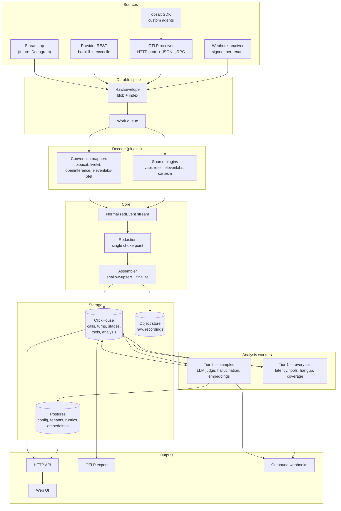

# obsalt v2 — architecture and rewrite plan

Status: **proposal, awaiting review**
Supersedes: the current `main` implementation (v0.1)
Written: 2026-08-22

---

## 0. How to read this

Section 1 defines what the product is, because every other decision depends on it. Section 2
is the evidence that forced the rewrite. Section 3 states the design tenets that fall out of
that evidence — these are the load-bearing claims, and if one of them is wrong the plan below
it changes shape. Sections 4–13 are the design. Section 14 is the build sequence. Section 15
lists what is still open, including two places where the answers I was given conflict and I
had to choose.

Reviewers should attack Section 3 first. Everything else is downstream.

---

## 1. Product definition

### 1.1 What obsalt is

**obsalt is a self-hosted call analytics and quality system for AI voice agents.** It owns the
call record and the analysis on top of it. It is the thing an engineer opens when a call went
wrong, and the thing a product owner opens to ask which agent is losing customers.

The product is these six capabilities. Everything in this plan exists to make them true:

| Capability | What it must actually deliver |
| --- | --- |
| **Latency breakdown** | STT, LLM, TTS time isolated per call. P50/P95 per agent across the fleet. |
| **Hangup analyzer** | Cluster calls by why they ended. Surface the call that lost the customer. |
| **Hallucination detection** | Flag agent claims not grounded in prompt, knowledge, tool results, or the caller. |
| **Function call telemetry** | Every tool invocation: success rate, retries, payload shape, time-to-tool. |
| **Custom evals** | Quality rubrics in plain English, judged by an LLM against every sampled call. |
| **Semantic search** | Find calls by meaning. "Customers asking about refunds" works. |

### 1.2 What obsalt is not

Stating this precisely is what makes the UI and storage scope decidable.

- **Not a general APM or tracing backend.** We export OTLP to Grafana/Tempo/Datadog/Honeycomb.
  We do not try to be a better Tempo. Infrastructure correlation stays in your APM.
- **Not a testing or simulation platform.** Generating synthetic callers, load testing, and
  pre-launch regression suites are Hamming/Coval/Cekura territory. obsalt observes production.
  (Production-to-test replay is a plausible later adjacency, explicitly out of v2 scope.)
- **Not a dashboard builder.** We ship the views the six capabilities need, not a query builder.
- **Not a prompt management or agent-building tool.**

### 1.3 Who it is for

1. **Teams on one hosted platform** (Vapi, Retell, ElevenLabs, …) who want a call console they
   own, with analysis their provider's dashboard does not do.
2. **Teams building custom agents** (Pipecat, LiveKit, OpenAI Realtime, Gemini Live) who want
   voice-aware call analysis and want their spans in their existing observability backend.

Multi-workspace operation is a **constraint** — the data model, auth, and per-tenant provider
credentials must be correct from day one — but agency/reseller features are not a v2 goal.

### 1.4 Scope of the UI (resolves Q17)

None of the six capabilities are expressible in Grafana. Hangup clusters, hallucination flags,
eval results, semantic search, and the per-call transcript-plus-timing join are all
domain-specific views over a domain-specific aggregate. So obsalt ships a real UI, scoped to
exactly these surfaces:

1. **Call list** — filter by agent, outcome, time, latency threshold, flag, eval result.
2. **Call detail** — the join view: timeline on the left, transcript on the right, tools,
   flags, evals, and an explicit provenance/coverage panel.
3. **Latency** — stage distributions and percentiles, by agent, over time.
4. **Hangups** — clusters with drill-through.
5. **Quality** — eval results and hallucination flags, with a review queue.
6. **Search** — semantic + filtered.
7. **Settings** — provider connections, rubrics, retention, plugins, keys.

No general charting. No custom dashboards. Fleet-wide infrastructure correlation is a link out
to your OTLP backend.

---

## 2. Why a rewrite (the evidence)

Three independent investigations converged on one root cause. Summary; the detail is in the PR
discussion.

### 2.1 The adapters were written against invented payloads

Provider adapters were validated against hand-written fixtures that were reverse-engineered
from the adapters themselves. All 62 tests pass. On real payloads:

| Provider | Real state |
| --- | --- |
| **Vapi** | **100% of the latency mapping is dead.** Reads `turnLatencies[].stt/llm/tts/e2e`; the real keys are `transcriberLatency`/`modelLatency`/`voiceLatency`/`turnLatency`. Reads `artifact.messages[].metadata.llmLatency` — `BotMessage` has no `metadata` property at all. Result: 0 provider latency samples, zero-width spans, empty waterfall. `endedReason` classification resolves 48% of a 627-value enum. |
| **Retell** | Worse, because it is silent. `words[].start/end` are **seconds**, read as milliseconds. Correct provider values (580ms, 900ms) get averaged with 1000×-low derived values (0.2ms, 0.6ms), yielding a P50 of 290ms where the truth is ~740ms. Tool timing is structurally unobtainable on this path. |
| **Bland** | Actually the most faithful adapter in the repo (89%). The log-line regex I assumed was fabricated is documented verbatim. Its one real defect: the `category == "tool"` branch is unreachable because Bland sends `category: "call"`. |
| **OpenAI Realtime** | Barge-in detection is a 100% false positive — every agent turn followed by any user speech is flagged as an interruption. One measured interval is written into three different fields (`llm_ttft_ms`, `llm_ms`, `tts_ttfb_ms`) and then rendered as three sequential spans. |

### 2.2 Webhook security is non-functional in both directions

All three signature verifiers implement the wrong algorithm, and the tests verify our formula
against itself:

```python
sig = hmac.new(b"secret", body, hashlib.sha256).hexdigest()
assert verify_retell({"x-retell-signature": sig}, body, "secret")   # tautology
```

Real Retell sends `X-Retell-Signature: v={ms},d={hex}` where the digest is
`HMAC-SHA256(raw_body + timestamp)` keyed by the **API key**. Real Bland sends
`X-Webhook-Signature` as an HMAC digest, not a plaintext secret. `verify_retell` and
`verify_bland` have their schemes swapped: `verify_retell` implements Bland's algorithm and
`verify_bland` implements Vapi's.

The failure is symmetric and total. Set a secret and every real webhook 401s. Leave it blank
and `verify_*` returns `True` unconditionally. **There is no configuration in which webhook
security both works and is enabled.**

### 2.3 Retroactive span synthesis cannot be fixed

Not a bug — a category error. `emitter.py` anchors every child span at the turn boundary and
lays them out by duration arithmetic:

```python
stt_end = _shift(t_start, stt_ms)     # STT starts at turn start
llm_end = _shift(t_start, llm_ms)     # LLM also starts at turn start
```

The rendered waterfall shows the LLM beginning simultaneously with speech recognition. Even
with the field names fixed, Vapi ships **durations with no timestamps and no turn index**, and
Retell ships a bare array of milliseconds. There is nothing to place spans at. A waterfall
drawn from summary statistics is not observability; it is a chart that causes wrong conclusions.

### 2.4 We tell users data is unobtainable while discarding it

`assess_coverage` reports VAD/endpointing timing and STT confidence as **structural** gaps —
"hosted platforms do not send this." Vapi sends `endpointingLatency` per turn,
`numAssistantInterrupted`, `numUserInterrupted`, and word-level confidence, in the payload we
already receive and throw away. Retell publishes `llm_websocket_network_rtt`. Bland publishes
`corrected_transcript[]` with real second-precision timings and per-utterance confidence.

This is the finding that determines the architecture. Our own honesty mechanism could not
distinguish "the provider did not send it" from "we failed to parse it," so it confidently
reported the wrong one.

### 2.5 The rest is prototype scaffolding

In-memory store (restart loses everything, so no adapter bug is ever recoverable);
`merge_calls` mutating stored objects in place with a dead variable in the middle;
all analysis running synchronously inside the webhook request; one global secret per provider
across all tenants; `require_auth=false` collapsing every unknown key into the first org;
`_call_summary` rebuilding a full span tree per call per list request; hangup clustering
re-embedding every call in the org on every request.

### 2.6 Half the premise was inverted

Worth stating plainly because it changes the plan: **zero of thirteen surveyed hosted voice
platforms push OTLP to a collector you specify.** ElevenLabs comes closest and is explicit that
it does not — it delivers OTLP-*shaped JSON* over a signed webhook you must still receive.
So the webhook receiver is not the redundant part; it is the only ingest path that exists for
hosted platforms, and being a correct signed receiver across six incompatible signature schemes
is real, security-sensitive work that every user would otherwise reimplement.

What is redundant is the span synthesis on top of it.

---

## 3. Design tenets

These are the claims the plan rests on. Each one is a direct response to evidence above.

> **T1. Never draw what you did not measure.**
> A timeline is only rendered where real timestamps exist. Durations without timestamps are
> stored and displayed as *measurements* — distributions, percentiles, per-turn chips — never
> as span positions. Fidelity is a property of the data, declared per source.

> **T2. Provenance is a first-class field, not metadata.**
> Every value carries where it came from: `provider_reported` (with the source path),
> `obsalt_derived` (with the derivation), or `absent` (with the reason). This is the only
> mechanism that distinguishes §2.1 from §2.4, and it is the product's trust surface.

> **T3. Raw first, durable, replayable.**
> Every inbound payload is persisted verbatim before it is acknowledged, and decode is a pure
> function from raw to normalized. Adapter bugs become replays, not permanent data loss. Given
> §2.1, we must assume adapter bugs are the *steady state*, not an exception.

> **T4. Decoders are validated against published schemas, not against themselves.**
> A provider fixture that does not validate against the vendor's published OpenAPI/JSON Schema
> fails CI. This is the specific control that would have caught every bug in §2.1.

> **T5. One choke point per cross-cutting concern.**
> All sources funnel through one normalization path, one redaction point, one assembly path.
> Per-transport hooks grow holes the moment a transport is added.

> **T6. Decode, assemble, and analyze are separate stages with separate versions.**
> Adapters emit small normalized events; core owns assembly; analysis runs async on the
> assembled aggregate. This is what kills `merge_calls` and makes reprocessing tractable.

> **T7. Pick the storage engine once, for the target scale, and do not abstract it.**
> A pluggable-backend layer is the thing to avoid, not the thing to build.

> **T8. Providers are separately installable packages against a versioned contract.**
> Core ships no providers. First-party providers use the same public plugin API as third-party
> ones, so the API cannot rot.

> **T9. Analysis cost must scale sub-linearly with call volume.**
> At millions of calls, LLM-judging every call against every rubric is financially impossible.
> Cheap deterministic analysis on 100%; expensive LLM analysis on a sampled/triggered subset.

---

## 4. Target architecture



### 4.1 Stage contracts

| Stage | Input | Output | Idempotent? | Versioned? |
| --- | --- | --- | --- | --- |
| Receive | HTTP request | `RawEnvelope` persisted, 202 returned | yes, by provider event id | — |
| Decode | `RawEnvelope` | `NormalizedEvent[]` | yes, pure function | `decoder_version` |
| Redact | `NormalizedEvent[]` | `NormalizedEvent[]` | yes | `redaction_policy_version` |
| Assemble | `NormalizedEvent[]` | rows in ClickHouse | yes, upsert semantics | `assembler_version` |
| Analyze T1 | assembled call | analysis rows | yes | `analyzer_version` per analyzer |
| Analyze T2 | assembled call | analysis rows | yes, cached by content hash | `judge_version` + `prompt_version` |

Every stage records its version on its output. Reprocessing is "re-run stage N+ for all
envelopes matching a filter," and the UI can show that a call's latency was decoded by
`vapi/3` while another was decoded by `vapi/2`.

---

## 5. Domain model

### 5.1 The core insight: separate measurement from timeline

This resolves the tension between "latency breakdown per call" (a required product capability)
and "hosted providers ship durations without timestamps" (an unfixable data limitation).

A **`StageMeasurement`** is a duration. It may optionally carry a real start/end. It always
carries provenance.

```python
class TimelineFidelity(StrEnum):
    STAGE_LEVEL = "stage_level"  # real start/end per stage -> true waterfall
    TURN_LEVEL  = "turn_level"   # real turn boundaries, stage durations unplaced
    CALL_LEVEL  = "call_level"   # aggregates only
    NONE        = "none"

class PipelineArchitecture(StrEnum):
    CASCADE         = "cascade"          # discrete STT -> LLM -> TTS
    SPEECH_TO_SPEECH = "speech_to_speech" # no stage decomposition exists
    HYBRID          = "hybrid"

class Provenance(StrEnum):
    PROVIDER_REPORTED = "provider_reported"
    OBSALT_DERIVED    = "obsalt_derived"
    ABSENT            = "absent"

class StageMeasurement(BaseModel):
    stage: Stage                    # vad|stt|llm|tts|playout|tool|e2e|ttfa|transport|endpointing
    metric: Metric                  # duration|ttft|ttfb|first_audio
    value_ms: float
    turn_index: int | None          # None => call-level
    started_at: datetime | None     # present iff STAGE_LEVEL
    ended_at: datetime | None
    provenance: Provenance
    source_path: str | None         # "artifact.performanceMetrics.turnLatencies[0].modelLatency"
    derivation: str | None          # "turn_gap(prev.ended_at, this.started_at)"
```

Two consequences:

- The **latency breakdown capability works on every provider**, because distributions and
  percentiles need durations, not timestamps.
- The **waterfall renders only at `STAGE_LEVEL`**, and at `TURN_LEVEL` the UI shows turn bars
  with stage duration chips inside them. At `CALL_LEVEL` it shows distributions and says why.

Per-source fidelity, from the provider survey:

| Source | Architecture | Fidelity | Waterfall | Notes |
| --- | --- | --- | --- | --- |
| Pipecat (OTLP) | cascade or S2S | `stage_level` | yes | real spans |
| LiveKit (OTLP) | cascade or S2S | `stage_level` | yes | real spans |
| obsalt SDK | either | `stage_level` | yes | we control the clock |
| Cartesia Line | cascade | `stage_level`¹ | yes | per-turn `start`/`end` + stage TTFBs |
| Vapi | cascade | `turn_level` | no | `secondsFromStart`+`duration` real; stage durations unplaced |
| Retell | cascade | `turn_level` | no | word timings real (seconds); stage values are call-level |
| ElevenLabs | cascade | `turn_level`² | no | `time_in_call_secs` is an integer |
| OpenAI Realtime | speech_to_speech | `stage_level`³ | partial | S2S shape: no STT/LLM/TTS split exists |
| Gemini Live | speech_to_speech | `stage_level`³ | partial | same |

¹ turn boundaries real, stage placement within turn partial. ² one-second resolution, flagged
in the UI. ³ client-stamped by our SDK; genuinely `stage_level` for the stages that exist
(`user_input`, `generation`, `playout`), but the cascade stages do not exist and must not be
shown as empty.

### 5.2 Aggregate

```
Call
├── identity      org, call_id (uuid5), source, source_call_id, agent_id, agent_version
├── telephony     direction, from/to (redacted), sip/provider ids
├── lifecycle     started_at, ended_at, duration_ms, status, pipeline_architecture,
│                 timeline_fidelity, cost
├── outcome       Hangup { reason, party, provider_code, provenance }
├── Turn[]        index, speaker, text_ref, started_at?, ended_at?, interrupted?, confidence?
├── StageMeasurement[]
├── ToolInvocation[]  id, name, turn_index?, started_at?, duration_ms?, status, retry_count,
│                     payload_shape, argument_hash, result_ref, error
├── Grounding     system_prompt_ref, knowledge_refs[], tool_result_refs[], user_text_ref
├── Evidence      transcript_ref, recording_ref { uri, channels[], duration_ms }
├── Analysis[]    versioned results: eval, hallucination, hangup_cluster, coverage
└── Provenance    map<field_path, Provenance + source_path>
```

Notes:

- **`*_ref` not inline text.** Transcripts, prompts, tool payloads and recordings are content-
  addressed references into the evidence store. Keeps the hot tables narrow and gives
  redaction and retention a single object to act on.
- **`Grounding` is populated.** In v0.1 `tool_results` and `user_text` were never set by any
  provider, which silently crippled hallucination detection. Populating grounding is a decoder
  conformance requirement (§13).
- **`Analysis[]` is versioned and additive.** Re-judging a call appends a result; it does not
  overwrite. Users can see that a call failed rubric v1 and passed v2.

### 5.3 Normalized events

Decoders emit small facts, not whole-call snapshots. This is what removes `merge_calls`.

```python
CallObserved(source_call_id, agent_id, direction, started_at, architecture, ...)
TurnObserved(turn_index, speaker, text, started_at?, ended_at?, confidence?, interrupted?)
StageObserved(stage, metric, value_ms, turn_index?, started_at?, ended_at?, provenance, source_path)
ToolObserved(tool_id, name, turn_index?, started_at?, ended_at?, status, args, result)
OutcomeObserved(provider_code, reason?, party?, ended_at, cost?)
GroundingObserved(kind, content)
EvidenceObserved(kind, uri, metadata)
InterruptionObserved(turn_index?, count?, kind)   # Vapi numAssistantInterrupted lands here
CallFinalized(reason)
```

Every event carries `(org_id, call_key, envelope_id, decoder_version, observed_at, sequence)`.
Assembly is a deterministic fold over the event stream ordered by `(observed_at, sequence)`.

---

## 6. Ingest

### 6.1 Webhook receiver

Route: `POST /v1/ingest/{provider}/{ingest_key}`

`ingest_key` is an opaque per-connection identifier. It is what makes per-tenant secrets
possible: we resolve the connection *before* verifying, so each tenant has its own signing
secret instead of one global `OBSALT_VAPI_SECRET`.

Ordered pipeline, non-negotiable order:

1. Read **raw bytes** (never a parsed model — parsing changes the byte sequence and breaks
   verification). Enforce a body size cap.
2. Resolve `ingest_key` → `(org_id, provider, connection, secret, plugin)`.
3. `plugin.verify(raw_bytes, headers, connection_config)`. Constant-time. Enforce the
   provider's replay window.
4. Extract the provider's stable event id → dedupe via atomic `INSERT ... ON CONFLICT DO
   NOTHING`. Never check-then-insert.
5. Persist `RawEnvelope` (blob to object store, row to index) — **before** acknowledging.
6. Enqueue. Return **202** with an empty body.

Decode happens in a worker. Nothing provider-facing waits on analysis.

Dedupe TTL must exceed the provider's full retry window. Retell retries for minutes;
ElevenLabs for ~40 minutes; some providers for days. This is a persisted table, not a short
Redis TTL.

Signature verification is a **plugin capability**, because the schemes are genuinely
incompatible and one is operator-configurable:

| Provider | Header | Scheme |
| --- | --- | --- |
| Vapi | configurable | Bearer / OAuth2 / HMAC with operator-chosen algorithm + header name. Legacy `X-Vapi-Secret` shared secret. **Must also accept `Authorization: Bearer`**, which v0.1 rejects. |
| Retell | `X-Retell-Signature` | `v={unix_ms},d={hex}`; `HMAC-SHA256(raw_body + timestamp)` keyed by the **API key**; ±5 min |
| ElevenLabs | `ElevenLabs-Signature` | `t={unix},v0={hex}`; `HMAC-SHA256("{t}.{body}")`; 30-min tolerance (one-sided upstream — we enforce both sides) |
| Cartesia Line | `x-webhook-secret` | plain shared secret (weakest; documented as such) |
| Bland | `X-Webhook-Signature` | `HMAC-SHA256(body)` hex, no timestamp → no replay protection |
| Telnyx | `Telnyx-Ed25519-Signature` | Ed25519, not HMAC |

Core provides tested primitives (`hmac_hex`, `hmac_base64`, `parse_kv_header`, `ed25519_verify`,
`enforce_window`, `constant_time_eq`) so plugins compose rather than reimplement.

### 6.2 OTLP receiver

`POST /v1/traces` — OTLP/HTTP protobuf **and** proto3-JSON. OTLP/gRPC on a separate
`grpc.aio` server in the same process, opt-in by config.

Implementation notes drawn from Phoenix's receiver:

- Parse with `opentelemetry-proto`. Do not hand-roll stubs.
- `Content-Type` must be `application/x-protobuf` or `application/json`; 415 otherwise.
  Handle `gzip` and `deflate`.
- Respond with a serialized `ExportTraceServiceResponse`, not an empty 200. Use
  `ExportTracePartialSuccess { rejected_spans, error_message }` to shed load without forcing
  the client to retry the whole batch.
- Decode in a threadpool so protobuf work never blocks the event loop.
- 503 when the queue is full, so the exporter's own backoff handles it. Malformed protobuf is
  422, not 500.
- Tenancy: resolve from the auth header, falling back to a resource attribute
  (`obsalt.org` / `service.namespace`) so a stock OTel Collector can route.

Spans are decoded into `NormalizedEvent`s by a **convention mapper** and then take the same
path as everything else. **obsalt does not become a general span store.** Raw spans are kept
in the raw archive for replay; the queryable model is the Call aggregate.

### 6.3 Trace assembly — never wait

Waiting for trace completion is unsolvable in general. The industry answer, and ours:

1. On the first span of an unseen trace, upsert a **shallow** call row:
   `{call_key, org, first_seen_at, status: open}`. A non-root span may never write semantic
   fields (name, outcome, ended_at).
2. When the root arrives (`parent_span_id` empty, or explicit `obsalt.as_root=true` for
   frameworks that emit orphan roots), fill semantic fields, set `status: rooted`.
3. Finalize at `min(root_ended_at + grace, first_seen_at + max_call_duration)`. **Voice calls
   have a natural upper bound that generic tracing lacks** — a platform's max call duration.
   Use it; this is where our domain beats the generic problem.
4. Late spans after finalize are accepted, applied, and counted in
   `obsalt_late_spans_after_finalize_total`. Instrument the frequency before tuning any window.

### 6.4 Provider REST backfill (Q6 — including it)

Webhooks are lossy: providers disable endpoints after consecutive failures, retries expire,
and being down for an hour means permanent gaps. A `plugin.backfill(since, until)` capability
polls the provider's calls API and emits the same `RawEnvelope`s, deduped by event id. Runs
on a schedule and on demand.

This is also the answer to "we shipped a decoder fix, now what": backfill re-fetches, replay
re-decodes. Together they mean no permanent data loss from either our bugs or their outages.

### 6.5 SDK sources

OpenAI Realtime and Gemini Live are bidirectional streaming APIs with no post-call webhook.
The only place their telemetry exists is your process. So they are served by the obsalt SDK
(a thin OTel wrapper) emitting OTLP, with a documented S2S span shape. This replaces the v0.1
"batch a JSON array of events and POST it," which was an obsalt-invented envelope.

### 6.6 Stream tap (Q29 — designed for, not built)

Deepgram Voice Agent has the richest per-turn latency data of anything surveyed (a seven-field
`LatencyReport` per turn) and no webhooks at all. Its integration shape is "tap the WebSocket,
persist every non-audio frame." That is a third plugin capability, `StreamSource`, declared in
the plugin API in v2 with no first-party implementation. Adding Deepgram later must not require
a core change.

### 6.7 The Langfuse-compatible endpoint (deferred, with rationale)

Vapi natively pushes traces to Langfuse via `assistant.observabilityPlan`, and it is currently
their only observability provider. Exposing a Langfuse-shaped ingest endpoint would let a Vapi
user point at obsalt with zero webhook configuration. It is genuinely tempting.

**Deferred, not rejected.** It is a compatibility surface for a proprietary, undocumented,
moving API, owned by a company that was acquired in January 2026. Given the answer to Q5
prioritized breadth of first-class provider support, the effort is better spent on the seven
committed providers. Revisit if Vapi's webhook path proves insufficient.

---

## 7. Plugin system and packaging

### 7.1 Separate distributable packages (Q9)

Core ships **no** providers.

```
obsalt                      core: domain, assembly, analysis, API, UI, plugin host
obsalt-testkit              conformance test base classes (dev dependency for plugin authors)
obsalt-vapi                 ┐
obsalt-retell               │
obsalt-elevenlabs           ├ first-party source plugins, released independently
obsalt-cartesia             │
obsalt-openai-realtime      │
obsalt-gemini-live          ┘
obsalt-pipecat              first-party convention mapper + optional Pipecat observer
obsalt-livekit              first-party convention mapper
```

Convenience extras: `pip install "obsalt[vapi,retell]"`. Bundle: `obsalt-providers-all`.

A company can publish `acme-obsalt-salesforce-voice` against the public contract and install it
alongside. Nothing in core changes.

### 7.2 Discovery and contract

Entry-point group `obsalt.plugins`, via `importlib.metadata.entry_points`. First-party
providers register through the **same** group — no privileged path, so the public API cannot rot.

```python
class ObsaltPlugin(Protocol):
    API_VERSION: ClassVar[int]           # checked against core's supported range
    name: ClassVar[str]                  # "vapi" — free-form, not a core enum
    display_name: ClassVar[str]
    capabilities: ClassVar[frozenset[Capability]]

class Capability(StrEnum):
    WEBHOOK_SOURCE     = "webhook_source"
    OTLP_MAPPER        = "otlp_mapper"
    REST_BACKFILL      = "rest_backfill"
    STREAM_SOURCE      = "stream_source"     # declared in v2, unimplemented
    SIGNATURE_VERIFY   = "signature_verify"
```

Capability protocols:

```python
class WebhookSource(Protocol):
    def verify(self, raw: bytes, headers: Mapping[str, str], cfg: ConnectionConfig) -> VerifyResult: ...
    def event_id(self, raw: bytes, headers: Mapping[str, str]) -> str | None: ...
    def decode(self, envelope: RawEnvelope) -> Iterable[NormalizedEvent]: ...

class OtlpMapper(Protocol):
    def claims(self, span: ReadableSpan) -> int: ...          # priority; 0 = not mine
    def decode(self, spans: Sequence[ReadableSpan]) -> Iterable[NormalizedEvent]: ...

class RestBackfill(Protocol):
    def fetch(self, cfg: ConnectionConfig, since: datetime, until: datetime) -> Iterable[RawEnvelope]: ...
```

Plugins also declare their **fidelity contract**, which the UI reads directly rather than
hardcoding prose (this replaces v0.1's hand-written `assess_coverage` if/else blocks):

```python
class FidelityDeclaration(BaseModel):
    architecture: PipelineArchitecture
    timeline_fidelity: TimelineFidelity
    provides: frozenset[Signal]      # stt_duration, llm_ttft, tool_timing, barge_in, ...
    structurally_absent: dict[Signal, str]   # signal -> why this provider cannot supply it
    schema_source: str               # URL of the published schema fixtures validate against
```

Loading is defensive: every load and every dispatch wrapped, version mismatches skipped with a
clear log line. One bad third-party wheel must not stop ingestion.

### 7.3 Hand-written Python, not a DSL (Q10/Q23 confirmed)

Decoders are Python, with a small declarative field-mapping helper for the boring majority:

```python
MAP = FieldMap({
    "source_call_id": "message.call.id",
    "agent_id":       ["message.call.assistantId", "message.assistant.id"],
    "started_at":     Ts("message.startedAt"),
    "cost":           "message.cost",
})
```

Not a DSL. Prior art is decisive: dbt shipped a YAML-spec adapter test framework
(`pytest-dbt-adapter`) and reversed out of it to inheritable Python classes; Airbyte's low-code
CDK retains a Python custom-component escape hatch that gets heavy use. And here the decision
is forced anyway — Vapi's signature algorithm and header names are operator-configured at
runtime, which is code, not a mapping table. Event discrimination, turn reconstruction from
heterogeneous transcript shapes, unit normalization, and tool-call/result pairing are all
likewise real logic.

---

## 8. Semantic conventions and OTLP

### 8.1 Position

OTel GenAI conventions live in `open-telemetry/semantic-conventions-genai`, have **zero tagged
releases**, and every attribute is `Development`. There is an **active voice-agent convention
effort** (PRs #390, #393, #394) whose open questions are literally this product's architecture.
So: adopt what is merged, track what is proposed, and own only what the spec explicitly leaves
open.

**Emit** (three tiers, in priority order):

1. **Merged and spec-blessed — adopt now.**
   `gen_ai.conversation.id` as the primary call join key. `gen_ai.usage.audio.input_tokens`,
   `.output_tokens`, `.cache_read.input_tokens`. `gen_ai.output.type=speech`.
   `gen_ai.token.modality`. `gen_ai.operation.name`, `gen_ai.provider.name`,
   `gen_ai.request.model`, `gen_ai.usage.{input,output}_tokens`, `gen_ai.tool.name`,
   `gen_ai.tool.call.id`, `error.type`.
2. **Proposed, behind a version flag.** `gen_ai.operation.name ∈ {speech_to_text,
   text_to_speech, generate_live_content}`, `gen_ai.speech.voice`,
   `gen_ai.speech.input.language`, `gen_ai.agent.invocation.end_reason`. Flag defaults off;
   flip when they merge.
3. **`obsalt.*` for what the spec leaves open.** Barge-in vs client cancel, endpointing/VAD,
   STT confidence, perceived end-to-end latency, TTFA, transport legs, recording reference with
   channel layout, timeline fidelity, provenance.

**Accept** all of: `gen_ai.*`, OpenInference (`openinference.span.kind`, `input.value`),
OpenLLMetry (`llm.*`, `traceloop.*`), LiveKit (`lk.*`), Pipecat (`metrics.ttfb`, `turn.*`),
`elevenlabs.*`, Azure Voice Live (`gen_ai.voice.*`), and `obsalt.*`. Priority-ordered mapper
registry, `obsalt.*` highest.

Two collisions we must handle explicitly:

- LiveKit ships `gen_ai.usage.input_audio_tokens` while merged spec says
  `gen_ai.usage.audio.input_tokens`. **Accept both.**
- Pipecat's docs say `gen_ai.system`; its code emits `gen_ai.provider.name`. Azure Voice Live
  uses `gen_ai.system`. **Accept both.** Instrument against code, not docs.

### 8.2 Span naming — deliberate divergence from the Hamming model

The Hamming guide recommends `turn.{index}`, `stt.provider.{name}`, `llm.tool_call.{name}` as
span *names*. `conventions.py` implements that faithfully. **We diverge.**

Span names must be low-cardinality: backends group by name and derive span metrics from it. A
200-turn call currently mints 200 unique span names, which degrades the index in Tempo/Datadog
and makes "P95 across turns" unaskable. Hamming can afford this inside their own backend; a
tool whose output lands in *your* backend cannot.

| v0.1 span name | v2 span name | Variable moves to |
| --- | --- | --- |
| `turn.7` | `turn` | `turn.index=7` |
| `stt.provider.deepgram` | `stt.provider_attempt` | `stt.provider="deepgram"` |
| `stt.provider.fallback.azure` | `stt.provider_attempt` | `stt.provider="azure"`, `stt.fallback=true` |
| `llm.tool_call.create_booking` | `execute_tool` | `gen_ai.tool.name="create_booking"` |
| `evaluation.assertion_check` | unchanged | — |

### 8.3 PII — marked namespace, not a denylist (Q28)

v0.1 uses a denylist of ~13 literal attribute keys, which fails **open** on anything
unanticipated. LiveKit's approach fails **safe**: sensitive content goes in a marked namespace
so a collector can strip by prefix.

- All conversational content lives under `obsalt.pii.*` (`obsalt.pii.user_transcript`,
  `obsalt.pii.tool.arguments`).
- Content never appears in a span **name**, because names are not redactable.
- Default exporter config strips `obsalt.pii.*`. Emitting it is opt-in.
- The denylist is retained as a **belt-and-braces assertion in tests**, not the mechanism.

### 8.4 Export

OTLP out to any backend, with the `obsalt.pii.*` strip applied. `BatchSpanProcessor`, never
`Simple`. Metrics exported alongside: `voice.call.duration`, `voice.stage.duration` (by stage),
`voice.turn.count`, `voice.interruption.count`, `voice.tool.failures`, `voice.eval.failures`.

**Critically: provider aggregate latency is exported as metrics, not spans.** Vapi's
`turnLatencyAverage` and Retell's `p50/p95/p99` are real measurements. They become
histograms/gauges. They do not become span widths. This is T1 in practice.

---

## 9. Analysis engine

### 9.1 Two-tier cost model (T9)

At 1M calls/month, LLM-judging every call against six rubrics is ~6M LLM calls/month. That is
not a product; it is a bankruptcy. So:

**Tier 1 — every call, deterministic, cheap.**
Stage measurement normalization and rollups; tool outcome/retry/shape telemetry; hangup
classification from provider codes; coverage and provenance computation; rule-based flags
(silence, dead air, tool failure, low STT confidence, truncated LLM response,
`finish_reason=length`); embedding generation for search.

**Tier 2 — sampled or triggered, expensive.**
LLM eval judging; LLM-based hallucination entailment.

Triggers, in order of precedence:
1. Manual request (a user opens a call and clicks "evaluate").
2. Tier-1 signal (tool failure, hangup reason in a watched set, latency over threshold,
   negative closing sentiment).
3. User-defined filter (agent, disposition, time window, custom predicate).
4. Baseline random sample at a configured rate, for unbiased fleet statistics.

Results are cached by `(call_content_hash, rubric_version, judge_version, prompt_version)` so
re-runs are free unless something actually changed. A per-org monthly LLM spend cap with a
visible burn-down, because silent cost overruns are how self-hosted tools get uninstalled.

### 9.2 Latency breakdown

Stage measurements land from decoders with provenance. Rollups are **precomputed** into
ClickHouse materialized views by `(org, agent, stage, metric, time bucket)` — not computed by
scanning every call per request as v0.1 does.

Percentiles come from ClickHouse `quantileTDigestState` aggregate states, so a P95 over 12
months is a merge of pre-aggregated states rather than a full scan.

Provider-published percentiles (Retell's `p50/p90/p95/p99`) are stored **separately** from
percentiles we compute, and never mixed into one distribution. Mixing them is what produced the
290ms-vs-740ms error. The UI can show both and label them.

### 9.3 Hangup analyzer

Two layers:

**Classification.** Provider code → normalized reason. This requires actually complete mapping
tables, generated from the provider's published enum and CI-checked for drift:

- Vapi's real `endedReason` enum has **627 values**; our table covers 48%. The fix is prefix
  rules for the modern `call.in-progress.error-vapifault-*`, `call.start.error-*`,
  `call.ringing.*`, `call.ending.*` families, plus reordering the token match so `*-voice-failed`
  resolves to TTS before the provider-name token resolves it to STT/LLM. Target >95%.
- A CI job diffs the published enum against our table and fails on unmapped values. Provider
  taxonomy drift becomes a visible test failure instead of a silent `unknown`.
- Bland's `disposition_tag` is **user-definable** and LLM-assigned, so it is unsound as a
  primary key; `call_ended_by` is the reliable signal. Noted for whoever adds Bland back.

**Clustering.** Group by `(reason, party, closing-utterance semantics)` using real embeddings,
computed as a scheduled job into a materialized table. v0.1 re-embedded every call in the org
on every `/v1/hangups` request; that is O(n) per pageview and unusable past a few thousand calls.

"The call that lost you the customer" is a ranked score combining hangup reason, closing
sentiment, unresolved tool failures, hallucination flags, and abnormal latency on the final
turn — with the contributing factors shown, not just a number.

### 9.4 Hallucination detection (real implementation, Q16)

v0.1 is regex over money patterns and a verb→tool map. Replaced with:

1. **Claim extraction** — segment agent turns into checkable assertions.
2. **Grounding corpus assembly** — system prompt, knowledge base content, tool results, and
   caller statements. This is the part that was quietly broken: `grounding.tool_results` and
   `grounding.user_text` were never populated by any provider, so the detector was checking
   claims against a nearly empty corpus. Populating grounding is now a decoder conformance
   requirement.
3. **Entailment check** — LLM verdict per claim: `grounded` / `contradicted` / `unsupported`,
   with the supporting span quoted.
4. **Deterministic pre-filter** — Tier 1 finds candidate claims (numbers, identifiers,
   commitments, policy statements) cheaply; only candidates reach the LLM.

Every flag carries the quote, the grounding evidence considered, the model and prompt version,
and a confidence. A flag with no evidence trail is worse than no flag.

### 9.5 Function call telemetry

Mostly a data-completeness problem, not an algorithm problem.

Success rate, retry rate, duration percentiles, payload-shape drift, and time-to-tool, per tool
per agent. Retries detected by consecutive same-name failures with matching argument hashes.

Where the provider cannot supply tool timing (Retell has no timestamp on either tool utterance
type), the UI shows the invocation with `duration: not reported by Retell` — provenance
`ABSENT` with the reason — rather than an empty bar. And Bland's `agent-action` rows
("Ended call", "Transferred call") must not be counted as tools; that polluted v0.1's rollup
with fake 0ms 100%-success entries.

### 9.6 Custom evals

Rubrics in plain English, judged by an LLM. Requirements:

- **Versioned rubrics.** Editing a rubric creates a version; results reference the version they
  were judged under. Otherwise the fleet trend line is meaningless.
- **Pluggable judge**, defaulting to Claude, configurable to any OpenAI-compatible endpoint or
  a local model. The judge is a plugin capability so an org can bring its own.
- **Structured output** — score, pass/fail, rationale, and quoted evidence spans. Free-text-only
  verdicts are unauditable.
- **Calibration harness.** A labelled set of calls the user can run a rubric against to see
  agreement before turning it loose on the fleet. Without this, "Claude evaluates every call"
  is a number nobody trusts.
- **Human review queue** with agree/disagree, feeding the calibration set.

### 9.7 Semantic search

Real embeddings, not v0.1's MD5 hashing trick.

- **Pluggable embedder.** Default a local ONNX model (no torch dependency, no API key, works
  air-gapped); optional OpenAI/Voyage/Cohere.
- **pgvector with HNSW** in Postgres. Millions of vectors is well inside pgvector's range, it
  is transactional with tenant metadata, and deletes are trivial — which matters for GDPR
  (§12.3). Search returns call ids; the call bodies hydrate from ClickHouse.
- **Hybrid retrieval.** Vector similarity fused with ClickHouse full-text over transcripts,
  plus structured filters (agent, date, outcome, flag). Pure vector search is bad at proper
  nouns and order numbers; pure keyword is bad at "customers asking about refunds."
- Embedded content is redacted content, and re-embedding is a versioned reprocessing job.

---

## 10. Storage and system design

### 10.1 Resolving the conflict in the answers

The instructions conflict here, and this is load-bearing enough to state plainly:

- **Q24** accepted "Postgres only for production, no pluggable-backend abstraction, Parquet
  export for analytics."
- **Q13** said "assume millions and use the right db that we don't want to change in future at
  all, think from system design perspective."

Postgres alone does not satisfy Q13 at millions of calls. Langfuse ran on Postgres through v2,
hit IOPS exhaustion at "tens of thousands of events per minute," and moved the analytical
workload to ClickHouse in v3 — a migration we would be signing up to repeat.

**Resolution: keep Q24's *principle* — commit to one architecture, build no pluggable-backend
abstraction — and apply Q13's *criterion* to choose it.** That yields a committed, non-optional
two-store architecture. ClickHouse is not an "optional analytics backend"; it is in the
compose file and there is no Postgres-only mode. That is precisely the multi-database adapter
Langfuse explicitly rejected as maintenance overhead, and I am not building it.

### 10.2 The three stores

| Store | Holds | Why |
| --- | --- | --- |
| **ClickHouse** | calls, turns, stage_measurements, tool_invocations, analysis_results, raw_envelope index, materialized rollups | Append-mostly, billions of rows, percentile and group-by-agent-over-time queries. Columnar means multi-KB transcript refs stay on disk until asked for. `quantileTDigestState` makes long-window percentiles cheap. |
| **Postgres** | orgs, users, api_keys, agents, provider_connections + secrets, rubrics + versions, plugin config, retention policies, deletion requests + audit, **call embeddings (pgvector)** | Small, relational, transactional, needs real constraints, migrations, and cheap row-level deletes. Everything a GDPR delete must touch synchronously. |
| **Object storage** (S3/MinIO/GCS) | raw payload blobs, transcripts, tool payloads, recordings | Immutable, content-addressed, lifecycle-managed. Encrypted at rest — raw blobs are unredacted by definition. |

Redis for the work queue and dedupe hot path. One worker process type, horizontally scalable.

### 10.3 Sizing at the target

At 1M calls/month, ~40 turns/call, and OTLP sources contributing ~10 stage rows/turn:

| Table | Rows/month | Notes |
| --- | --- | --- |
| `calls` | 1M | `ReplacingMergeTree(updated_at)`, PK `(org_id, started_at, call_id)` |
| `turns` | 40M | partition by month, order by `(org_id, call_id, turn_index)` |
| `stage_measurements` | 100–400M | the volume driver; narrow rows, heavily compressible |
| `tool_invocations` | ~5M | |
| `analysis_results` | 5–10M | additive, versioned |

Billions of rows within a year. This is the number that decides the engine, and it is why
`stage_measurements` is a narrow fact table with references rather than nested JSON.

### 10.4 Schema principles

- **Append-only in the hot path.** No cross-row updates during ingest. Upserts are
  last-write-wins per column via `ReplacingMergeTree`, and a shallow write may never overwrite
  a semantic column with null (§6.3).
- **Attribute promotion is configuration, not migration.** Unmapped attributes go to a
  `Map(String, String)` catch-all; a config list names which keys get materialized into typed,
  indexed columns. This gives us Langfuse's catch-all without their tax of "rename the
  attribute at emit time to make it filterable."
- **Provenance travels with the value.** `stage_measurements` carries `provenance`,
  `source_path`, `derivation` as columns. Call-level provenance is a `Map(String, String)`.
- **Every derived table is a materialized view**, refreshed on insert, so read paths never
  aggregate raw rows on demand.

### 10.5 Dev and demo mode

Requiring ClickHouse for `pip install obsalt && obsalt serve` is hostile. But building a second
storage backend is worse. Compromise:

- `docker compose up` is the supported path and brings up everything.
- `obsalt demo` runs a fully in-process ephemeral mode (chDB or a container-managed ClickHouse,
  decided in Phase 1) with a loud "not for production, data is not durable" banner, for
  evaluating the product in one command.
- No SQLite/Postgres-only production mode. Documented as a deliberate non-goal with reasoning.

### 10.6 Parquet export

Finalized calls/turns/measurements export to Parquet on a schedule for teams that want their
own warehouse. This is the escape valve that means committing to ClickHouse internally does not
lock anyone's data in.

---

## 11. API and UI

### 11.1 API

Versioned at `/v1`. Every collection endpoint is paginated with cursors and requires a bounded
time range — v0.1's unbounded `list_calls` and per-call span-tree rebuild in the list response
are the shape of bug that only appears in production.

```
POST   /v1/ingest/{provider}/{ingest_key}   webhook
POST   /v1/traces                           OTLP HTTP (proto + JSON)
GET    /v1/calls                            cursor paginated, filtered, time-bounded
GET    /v1/calls/{id}                       aggregate + provenance
GET    /v1/calls/{id}/timeline              timeline w/ declared fidelity
GET    /v1/calls/{id}/evidence/{ref}        transcript / tool payload / recording (authz'd)
POST   /v1/search                           hybrid semantic + filter
GET    /v1/latency                          precomputed rollups
GET    /v1/hangups                          precomputed clusters
GET    /v1/tools                            precomputed rollups
GET    /v1/quality                          evals + flags
POST   /v1/calls/{id}/analyze               request tier-2 analysis
CRUD   /v1/rubrics                          versioned
CRUD   /v1/connections                      provider connections + secrets
POST   /v1/replay                           reprocess by filter (admin)
POST   /v1/backfill                         trigger provider pull (admin)
POST   /v1/privacy/deletion-requests        delete by caller / call / range
GET    /v1/plugins                          installed plugins + fidelity declarations
GET    /health  /ready  /metrics
```

Auth: API keys per org, scoped (`ingest`, `read`, `admin`). `require_auth=false` is deleted —
it silently collapsed every unknown key into the first org.

### 11.2 UI

Server-rendered with progressive enhancement, or a small SPA — decided in Phase 5. Not a
hand-rolled HTML string builder like v0.1's `view.py`.

The **provenance panel** on call detail is the differentiating surface. For every signal:
reported by the provider (with the source path), derived by obsalt (with the derivation), or
absent (with the reason — "Retell does not timestamp tool utterances," "Vapi reports stage
durations without timestamps, so no waterfall is drawn"). This is §2.4 turned into a feature.

---

## 12. Reliability, security, tenancy

### 12.1 Tenancy

`org_id` is the boundary and is in the primary key of every ClickHouse table and every query
path — not applied as a post-filter. Provider connections, secrets, rubrics, retention, and
LLM budgets are all per-org. Cross-tenant reads are prevented at the query layer and asserted
in tests.

### 12.2 Reliability

Fast-ACK with durable raw persistence before the 202. Atomic dedupe. Bounded, idempotent
workers. Dead-letter queue carrying raw payload, headers, decoder version, and error history —
with an alert on insert, not just a log line. Replay from raw as a first-class operation.
Backpressure via 503 so exporters back off. Reconciliation against provider APIs.

Health signals worth having from day one: decode failure rate by plugin, DLQ depth, late-root
frequency, unmapped-provider-code rate, unmapped-attribute rate, tier-2 spend burn-down.

### 12.3 PII and retention

- **Redaction is synchronous, at one choke point, before durable write of normalized data.**
  This improves on Langfuse deliberately: their masking runs in an async worker, so unmasked
  payloads land in blob storage first. Ours runs inline on the normalized event stream, which
  every source traverses (T5).
- **Raw blobs are unredacted by definition.** So: encrypted at rest, short retention (default
  30 days, tunable), separately access-controlled, and excluded from normal read paths. This is
  the honest tradeoff for T3's replayability, and it must be documented prominently.
- **Retention defaults are finite.** 90 days for transcripts/recordings, 30 for raw, 400 for
  aggregates. "Indefinite by default" is how self-hosted tools accumulate liability.
- **Deletion works.** Delete by caller identifier, call id, or time range. Postgres rows delete
  synchronously; ClickHouse uses lightweight deletes plus TTL; object storage deletes by
  content ref with versioned-bucket lifecycle handled. Every request is audited. A deletion job
  that was never exercised is a deletion job that does not work — this ships in v2, not later.
- **Pluggable redactor** so an operator can supply their own policy.

### 12.4 Outbound webhooks (Q25)

`call.finalized`, `eval.failed`, `flag.raised`, `slo.breached`, emitted per the
[Standard Webhooks](https://www.standardwebhooks.com/) spec (`webhook-id`, `webhook-timestamp`,
`webhook-signature`, `whsec_` secrets, 5-minute tolerance). Consumers get verification from
off-the-shelf libraries; the alternative is inventing a seventh scheme.

---

## 13. Testing and conformance

This section is the actual fix for §2.1 and §2.2. Everything else is a consequence.

### 13.1 Schema-validated fixtures as a CI gate (Q11)

Every provider plugin ships:

```
fixtures/
  schema/            vendored provider OpenAPI/JSON Schema + the commit/revision + date fetched
  raw/               real-shaped payloads, one per event type
  expected/          the NormalizedEvent[] each raw payload must produce
  ignore_fields      volatile values excluded from comparison
  bypass_reasons     written justification for any unasserted signal
```

CI does three things v0.1 never did:

1. **Validates every `raw/` fixture against the vendored provider schema.** A fixture that
   does not validate fails the build. This alone catches every bug in §2.1.
2. **Drift check** — refetches the provider's published schema and fails (or warns loudly) when
   it diverges from the vendored copy. Provider schema changes become a visible test failure.
3. **Enum coverage** — diffs the provider's published reason-code enum against our mapping
   table and fails on unmapped values. Vapi's 627-value enum at 48% coverage would not have
   shipped.

### 13.2 Conformance test kit

`obsalt-testkit` ships inheritable base classes. Plugin authors subclass; skipping a required
test needs an explicit marker plus a written reason.

**Required** (every plugin): signature verification against real captured headers, including
negative cases and replay-window enforcement; event-id extraction; idempotent decode; unknown
event types tolerated without crashing; call identity extraction; the fidelity declaration
matching what decode actually produces; **grounding populated where the provider supplies it**;
no PII in span names; unit correctness (a dedicated test class for seconds-vs-milliseconds,
since that is the Retell bug).

**Optional** (declared per capability): recordings, per-turn stage timing, tool timing, cost,
interruption counts, backfill.

The critical rule: **the fidelity declaration is tested against decode output.** A plugin that
claims `stage_level` but produces measurements without timestamps fails. That is what makes
§2.4 impossible to repeat — you cannot claim a signal is structurally absent while discarding it.

### 13.3 Golden-file ergonomics

A `record` mode writes a new expected-output file from a raw payload, so adding an event type is
one command plus a reviewed diff. Golden-file testing that is tedious to update rots; this is
what keeps the corpus alive.

### 13.4 Other layers

Property tests on the assembler (any permutation of an event stream folds to the same
aggregate — the direct antidote to `merge_calls`). Contract tests on the OTLP receiver against
real exporter output from Pipecat and LiveKit. Load test to the §10.3 target. Cross-tenant
isolation assertions. Migration tests on the ClickHouse schema.

---

## 14. Build sequence

Clean rewrite on `main`, no compatibility promises (Q18a). v0.1 is unreleased, in-memory, and
has no users; the freedom is real and worth taking. Each phase has an exit criterion that is
demonstrable, not "code written."

### Phase 0 — Foundations
Repo restructure into `obsalt` core + plugin packages + testkit. Domain model (§5), normalized
event types, plugin contract (§7.2), `obsalt-testkit` skeleton. CI: lint, type-check (strict),
schema-validation harness.
**Exit:** a trivial example plugin in a separate package is discovered, loaded, and passes the
conformance kit.

### Phase 1 — Durable spine
ClickHouse + Postgres + object storage schemas and migrations. Raw envelope write path. Webhook
receiver with per-tenant connections and correct signature primitives. Dedupe. Queue and worker.
Replay. Redaction choke point.
**Exit:** a signed Vapi webhook is verified, persisted, 202'd in <50ms p99, and replayable after
a full restart. Deliberately verified against captured real headers, not synthetic ones.

### Phase 2 — Decode and assemble
`obsalt-vapi` and `obsalt-retell` rebuilt from published schemas. Assembler with shallow-upsert
and finalization. Provenance end to end. Fidelity declarations.
**Exit:** a real Vapi payload yields correct `transcriberLatency`/`modelLatency`/`voiceLatency`
measurements with `provider_reported` provenance; a real Retell payload yields correct
percentiles with no unit error; both declare `turn_level` and render no waterfall. The specific
regression tests for §2.1 and §2.3 are green.

### Phase 3 — OTLP in
OTLP receiver (HTTP proto + JSON; gRPC opt-in). Mapper registry. `obsalt-pipecat` and
`obsalt-livekit`. Foreign convention support (OpenInference, OpenLLMetry, `lk.*`).
**Exit:** a stock Pipecat app with `enable_tracing=True` and no obsalt-specific code produces a
complete call with a true `stage_level` waterfall.

### Phase 4 — Analysis
Tier 1 analyzers and materialized rollups. Tier 2 framework with sampling, triggers, caching,
budget. LLM judge with versioned rubrics and a calibration harness. Hallucination detection with
real grounding. Real embeddings and hybrid search. Hangup classification to >95% enum coverage
plus scheduled clustering.
**Exit:** all six product capabilities work end to end on real data from two providers, with
tier-2 spend measured against a cap.

### Phase 5 — API and UI
API per §11.1. UI per §1.4, provenance panel included.
**Exit:** a user can go from "which agent regressed this week" to the specific call and the
specific turn, and can see for every missing signal whether the provider withheld it or we
derived it.

### Phase 6 — Provider breadth
`obsalt-elevenlabs` (webhook + its OTel format), `obsalt-cartesia` (the flagship `stage_level`
hosted provider), `obsalt-openai-realtime` and `obsalt-gemini-live` (SDK sources with a correct
S2S shape and barge-in from real signals). OTLP export. Outbound webhooks.
**Exit:** all seven committed providers pass conformance. `StreamSource` is declared and
documented so Deepgram is additive.

### Phase 7 — Production hardening
Retention and deletion jobs, exercised. Encryption at rest. Ops runbooks. Load test to target.
Backfill and reconciliation schedules.
**Exit:** documented restore-from-raw drill and an exercised delete-by-caller path.

### Explicit non-goals for v2
Simulation/synthetic testing. Production-to-test replay. Custom dashboard building. Non-voice
channels. A hosted control plane. Deepgram. Bland (see §15).

---

## 15. Open questions and risks

### 15.1 Where I chose against an instruction

1. **Storage (Q13 vs Q24).** Resolved in §10.1 toward a committed Postgres + ClickHouse +
   object storage architecture. This is the single biggest deviation and the thing to overturn
   first if you disagree. Overturning it means accepting a future migration.

2. **The Langfuse-compatible endpoint (Q5).** Your answer was about provider breadth, so I read
   the Langfuse trick as deprioritized and deferred it (§6.7) rather than dropping it.

### 15.2 Genuinely open

3. **Bland was dropped from the provider list (Q19)** — worth noting it is the *most* faithful
   adapter in the current repo (89%) and publishes `corrected_transcript[]` with real
   second-precision timings and per-utterance confidence, which is better data than Vapi gives
   us. Keep as a community plugin, or restore it?

4. **Cartesia Line's priority (Q27).** It is the only hosted platform with real per-turn
   timestamps, making it the only one where a waterfall is honest — a strong flagship for T1.
   Phase 6 as written, or pull it into Phase 2 alongside Vapi/Retell to prove `stage_level` and
   `turn_level` side by side early?

5. **Default embedding model.** A local ONNX model works air-gapped and free but is weaker than
   a hosted API. Default local and let users upgrade, or default to quality?

6. **Tier-2 default sample rate.** Affects perceived value on day one versus surprise LLM
   spend. My inclination: 0% baseline sampling with trigger-based analysis on, so the first
   bill is predictable, and prompt the user to opt into a sample rate.

7. **UI stack.** Server-rendered templates keep the single-artifact story; a small SPA is better
   for the timeline and review queue. Deferred to Phase 5 deliberately.

8. **Should we contribute upstream?** OTel's voice-convention PR #390 has an open question about
   a portable in-trace reference to whole-conversation audio, and the evidence-store-plus-trace
   split it describes as unresolved is exactly what we run. Commenting is cheap and would shape
   the spec toward our design rather than away from it.

### 15.3 Risks

| Risk | Mitigation |
| --- | --- |
| Provider schemas drift and break decoders | Vendored schemas + CI drift check + enum coverage check (§13.1); replay makes fixes retroactive |
| ClickHouse operational burden for self-hosters | Compose file, `obsalt demo` one-command mode, tuned defaults, no manual sharding at target scale |
| Tier-2 LLM cost surprises a user | Hard per-org cap, burn-down UI, 0% default baseline sampling, content-hash caching |
| Scope is large | Phases 0–4 are the product; 5–7 are breadth and hardening. Two providers end-to-end beats seven half-done |
| OTel voice conventions land differently than proposed | Version-flagged tier-2 attributes; `obsalt.*` is authoritative internally; mapper registry absorbs renames |
| Plugin API ossifies wrong | `API_VERSION` from day one, first-party plugins use the public path, testkit pins the contract |
| Rewrite loses the good parts of v0.1 | Explicitly carried forward: the voice attribute vocabulary, the coverage/provenance *idea*, the hangup taxonomy, the evidence-vs-span split |
