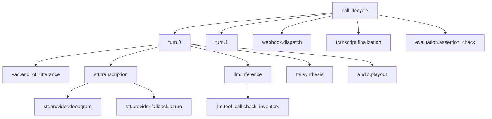

# Trace model

A voice trace models a **call**, not an HTTP request. One root span covers the whole conversation. Each turn is a child. Each independently failing step (STT attempt, LLM, tool, TTS) is a grandchild.

This is the tree both live `VoiceCall` / `VoiceCallTracer` and webhook ingest (reconstructed) produce. Naming follows the [voice-agent OpenTelemetry guide](https://hamming.ai/resources/opentelemetry-voice-agents-tracing-guide): do not flatten the call into an LLM-only trace, and do not put transcripts on span attributes.

## Span tree



```
call.lifecycle
├── turn.0
│   ├── vad.end_of_utterance
│   ├── stt.transcription
│   │   ├── stt.provider.deepgram          # timed out
│   │   └── stt.provider.fallback.azure
│   ├── llm.inference
│   │   └── llm.tool_call.check_inventory
│   ├── tts.synthesis
│   └── audio.playout
├── webhook.dispatch
├── transcript.finalization
└── evaluation.assertion_check
```

| Span | Parent | What it proves |
| --- | --- | --- |
| `call.lifecycle` | root | Full call, status, tenant |
| `turn.{index}` | `call.lifecycle` | Which exchange broke |
| `vad.end_of_utterance` | turn | Endpointing delay before STT/LLM |
| `stt.transcription` | turn | Whether bad input reached the LLM |
| `stt.provider.{name}` | `stt.transcription` | Per-attempt latency / timeout |
| `stt.provider.fallback.{name}` | `stt.transcription` | Fallback chain |
| `stt.provider_selection` | `stt.transcription` | Language routing decision |
| `llm.inference` | turn | Model, TTFT, tokens, finish reason |
| `llm.tool_call.{name}` | `llm.inference` | Side-effect timing and status |
| `tts.synthesis` | turn | Synthesis vs playback |
| `audio.playout` | turn | Dead air after TTS |
| `webhook.dispatch` | `call.lifecycle` | Outbound delivery / retries |
| `transcript.finalization` | `call.lifecycle` | Canonical transcript written |
| `evaluation.assertion_check` | `call.lifecycle` | Guardrail / rubric / hallucination |

Parent/child is a real `SpanContext`, not a naming coincidence. Reconstruction uses historical `start_time` / `end_time` so the waterfall is the real call, not “everything happened just now.”

Optional cascade spans (`transcript.json_parse`, `transcript.merge.fallback`) are only emitted when that signal exists — never as placeholders. Fallbacks are only emitted when the payload has a second hop.

## Join keys

Copied onto **every** span:

`call.id` · `call.provider_id` · `workspace.id` · `agent.id` · `gen_ai.conversation.id`

Turn-scoped spans also carry `turn.index`. Optional: `room.id`, `test_run.id`, `scenario.id`.

`workspace.id` is the obsalt tenant (`org_id`). `call.id` is uuid5(org, provider, your id) and joins Tempo to `GET /v1/calls/{id}`. `call.provider_id` is your room / SIP / Vapi id.

## Debug attributes

Low-cardinality fields for filtering in Tempo. Not PII.

`stt.provider` `stt.confidence` `stt.latency_ms` `llm.model` `llm.ttft_ms` `llm.tokens.input` `llm.tokens.output` `tts.provider` `tts.synthesis_ms` `tool.name` `tool.execution_ms` `call.duration_ms`

Also used: `llm.finish_reason`, `tts.first_audio_ms`, `tts.voice_id`, `vad.end_of_utterance_ms`, `call.status`, `call.error_type`.

## GenAI conventions (LLM and tools only)

OpenTelemetry GenAI is development-status and does **not** standardize STT, TTS, VAD, barge-in, or SIP. obsalt dual-names:

- LLM: `gen_ai.operation.name=chat`, `gen_ai.provider.name`, `gen_ai.request.model`, `gen_ai.usage.input_tokens` / `output_tokens`
- Tools: `gen_ai.operation.name=execute_tool`, `gen_ai.tool.name`, `gen_ai.tool.call.id`, `error.type`

Voice-specific names stay on STT / TTS / VAD / telephony spans.

## What must not appear on spans

Transcript text, prompts, tool arguments, tool results, phone numbers, emails.

Store those as evidence. On the span, set:

- `evidence.transcript_id`
- `evidence.recording_id`
- `evidence.redaction_state=redacted`

`GET /v1/calls/{id}/view` rebuilds this same tree for the join UI. It still does not copy transcript text onto span attributes.

Fallbacks are only emitted when the payload has a second hop. Path B records those hops on `turn.metadata.stt_attempts` so the join view and a later reconstruction can show them. Path A never invents them.
