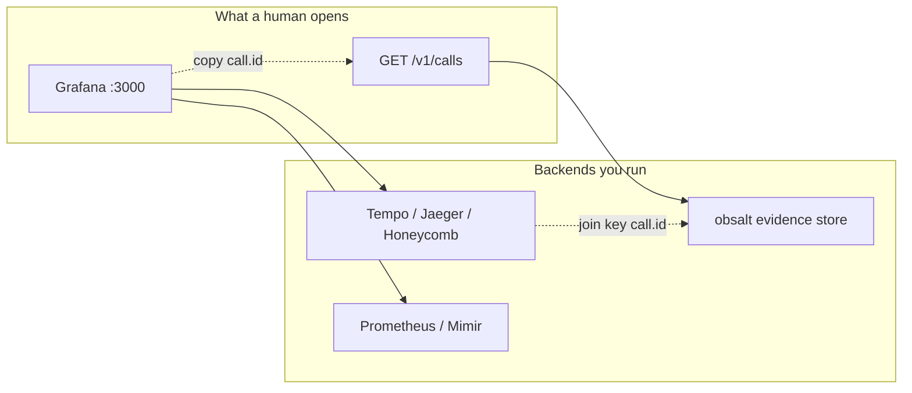

# What you can see, and from where

obsalt does **not** ship a product UI. “User-facing” means the backends you already run, plus an HTTP API.

```
You / on-call / product
        │
        ├─ Grafana Explore → Tempo     waterfalls, “where did 1.8s go?”
        ├─ Grafana Explore → Prometheus  P95 STT / LLM / TTS, error counts
        ├─ curl / scripts / your app  → obsalt HTTP API
        │                                 transcripts, hangups, evals, search
        └─ (optional) Loki               turn envelopes you emit yourself
```



## Surfaces

| Question | Where you look | Produced by | Path |
| --- | --- | --- | --- |
| Where did time go on this turn? | Tempo waterfall (`call.lifecycle` → `turn.N` → STT/LLM/TTS) | **A:** server reconstructs after the webhook. **B:** `VoiceCall` exports live over OTLP | Both |
| Did Deepgram time out and Azure save the turn? | Same waterfall, `stt.provider.*` children | Only Path B (vendors do not send fallback hops) | B |
| What did the agent actually say? | `GET /v1/calls/{call.id}` → `transcript_text` / `turns[].text` | `obsalt serve` evidence store | A always; B if you POST a snapshot |
| Invented order number / price? | `hallucinations[]` on that call | Server analysis at finalize | A always; B with snapshot |
| Are refunds hanging up angry? | `GET /v1/hangups` | Server | A / B+snapshot |
| P95 time-to-first-audio | Prometheus `voice_response_latency_seconds{stage="ttfa"}` or `GET /v1/latency` | Server at finalize (not the live tracer) | A / B+snapshot |
| Recording | `recording_url` on the call JSON | Copied from the vendor payload or your snapshot | A if the vendor sent it; B if you set it |

Join key: **`call.id`** on every span = the obsalt uuid returned by ingest = `GET /v1/calls/{that id}`.

Your room / SIP / Vapi id is **`call.provider_id`** on spans and `provider_call_id` on the JSON. Lookup: `GET /v1/calls?provider_call_id=room-42&provider=native`.

## What is *not* a screen in obsalt

| Thing | What it actually is |
| --- | --- |
| VoiceCallTracer | A **Python class** in your process. It creates spans. It is not a server and has no port. |
| VoiceCall | A **Python class**. Spans + an evidence snapshot. Still not a server. |
| OTLP | A **wire protocol** (HTTP, usually port **4318**). Tempo/Jaeger/Honeycomb speak it. obsalt does not host it. |
| `obsalt serve` | An **HTTP server** (`:8080` by default). Ingest + evidence lookup. Not Grafana. |
| CallRecorder snapshot | A **JSON document**. The obsalt-shaped equivalent of a Vapi `end-of-call-report`. |

## Path A — what appears after a Vapi call

1. Vapi POSTs `end-of-call-report` to `obsalt serve`.
2. You can immediately `GET /v1/calls` — transcript, tools, hangup, hallucinations, evals.
3. If `OBSALT_OTLP_ENDPOINT` is set, the server **rebuilds** a `call.lifecycle` tree and POSTs it to Tempo. The waterfall shows the call’s real timestamps, not “just now”.
4. Prometheus histograms update from the same finalize step.

You never see a live waterfall *during* the Vapi call. The vendor does not stream OTel to you.

## Path B — what appears during a Pipecat call

1. `setup_tracing(otlp_endpoint="http://localhost:4318")` in the **agent** process. Spans leave that process over OTLP while the user is talking.
2. Grafana Tempo: live `call.lifecycle`. No transcript text on spans (by design).
3. `/v1/calls` stays empty until the snapshot is POSTed (`VoiceCall(..., client=...)` does this on exit, or `ObsaltObserver.close()`).
4. After ingest: search, hangups, evals. Eval spans are attached to the **same** live trace (via `traceparent`). The server does **not** emit a second `call.lifecycle`.

## Grafana, Tempo, Prometheus

Local all-in-one:

```bash
docker run --rm -p 3000:3000 -p 4317:4317 -p 4318:4318 grafana/otel-lgtm
```

| Port | Role |
| --- | --- |
| 3000 | Grafana UI (admin / admin on a fresh LGTM) |
| 4318 | OTLP HTTP — `OBSALT_OTLP_ENDPOINT` and `setup_tracing(otlp_endpoint=...)` |
| 4317 | OTLP gRPC (optional) |

Filter Tempo on `call.id`, `call.provider_id`, `workspace.id`, `agent.id`, `turn.index`. Dashboards: [Metrics and Grafana](grafana.md).

## Evidence HTTP API (no UI)

```bash
curl -H "X-API-Key: secret" http://localhost:8080/v1/calls
curl -H "X-API-Key: secret" http://localhost:8080/v1/calls/$CALL_ID
curl -H "X-API-Key: secret" "http://localhost:8080/v1/search?q=refund"
curl -H "X-API-Key: secret" http://localhost:8080/v1/hangups
curl -H "X-API-Key: secret" http://localhost:8080/v1/latency
```

Interactive: `http://localhost:8080/docs`. Full reference: [HTTP API](api.md).

v0.1 store is **in-memory**. A restart loses calls. Traces in Tempo are independent — they survive an obsalt restart if Tempo persisted them.
